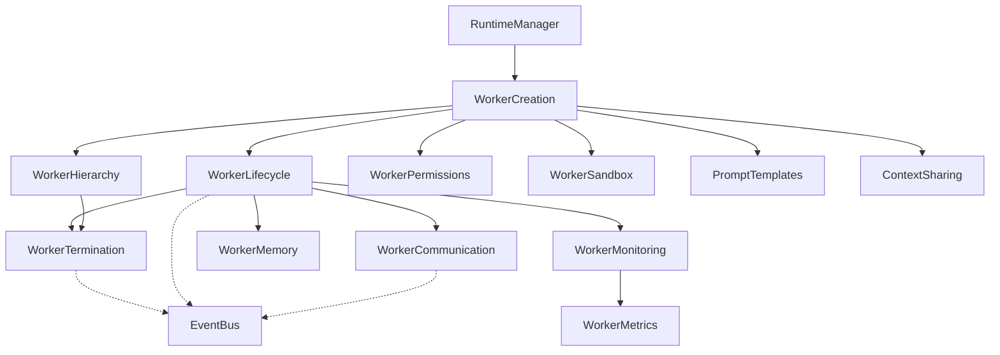

---
title: 03 Worker System
status: draft
version: 1.0
tags:
  - worker-system
  - workers
  - architecture
  - Eulinx
  - flow:P06-SPAWN-WFACTORY
  - flow:P06-SPAWN-VALIDATE
  - flow:P06-SPAWN-INIT
  - flow:P06-SPAWN-CLEANUP
  - flow:P06-SPAWN-DESTROY
  - flow:P06-SPAWN-RESTART
  - flow:P06-SPAWN-RECOVERY
  - flow:P07-SESSION-CLEANUP
  - flow:P08-WORKER-MANAGER
  - flow:P08-WORKER-REGISTRY
  - flow:P08-WORKER-LIFECYCLE
  - flow:P08-WORKER-MSG
  - flow:P08-WORKER-HEALTH
  - flow:P08-WORKER-RECOVERY
  - flow:P08-WORKER-SCALING
  - flow:P08-WORKER-POOLS
  - flow:P08-WORKER-CAPS
  - flow:P08-WORKER-COORD
  - flow:P17-CLI-WORKER
  - flow:P18-UI-WORKEREXP
related:
  - "[[02-runtime/README]]"
  - "[[Worker-Part01]]"
  - "[[WorkerSpawner-Part01]]"
  - "[[ProcessLifecycle-Part01]]"
  - "[[Permission-Part01]]"
---

# 03 Worker System

## Purpose

The `03-worker-system` folder defines the Worker itself.

If `01-core-concepts` defines what a Worker *is* as a noun, and `02-runtime` defines the *services* that act upon Workers, this folder defines the Worker as a **system**: its own state machine, its own hierarchy, its own communication rules, its own memory, and its own boundaries.

This distinction matters and implementers get it wrong constantly.

```text
WorkerSpawner is the service that spawns.
WorkerCreation is the Worker's own rule set for coming into existence.

ProcessLifecycle is the service that owns OS processes.
WorkerLifecycle is the Worker's own state machine.

MemoryManager is the service that stores memory.
WorkerMemory is what a Worker is allowed to remember and forget.
```

A runtime service is a thing Eulinx owns. A Worker is a thing Eulinx contains.

The Worker is the only component in Eulinx that reasons. Everything in this folder exists to keep that reasoning contained, observable, interruptible, and reversible.

## Worker System Folder Structure

This folder is organized as one folder per Worker-system concern.

```text
03-worker-system/
  README.md

  WorkerLifecycle/
    WorkerLifecycle-Part01.md ... WorkerLifecycle-Part06.md
    WorkerLifecycle-Diagrams.md

  WorkerCreation/
    WorkerCreation-Part01.md ... WorkerCreation-Part06.md
    WorkerCreation-Diagrams.md

  WorkerTermination/
    WorkerTermination-Part01.md ... WorkerTermination-Part05.md
    WorkerTermination-Diagrams.md

  WorkerHierarchy/
    WorkerHierarchy-Part01.md ... WorkerHierarchy-Part06.md
    WorkerHierarchy-Diagrams.md

  WorkerCommunication/
    WorkerCommunication-Part01.md ... WorkerCommunication-Part08.md
    WorkerCommunication-Diagrams.md

  WorkerMemory/
    WorkerMemory-Part01.md ... WorkerMemory-Part06.md
    WorkerMemory-Diagrams.md

  WorkerPermissions/
    WorkerPermissions-Part01.md ... WorkerPermissions-Part06.md
    WorkerPermissions-Diagrams.md

  WorkerSandbox/
    WorkerSandbox-Part01.md ... WorkerSandbox-Part06.md
    WorkerSandbox-Diagrams.md

  WorkerMetrics/
    WorkerMetrics-Part01.md ... WorkerMetrics-Part05.md
    WorkerMetrics-Diagrams.md

  WorkerMonitoring/
    WorkerMonitoring-Part01.md ... WorkerMonitoring-Part05.md
    WorkerMonitoring-Diagrams.md

  ContextSharing/
    ContextSharing-Part01.md ... ContextSharing-Part06.md
    ContextSharing-Diagrams.md

  PromptTemplates/
    PromptTemplates-Part01.md ... PromptTemplates-Part05.md
    PromptTemplates-Diagrams.md

  WorkerExamples/
    WorkerExamples-Part01.md ... WorkerExamples-Part04.md
    WorkerExamples-Diagrams.md
```

## Total Worker System Specification Size

```text
13 worker-system topic folders
1 root README
73 Markdown specification parts
13 Diagrams files
```

## Worker System Topic Responsibilities

## WorkerLifecycle

WorkerLifecycle owns the Worker state machine: the thirteen legal states, every legal transition and its trigger, illegal transitions, per-state allowed operations, timeouts, heartbeats, health, crash recovery, lifecycle events, and persistence of lifecycle state across app restart.

Parts: 6

## WorkerCreation

WorkerCreation owns the Worker's own birth rules: the creation request schema, validation, admission control, identity assignment, role and profile selection, model and provider binding, permission attachment, context package assembly, sandbox assignment, terminal attachment, runtime registration, the ordered creation algorithm, and rollback at every failure point.

Parts: 6

## WorkerTermination

WorkerTermination owns Worker death: graceful shutdown versus forced kill, drain semantics, in-flight task disposition, artifact flushing, lock release, memory flush, child cascade, orphan and zombie reaping, OS cleanup, terminal teardown, the termination reason enum, and post-mortem records.

Parts: 5

## WorkerHierarchy

WorkerHierarchy owns parent and child relationships: the Worker tree, depth limits, fan-out limits, ancestry rules, inheritance of permissions and context, cascade semantics, and orphan policy.

Parts: 6

## WorkerCommunication

WorkerCommunication owns how Workers talk: to the runtime, to their parent, to siblings, and to the user. It defines the message envelope, channels, request and response semantics, backpressure, and the rule that Workers never address each other directly.

Parts: 8

## WorkerMemory

WorkerMemory owns what a Worker may remember: working memory, episodic memory, scratch memory, memory scoping, promotion of memory to durable storage, forgetting, and the boundary against MemoryManager.

Parts: 6

## WorkerPermissions

WorkerPermissions owns the Worker's permission surface: the permission profile as attached to a Worker, escalation requests, delegation to children, revocation at runtime, and the fail-closed default.

Parts: 6

## WorkerSandbox

WorkerSandbox owns the Worker's confinement: sandbox roots, path boundaries, filesystem views, network policy, environment isolation, and cleanup.

Parts: 6

## WorkerMetrics

WorkerMetrics owns what is counted: tokens, cost, tool calls, wall time, CPU time, retries, artifacts produced, and budget consumption.

Parts: 5

## WorkerMonitoring

WorkerMonitoring owns what is watched: heartbeats, health probes, stall detection, runaway detection, output tailing, and alerting to the UI.

Parts: 5

## ContextSharing

ContextSharing owns how context moves between Workers: what a parent may pass down, what a child may pass up, redaction, context diffing, and the prohibition on ambient shared state.

Parts: 6

## PromptTemplates

PromptTemplates owns the Worker's startup prompt: template structure, variable binding, template versioning, injection safety, and the rule that no AI output becomes a template.

Parts: 5

## WorkerExamples

WorkerExamples provides end-to-end worked examples of real Workers with real values, from creation request to post-mortem record.

Parts: 4

## Global Worker Principles

A Worker MUST have exactly one lifecycle state at any instant.

A Worker MUST belong to exactly one Workspace for its entire life.

A Worker MUST NOT change its Workspace, Project, sandbox root, or identity after creation.

A Worker MUST produce Artifacts rather than mutate trusted state directly.

A Worker MUST NOT be trusted. Everything it emits is untrusted input until verified.

A Worker MUST be interruptible at every state that can persist longer than one tick.

A Worker MUST emit an event on every state transition.

A Worker MUST NOT outlive its parent unless it has been explicitly re-parented.

A Worker MUST NOT hold a lock across termination.

A Worker MUST NOT address another Worker directly. All Worker-to-Worker traffic passes through the runtime.

A Worker MUST fail closed. An unknown permission is a denied permission.

A Worker MUST be reconstructible from its persisted record after an app restart.

A Worker MUST NOT be able to widen its own permissions, budget, or sandbox.

## Worker System Architecture Overview



## ASCII Overview

```text
Worker
  |
  +-- Identity        (WorkerCreation)
  +-- State machine   (WorkerLifecycle)
  +-- Death           (WorkerTermination)
  |
  +-- Tree position   (WorkerHierarchy)
  +-- Channels        (WorkerCommunication)
  +-- Memory          (WorkerMemory)
  |
  +-- Powers          (WorkerPermissions)
  +-- Confinement     (WorkerSandbox)
  |
  +-- Counters        (WorkerMetrics)
  +-- Watchdogs       (WorkerMonitoring)
  |
  +-- Inherited data  (ContextSharing)
  +-- Startup prompt  (PromptTemplates)
  |
  +-- Worked examples (WorkerExamples)
```

## AI Notes

Do not implement the Worker as a chat session object with a `messages` array. A Worker is a supervised process with a state machine, a budget, a sandbox, and a death procedure. The conversation is an implementation detail of one state.

Do not duplicate `02-runtime` logic here. If your code is starting an OS process, that is ProcessLifecycle. If your code is deciding whether a spawn may run now, that is Scheduler. This section defines the Worker's rules, and calls those services.

Do not let a Worker's state live only in memory. Every transition writes to SQLite before the event is emitted, or a crash loses the Worker.

Do not add a state. Thirteen states are specified in WorkerLifecycle. If you feel you need a fourteenth, you have misread a transition.

## Related Documents

- [[01-core-concepts/README]]
- [[02-runtime/README]]
- [[Worker-Part01]]
- [[WorkerLifecycle-Part01]]
- [[WorkerCreation-Part01]]
- [[WorkerTermination-Part01]]
- [[WorkerSpawner-Part01]]
- [[ProcessLifecycle-Part01]]
- [[Permission-Part01]]
- [[Memory-Part01]]
- [[04-memory/README]]
- [[06-workflow-engine/README]]
</content>
</invoke>
