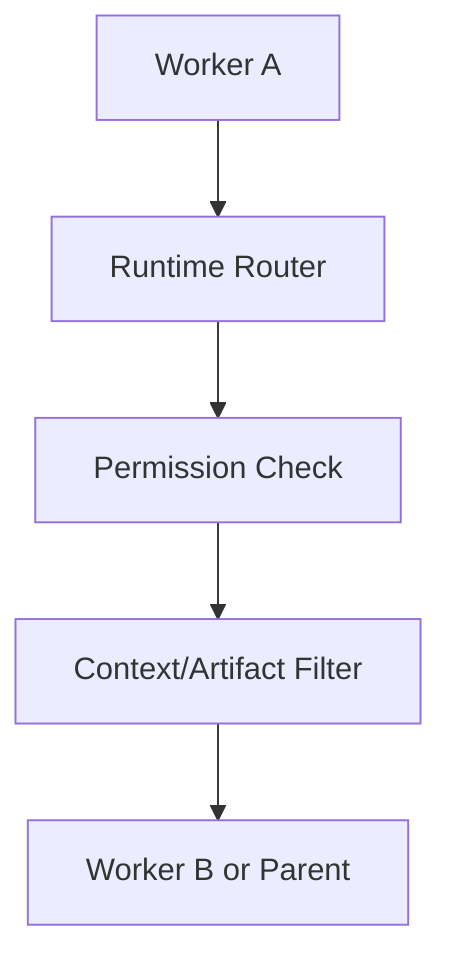
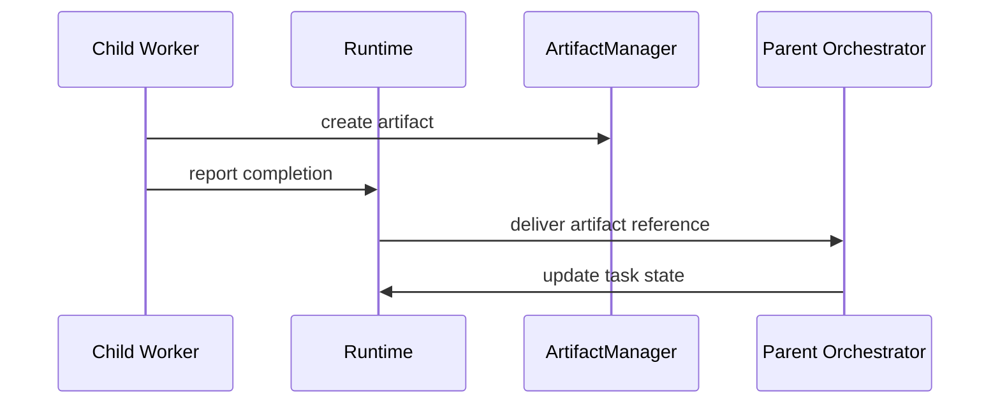
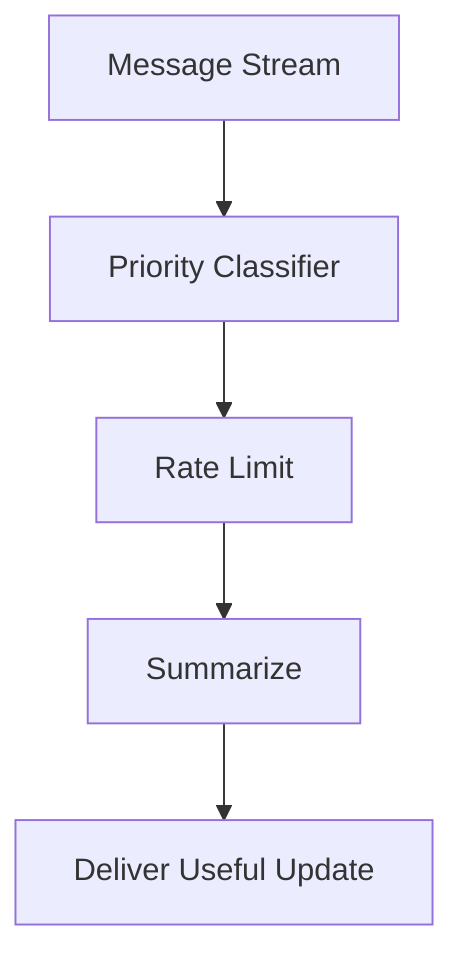

# WorkerCommunication Diagrams

## Runtime-Routed Communication



## Parent-Child Reporting



## Backpressure Flow



## ASCII Overview

```text
Worker message
  -> validate envelope
  -> check channel
  -> check permission
  -> redact if needed
  -> route
  -> acknowledge
  -> persist for replay
```

# Related Documents

- [[WorkerCommunication-Part01]]
- [[WorkerCommunication-Part08]]

