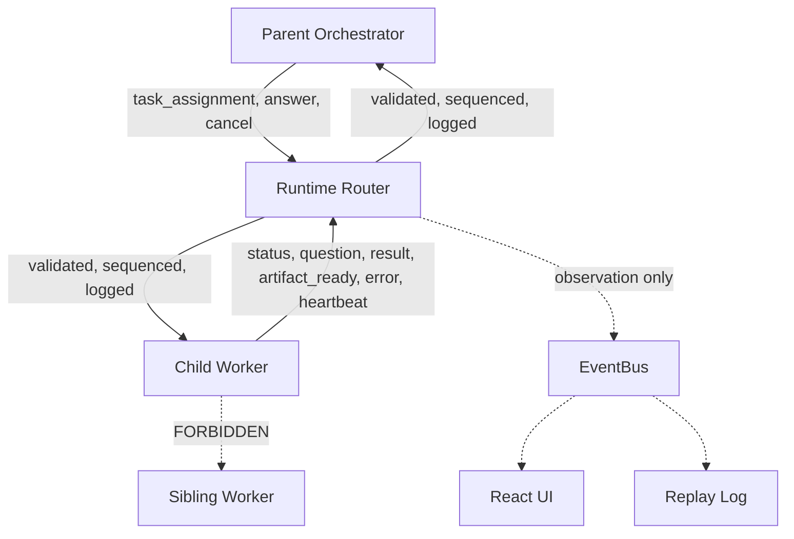

---
title: WorkerCommunication Specification - Part 01
status: draft
version: 1.0
tags:
  - worker-system
  - worker-communication
  - architecture
related:
  - "[[03-worker-system/README]]"
  - "[[WorkerHierarchy-Part01]]"
  - "[[EventBus-Part01]]"
  - "[[Worker-Part01]]"
---

# WorkerCommunication Specification (Part 01)

## Document Index

```text
WorkerCommunication-Part01 - Purpose, philosophy, envelope overview, invariants
WorkerCommunication-Part02 - The message envelope and every message kind in full
WorkerCommunication-Part03 - Channels, mediated routing, and the no-peer-to-peer rule
WorkerCommunication-Part04 - Correlation IDs, request and response, timeouts, retries
WorkerCommunication-Part05 - Ordering, delivery guarantees, backpressure, EventBus split
WorkerCommunication-Part06 - Implementation checklist, worked examples, future expansion
WorkerCommunication-Diagrams - All communication flows rendered four ways
```

# Purpose

WorkerCommunication defines how direction travels between nodes in the Worker tree.

A Worker needs to be told what to do. It needs to ask questions and get answers. It needs to report progress, hand back results, and say that it is still alive. Its parent needs to cancel it. All of that is messaging, and all of it goes through the runtime.

This document specifies the envelope, the message kinds, the channels, the routing rules, the correlation model, the timeout and retry policy, the delivery guarantees, and the backpressure mechanism. It does not specify what a Worker reasons about. It specifies the pipe.

# Core Philosophy

```text
Messages are direction. Events are observation.
A message has exactly one recipient and expects something to happen.
An event has any number of observers and expects nothing.
```

Confusing the two is the most common architectural error in systems like Eulinx, and it is fatal. If direction flows on the event bus, then anyone who subscribes can steer a Worker. If observation flows on the message channel, the UI becomes a participant in the authority chain. The split is specified in [[WorkerCommunication-Part05]] and it is not negotiable.

The second philosophy is mediation. Two Workers never speak. Not because it would be slow, but because a direct channel is an unaudited channel, and an unaudited channel is an authority leak.

```text
Every message is routed.
Every routed message is checked.
Every checked message is logged.
No exceptions for speed, convenience, or "just this one case".
```

# Definition

WorkerCommunication is the runtime-mediated, envelope-based, parent-child-only messaging layer connecting nodes in the WorkerHierarchy.

It is:

- typed, every message is a discriminated union member with a full schema
- mediated, the runtime is on the path of every message
- directional, messages travel along a single hierarchy edge
- correlated, every request carries an id its response must echo
- bounded, every channel has a finite queue and applies backpressure
- ordered, per channel and per direction, FIFO
- durable, messages that matter survive a restart
- observable, every message emits an event describing that it happened

It is not:

- a pub-sub bus, that is the EventBus
- a peer-to-peer network
- a place for AI-authored routing decisions
- a transport for file content, that is the ArtifactManager

# Responsibilities

WorkerCommunication MUST:

- wrap every message in a `MessageEnvelope` with all required fields populated
- validate that sender and recipient are directly related in the hierarchy
- reject any message whose sender is not the authenticated node
- reject any message that crosses Sessions or Workspaces
- assign a monotonic `sequence` per channel
- deliver messages in `sequence` order within a channel
- correlate responses to requests via `correlationId`
- enforce a timeout on every request that expects a response
- retry idempotent messages according to the policy in Part 04
- apply backpressure when a queue reaches its high-water mark
- persist durable message kinds before acknowledging them
- emit an EventBus event for every message sent, delivered, and dropped
- deliver a cancel message ahead of every queued message on the channel

WorkerCommunication SHOULD:

- keep envelope payloads small and reference Artifacts by id
- collapse redundant status messages when a queue is backed up
- expose channel depth as a health metric

WorkerCommunication MUST NOT:

- allow a Worker to send to a sibling
- allow a Worker to send to its grandparent
- allow a Worker to send to an arbitrary node id
- allow a message to carry a permission grant
- allow AI output to name the recipient
- allow an unbounded queue
- allow the EventBus to deliver direction
- allow a message to mutate Project files

# Message Envelope Overview

Every message in Eulinx is this shape. The full field-by-field specification is in [[WorkerCommunication-Part02]].

```ts
type MessageEnvelope<K extends MessageKind = MessageKind> = {
  messageId: string;
  correlationId: string | null;
  causationId: string | null;
  kind: K;
  sessionId: string;
  workspaceId: string;
  fromNodeId: HierarchyNodeId;
  toNodeId: HierarchyNodeId;
  channelId: string;
  sequence: number;
  direction: "down" | "up";
  priority: MessagePriority;
  deliveryMode: "at-least-once" | "at-most-once";
  durable: boolean;
  expiresAt: string | null;
  attempt: number;
  payload: MessagePayloadFor<K>;
  sentAt: string;
};
```

# Message Kinds

```text
kind              direction  expects response  durable  priority
----------------  ---------  ----------------  -------  --------
task_assignment   down       yes (result)      yes      normal
question          up         yes (answer)      yes      normal
answer            down       no                yes      normal
status            up         no                no       low
heartbeat         up         no                no       low
result            up         yes (ack)         yes      high
artifact_ready    up         yes (ack)         yes      normal
error             up         no                yes      high
cancel            down       yes (ack)         yes      control
```

`control` priority is above `high` and exists only for `cancel`. A cancel MUST jump the queue. Every other kind waits its turn.

# Envelope Invariants

```text
M1  fromNodeId and toNodeId MUST be parent and child of each other, in
    either order. No other pair is valid.
M2  direction MUST agree with the hierarchy: "down" means fromNodeId is the
    parent of toNodeId, "up" means the reverse.
M3  fromNodeId MUST equal the authenticated node id of the sender. A node
    MUST NOT set this field itself.
M4  sessionId and workspaceId MUST match on both nodes.
M5  sequence MUST be strictly increasing per (channelId, direction).
M6  A message with correlationId != null MUST reference a messageId that
    exists and was sent on the same channel.
M7  A response MUST travel the opposite direction from its request.
M8  durable == true MUST be persisted before delivery is acknowledged.
M9  A message MUST NOT be delivered to a node in a terminal state.
M10 A message MUST NOT be delivered if any ancestor of toNodeId is paused,
    cancelled, or failed. It is dropped and an event is emitted.
M11 payload MUST validate against the schema for kind. A payload that fails
    validation MUST be rejected at send time, never at receive time.
M12 An envelope MUST NOT contain a PermissionGrant. Authority comes from the
    hierarchy, never from a message.
```

Invariant M12 is the load-bearing one. If a message could carry a grant, then any node that could send a message could escalate, and the entire permission model in [[WorkerHierarchy-Part04]] evaporates.

# Mermaid Diagram



# AI Notes

Do not build this on the EventBus. It is tempting, the EventBus already exists and already delivers things. But an event has no single recipient, no correlation, no backpressure, and no authority check. Direction on a pub-sub bus means any subscriber can steer a Worker. Build a separate router.

Do not let the model choose `toNodeId`. The runtime derives the recipient from the sender's node and the message kind. A Worker sending `result` has exactly one legal recipient, its parent. If your API is `send(toNodeId, payload)`, a model will eventually put a sibling's id in there and your validation is now the only thing between you and a cross-talk bug. Make the API `reportResult(payload)` and derive the rest.

Do not skip the sequence number because "TCP is ordered anyway". Channels survive process restarts and TCP does not. The sequence is what lets a reconnecting Worker know it missed message 7.

Do not make the queue unbounded to "avoid dropping messages". An unbounded queue does not avoid failure, it converts a fast, visible backpressure signal into a slow, invisible memory exhaustion. Bound it and apply the policy in Part 05.

# Related Documents

- [[03-worker-system/README]]
- [[WorkerCommunication-Part02]]
- [[WorkerCommunication-Diagrams]]
- [[WorkerHierarchy-Part01]]
- [[EventBus-Part01]]
- [[Worker-Part01]]
