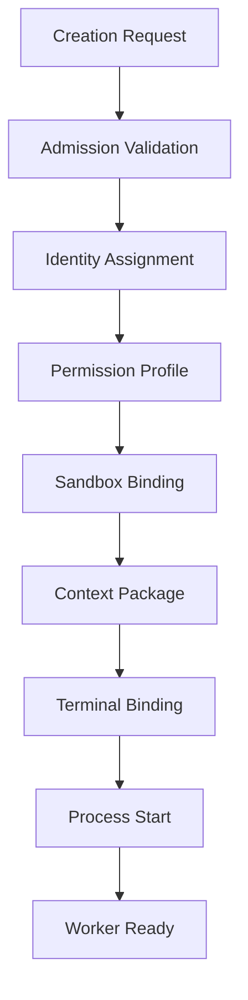
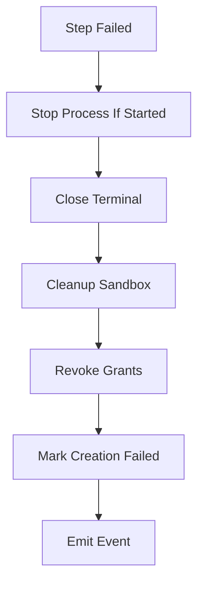
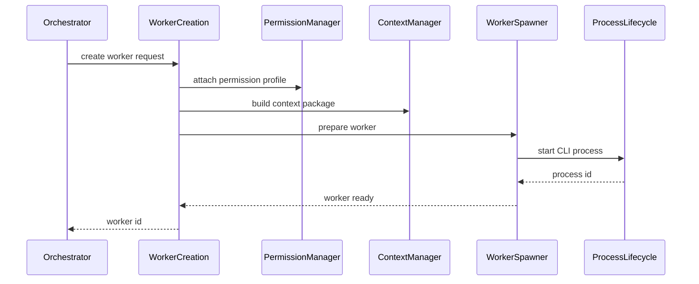

# WorkerCreation Diagrams

## High-Level Flow



## Rollback Flow



## Sequence Diagram



## ASCII Overview

```text
Request
  -> Validate
  -> Reserve identity
  -> Bind permission
  -> Create sandbox
  -> Build context
  -> Attach terminal
  -> Start process
  -> Ready
```

# Related Documents

- [[WorkerCreation-Part01]]
- [[WorkerCreation-Part06]]

