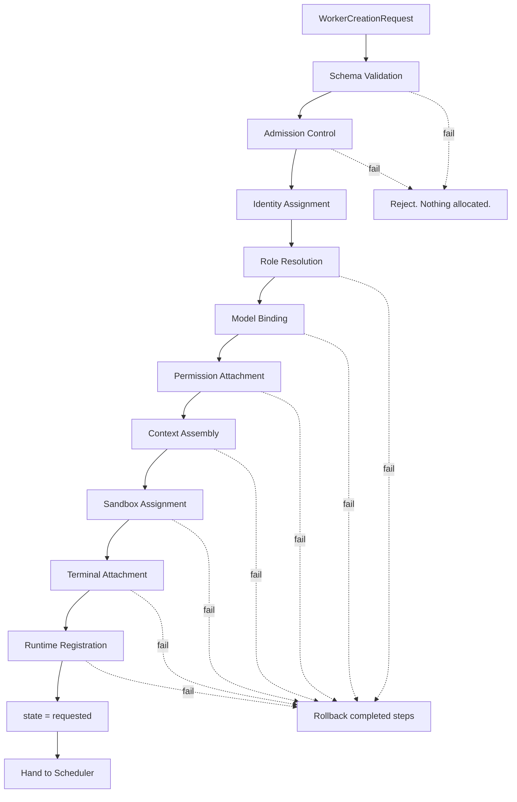

# WorkerCreation Specification (Part 01)

## Document Index

Part 01 - Purpose, Philosophy, Scope, and Object Model
Part 02 - Creation Request Schema and Validation
Part 03 - Admission Control, Identity, and Role Selection
Part 04 - Binding: Model, Permissions, Context, Sandbox, Terminal
Part 05 - The Ordered Creation Algorithm and Registration
Part 06 - Failure, Rollback, Checklist, and Examples
Diagrams - WorkerCreation-Diagrams.md

# Purpose

WorkerCreation defines the Worker's own rules for coming into existence.

This is not WorkerSpawner. The distinction is the first thing to internalize, because everything in this document depends on it.

```text
WorkerSpawner is a runtime service. It is the machinery.
  It receives an approved request and operates the levers:
  it calls ProcessLifecycle, it writes env vars, it binds a PTY.

WorkerCreation is the Worker's rule set. It is the law.
  It defines what a valid Worker IS: what identity means,
  what may be inherited, what must be bound before birth,
  and what must be undone if birth fails.

WorkerSpawner executes. WorkerCreation governs.
```

A Worker created outside these rules is not a Worker. It is an unsupervised AI process with filesystem access on a user's machine.

# Core Philosophy

Creation is the only moment at which a Worker's powers are set.

After creation, a Worker's identity, workspace, sandbox root, permission profile, model binding, and budget are **immutable**. There is no widening. There is no renegotiation. A Worker that needs more power does not get more power; it requests an escalation that a human or the PermissionManager grants as a scoped, audited, revocable exception, and that exception never rewrites the creation record.

This immutability is the entire security model. If creation is loose, nothing downstream can tighten it.

```text
Everything a Worker will ever be allowed to do
is decided before its process exists.
```

Creation is therefore **all-or-nothing**. A partially created Worker MUST NOT exist. Every step in the creation algorithm has a defined rollback, and any failure runs every completed rollback in reverse order.

# Definition

WorkerCreation is the Worker-owned rule set that defines:

- the creation request schema
- validation of that request
- admission control and the decision to accept work at all
- identity and ID assignment
- role and profile selection
- model and provider binding
- permission profile attachment
- context package assembly
- sandbox assignment
- terminal and PTY attachment
- registration with the runtime
- the full ordered creation algorithm
- every failure point and its rollback

# Responsibilities

WorkerCreation MUST:

- accept only a typed, schema-valid `WorkerCreationRequest`
- validate before allocating anything
- allocate in a fixed, documented order
- assign an identity that is unique, opaque, and immutable
- bind exactly one model, one permission profile, one sandbox, one context package
- resolve every profile reference to a concrete, frozen snapshot before birth
- register the Worker with the runtime before its process starts
- write the `requested` lifecycle record before any resource is allocated
- roll back every completed step on any failure
- emit a creation event on success and a rejection event on failure
- produce a Worker whose first lifecycle state is `requested`

WorkerCreation SHOULD:

- support a dry-run mode that validates without allocating
- resolve profiles from a cache to keep creation fast
- record the resolved snapshot for Replay

WorkerCreation MUST NOT:

- allow a Worker to specify its own permissions
- allow a Worker to specify its own budget
- allow a Worker to specify its own sandbox root
- allow AI output to become a command argument
- allow a child to receive powers its parent lacks
- allow creation before runtime recovery has completed
- start a process before registration succeeds
- leave any allocated resource behind on failure

# The Creation Request

```ts
type WorkerCreationRequest = {
  requestId: string;
  workspaceId: string;
  projectId: string;
  sessionId: string;
  parentRef?: WorkerParentRef;
  requestedBy: RuntimeActorRef;
  roleId: string;
  objective: string;
  taskId?: string;
  workflowId?: string;
  workflowNodeId?: string;
  retryOf?: string;
  modelPreference?: ModelPreference;
  permissionProfileOverrideId?: string;
  contextSeed?: ContextSeed;
  budgetOverride?: BudgetOverride;
  creationMode: "normal" | "dry_run" | "simulation" | "replay" | "recovery";
  priority: "low" | "normal" | "high" | "critical";
  reason: string;
  createdAt: string;
};

type WorkerParentRef = {
  kind: "worker" | "orchestrator" | "workflow_node" | "user";
  id: string;
  depth: number;
};

type ModelPreference = {
  providerId?: string;
  modelId?: string;
  fallbackAllowed: boolean;
};

type ContextSeed = {
  includeParentContext: boolean;
  memoryQuery?: string;
  explicitArtifactIds: string[];
  explicitFilePaths: string[];
};

type BudgetOverride = {
  maxTokens?: number;
  maxCostUsd?: number;
  maxToolCalls?: number;
  maxWallClockMs?: number;
  maxChildren?: number;
};
```

Note what is absent. There is no `permissions` array, no `sandboxRoot`, no `command`, no `args`, no `env`. A caller cannot ask for powers directly. It names a `roleId`, and the role resolves to powers under rules the caller does not control.

`permissionProfileOverrideId` and `budgetOverride` exist but are **narrowing-only**. See Part 04. They can shrink what the role grants. They can never widen it.

# The Creation Result

```ts
type WorkerCreationResult =
  | { ok: true; worker: WorkerIdentity; resolved: ResolvedWorkerProfile }
  | { ok: false; error: WorkerCreationError };

type WorkerIdentity = {
  workerId: string;
  workspaceId: string;
  projectId: string;
  sessionId: string;
  parentWorkerId?: string;
  rootWorkerId: string;
  depth: number;
  roleId: string;
  createdAt: string;
};

type WorkerCreationError = {
  kind: WorkerCreationErrorKind;
  requestId: string;
  failedAtStep: number;
  rolledBackSteps: number[];
  message: string;
  retryable: boolean;
  at: string;
};
```

`failedAtStep` and `rolledBackSteps` are not debug niceties. They are the audit trail proving that every allocated resource was released. Part 06 defines them per step.

# Immutable After Creation

These fields MUST NOT change for the life of the Worker.

```text
workerId            identity
workspaceId         isolation boundary
projectId           isolation boundary
rootWorkerId        tree root
parentWorkerId      tree position
depth               tree depth
roleId              what it is
resolvedModel       what reasons for it
resolvedPermissions what it may do
sandboxRoot         where it may act
budget              what it may spend
contextPackageId    what it was told
promptTemplateId    how it was told
```

A change to any of these is a new Worker. There is no exception, including retry. A retried Worker gets a new `workerId` and a `retryOf` pointer, per [[WorkerLifecycle-Part05]].

# Invariants

```text
A Worker's lifecycle record exists before any resource is allocated.
A Worker's first state is always requested.
A Worker is registered with the runtime before its process starts.
Every allocated resource has a rollback.
A failed creation leaves zero resources allocated.
A child's permissions are a subset of its parent's.
A child's budget is drawn from its parent's remaining budget.
A child's depth is exactly parent depth + 1.
No Worker is created before runtime recovery completes.
The resolved profile is a frozen snapshot, not a live reference.
Nothing in the request can widen anything.
```

The frozen-snapshot rule deserves emphasis. If a Worker held a reference to a role definition and a user edited that role mid-run, the Worker's powers would change under it. Creation resolves every profile to a value and stores that value. See Part 04.

# Mermaid Diagram



# AI Notes

Do not implement WorkerCreation as a thin wrapper that forwards to WorkerSpawner. They are different layers. Creation decides what is legal and resolves it to concrete values; the Spawner takes those values and operates machinery. If your creation function's body is one call to `spawn`, you have skipped the entire specification.

Do not let the request carry permissions, a sandbox path, a command, or env vars. The moment a caller can name its own sandbox root, workspace isolation is decoration. Callers name a role. Roles resolve to powers.

Do not store a reference to a role or permission profile on the Worker. Store the resolved snapshot. Users edit profiles while Workers run.

Do not start a process before registration. An unregistered process is an escaped process, and Part 05 of WorkerLifecycle has to hunt it down by PID afterward.

Do not skip rollback because "creation rarely fails". It fails constantly: missing CLI, expired credentials, exhausted budget, sandbox collision. Each of those leaks a resource if rollback is absent.

# Related Documents

- [[03-worker-system/README]]
- [[WorkerCreation-Part02]]
- [[WorkerCreation-Diagrams]]
- [[WorkerLifecycle-Part01]]
- [[WorkerSpawner-Part01]]
- [[WorkerHierarchy-Part01]]
- [[Worker-Part01]]
</content>
