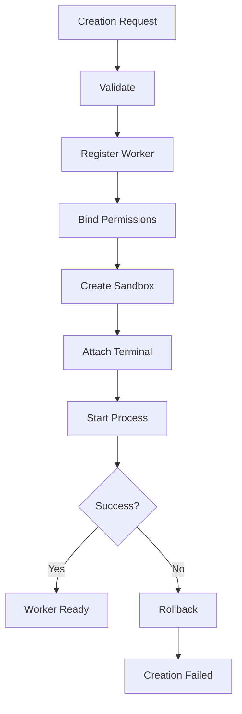

---
title: WorkerCreation Specification - Part 05
status: draft
version: 1.0
tags:
  - worker-system
  - worker-creation
  - rollback
  - registration
related:
  - "[[WorkerCreation-Part01]]"
  - "[[WorkerSpawner-Part01]]"
  - "[[RuntimeManager-Part01]]"
---

# WorkerCreation Specification (Part 05)

## Document Index

Part 01 - Purpose, Request Model, and Admission
Part 02 - Identity, Profile, Provider, and Model Binding
Part 03 - Permission, Sandbox, Terminal, and Context Binding
Part 04 - Ordered Creation Algorithm
Part 05 - Registration, Rollback, Recovery, and Idempotency
Part 06 - Events, UI, Database, and Implementation Checklist

# Purpose

This part defines what happens after the Worker has enough information to be created but before it becomes visible as a running Worker.

Worker creation is a multi-step process. Some steps allocate resources, create database records, reserve budgets, acquire permissions, create sandboxes, and start processes. Any of those can fail. Therefore WorkerCreation needs rollback and idempotency rules.

# Registration Principle

A Worker MUST be registered before it is allowed to execute.

Registration creates the durable Worker record that other services can reference.

Registration should happen after admission validation but before external process start.

```text
Validate request
  |
  v
Reserve identity
  |
  v
Create Worker record
  |
  v
Bind resources
  |
  v
Start runtime process
```

# Worker Registration Record

The registration record SHOULD include:

- Worker id
- Workspace id
- Project id
- Session id
- parent Worker or Orchestrator id
- task id
- Worker profile
- lifecycle state
- permission profile id
- sandbox id
- terminal id if created
- context package id
- creation request id
- created timestamp

# Idempotency

WorkerCreation MUST support idempotency.

If the same creation request is retried after a transient failure, Eulinx should not accidentally create duplicate Workers.

Creation requests SHOULD include an idempotency key.

```ts
type WorkerCreationIdempotency = {
  creationRequestId: string;
  idempotencyKey: string;
  workerId?: string;
  status: "pending" | "created" | "failed" | "rolled_back";
};
```

# Rollback Points

WorkerCreation should define rollback after each major step.

```text
Identity reserved
  rollback: release identity reservation

Worker record created
  rollback: mark creation_failed, do not delete silently

Permission profile attached
  rollback: revoke grants

Sandbox created
  rollback: cleanup sandbox

Terminal created
  rollback: close terminal

Process started
  rollback: terminate process

Context package created
  rollback: mark unused or archive
```

# Partial Creation States

Eulinx SHOULD represent partial creation explicitly.

States:

```text
creation_requested
creation_validating
creation_admitted
creation_registering
creation_binding_resources
creation_starting_process
creation_ready
creation_failed
creation_rolled_back
```

These are creation substates, not main Worker lifecycle states.

# Recovery After App Restart

If Eulinx restarts during Worker creation, Runtime should inspect incomplete records.

Possible recovery:

- mark creation failed
- resume creation if safe
- terminate orphaned process
- cleanup sandbox
- revoke grants
- preserve diagnostic record

# Orphan Detection

WorkerCreation should detect:

- Worker record with no process
- process with no Worker record
- sandbox with no Worker
- terminal with no Worker
- permission profile attached to failed Worker

# Mermaid Diagram



# AI Notes

Do not make Worker creation a single function that performs all steps without rollback.

Worker creation is a mini transaction across database, permissions, sandbox, terminal, and process lifecycle.

# Related Documents

- [[WorkerCreation-Part06]]
- [[WorkerSpawner-Part01]]
- [[ProcessLifecycle-Part01]]
- [[PermissionManager-Part01]]

