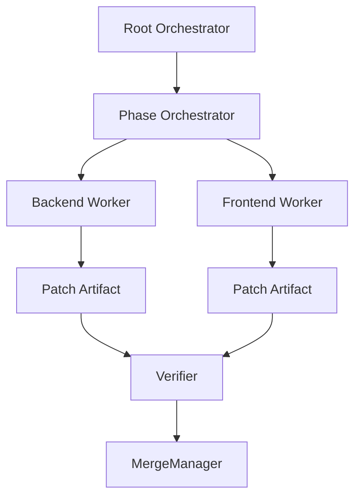

# WorkerExamples Diagrams



```text
Goal
  -> orchestrate
  -> spawn workers
  -> produce artifacts
  -> verify
  -> merge
```

# Related Documents

- [[WorkerExamples-Part01]]
- [[WorkerExamples-Part04]]

