# WorkerHierarchy Diagrams

## Tree Shape

### High-Level Overview

```text
User -> Root Orchestrator -> Sub-Orchestrators -> Workers
Authority narrows going down. Results bubble going up.
```

### Detailed Mermaid Diagram

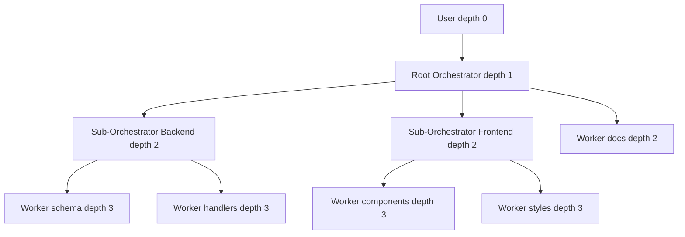

### ASCII Diagram

```text
user_root                          depth 0  kind=user         perms: fs.write **
  |
  +-- orc_root                     depth 1  kind=orchestrator  perms: fs.write **
        |
        +-- sub_api                depth 2  kind=orchestrator  perms: fs.write src/api/**
        |     |
        |     +-- wrk_schema       depth 3  kind=worker        perms: fs.write src/api/db/*
        |     +-- wrk_handlers     depth 3  kind=worker        perms: fs.write src/api/h/*
        |
        +-- sub_ui                 depth 2  kind=orchestrator  perms: fs.write src/ui/**
        |     |
        |     +-- wrk_components   depth 3  kind=worker        perms: fs.write src/ui/c/*
        |     +-- wrk_styles       depth 3  kind=worker        perms: fs.write src/ui/s/*
        |
        +-- wrk_docs               depth 2  kind=worker        perms: fs.write docs/**

Leaves are always kind=worker. Interior nodes are always kind=orchestrator.
A Worker may sit at depth 2. Depth is capped, not required.
```

### Sequence Diagram

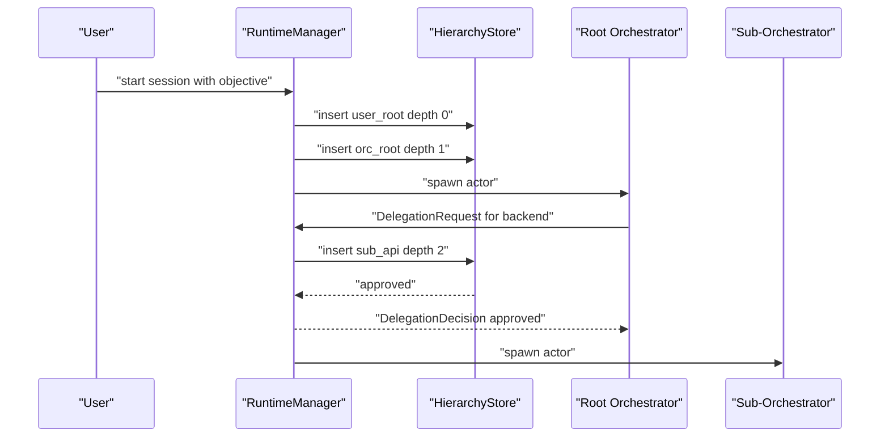

## Delegation Flow

### High-Level Overview

```text
Orchestrator asks. Runtime checks scope, permissions, budget, depth, fan-out,
cycles. Runtime inserts or rejects. The Orchestrator never inserts.
```

### Detailed Mermaid Diagram

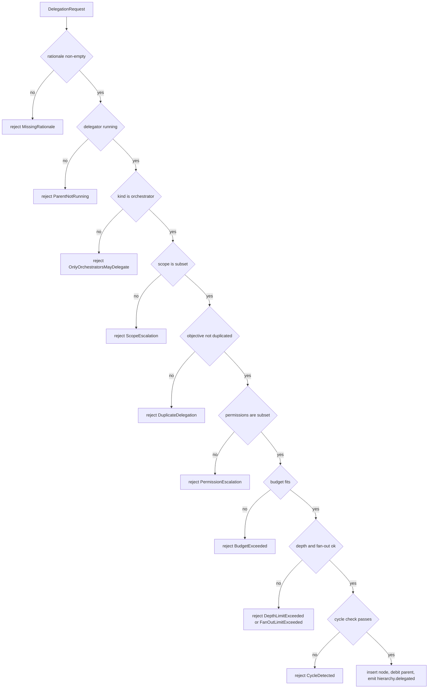

### ASCII Diagram

```text
DelegationRequest
  |
  v
[1] rationale non-empty? ------ no --> MissingRationale
  | yes
[2] delegator state running? -- no --> ParentNotRunning
  | yes
[3] delegator is orchestrator? no --> OnlyOrchestratorsMayDelegate
  | yes
[4] scope subset check
      allowedPaths   subset of parent   -- no --> ScopeEscalation
      deniedPaths    superset of parent -- no --> ScopeEscalation
      allowedToolIds subset of parent   -- no --> ScopeEscalation
      deadlineAt     <= parent deadline -- no --> ScopeEscalation
  | pass
[5] duplicate objective among siblings? yes --> DuplicateDelegation
  | no
[6] isPermissionSubset(child, parent)? no --> PermissionEscalation
  | yes
[7] budgetFits(request, parent)? ------ no --> BudgetExceeded
  | yes
=== SQLite TRANSACTION BEGIN ===
[8] childDepth <= maxDepth? --------- no --> DepthLimitExceeded
[9] fanOut < maxDirectChildren? ----- no --> FanOutLimitExceeded
[10] descendants < maxDescendants? -- no --> DescendantLimitExceeded
[11] cycle check on childPath? ------ fail --> CycleDetected
[12] debit parent.reservedForChildren
[13] INSERT child row state=pending
[14] UPDATE parent.childIds
=== SQLite TRANSACTION COMMIT ===
  |
  v
emit hierarchy.delegated --> Scheduler admission
```

### Sequence Diagram

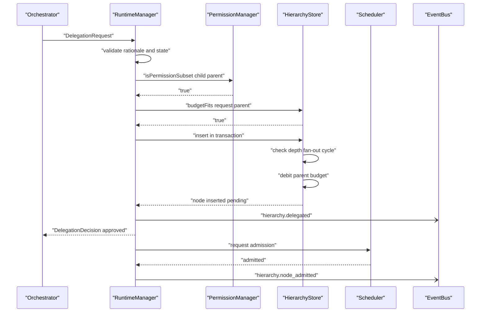

## Permission Inheritance

### High-Level Overview

```text
Grants intersect going down. Denials union going down.
A child is always weaker than its parent.
```

### Detailed Mermaid Diagram

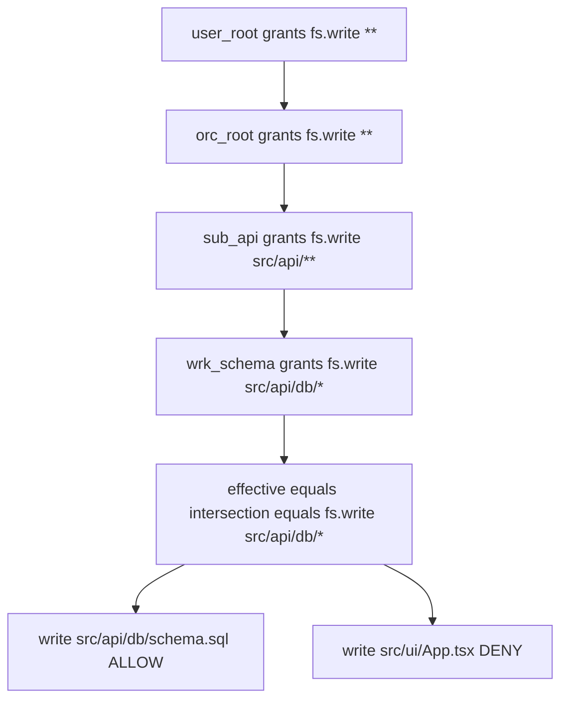

### ASCII Diagram

```text
Effective permission resolution for wrk_schema:

  path = "user_root/orc_root/sub_api/wrk_schema"
  split -> [user_root, orc_root, sub_api, wrk_schema]
  batch load all four in ONE query

  step  node        grants                   running?   effective grants
  ----  ----------  -----------------------  ---------  -------------------
  1     user_root   fs.write **              yes        fs.write **
  2     orc_root    fs.write **              yes        fs.write **
  3     sub_api     fs.write src/api/**      yes        fs.write src/api/**
  4     wrk_schema  fs.write src/api/db/*    yes        fs.write src/api/db/*

  denials union across all four: [fs.write **/*.env]

  request: fs.write "src/api/db/schema.sql"
    denial match? no
    grant match on "src/api/db/*"? yes
    requiresApproval constraint? no
    -> ALLOW

  request: fs.write "src/ui/App.tsx"
    denial match? no
    grant match? no  -> fail closed -> DENY
    NOTE: user_root holds fs.write ** and it does not help.
          The narrowest ancestor wins.

  request: fs.write "src/api/db/.env"
    denial fs.write **/*.env matches -> DENY before any grant is considered.

  If sub_api.state were "paused":
    step 6 of the resolution returns Deny(AncestorNotRunning) immediately,
    regardless of grants. A node MUST NOT act under a suspended ancestor.
```

### Sequence Diagram

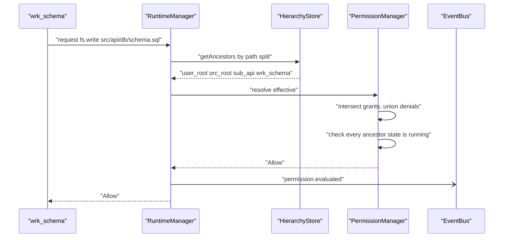

## Cascade Cancel

### High-Level Overview

```text
Signals travel down only. Deepest nodes die first.
Locks are released by the cascade, not by the dying actor.
```

### Detailed Mermaid Diagram

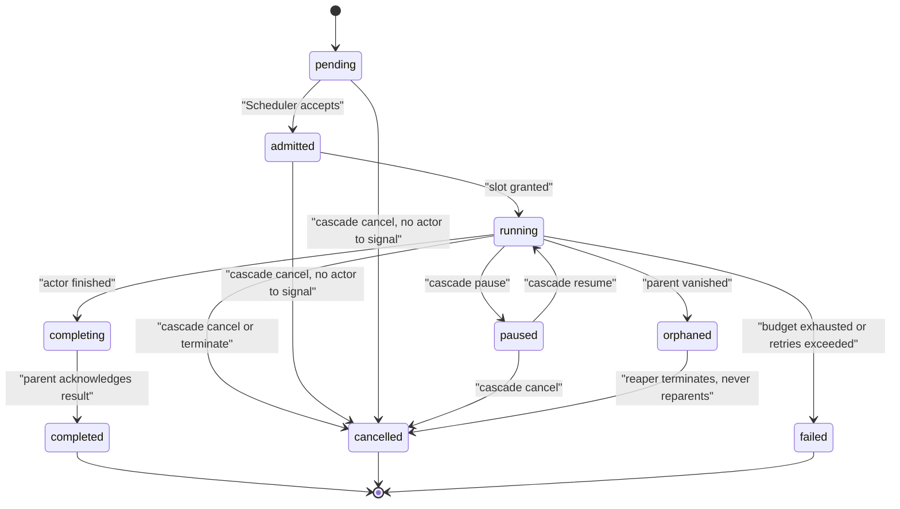

### ASCII Diagram

```text
User cancels orc_root. gracePeriodMs 5000.

Authorization: is "user_root" in orc_root.path? yes -> allowed.
Collect subtree via  WHERE path LIKE 'user_root/orc_root%'

Sort by depth DESCENDING. This order is MANDATORY.

  order  depth  node            action
  -----  -----  --------------  ----------------------------------------
  1      3      wrk_schema      cancel msg, RELEASE LOCK, refund budget
  2      3      wrk_handlers    cancel msg, refund budget
  3      3      wrk_components  state only, no actor exists yet
  4      2      sub_api         cancel msg, refund to orc_root
  5      2      sub_ui          cancel msg, refund to orc_root
  6      1      orc_root        cancel msg, refund to user_root

Grace window:
  wrk_schema   ACK at 800ms   -> partial NodeResult with 1 artifact kept
  wrk_handlers NO ACK at 5000 -> escalate to terminate, kill process
                                 emit hierarchy.cancel_escalated_to_terminate

emit hierarchy.cascade_complete affectedCount=6

WRONG ORDER (do not do this):
  orc_root first -> orc_root terminal while wrk_schema still running
                 -> violates H11 (terminal node with live descendants)
                 -> lock on schema.sql never released
                 -> every sibling waiting on that file deadlocks
```

### Sequence Diagram

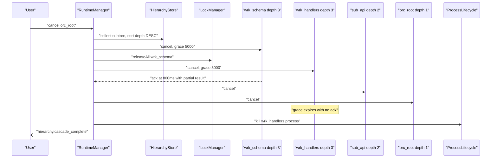

## Result Bubbling

### High-Level Overview

```text
One edge at a time. Persist, then acknowledge. Never skip a level.
```

### Detailed Mermaid Diagram

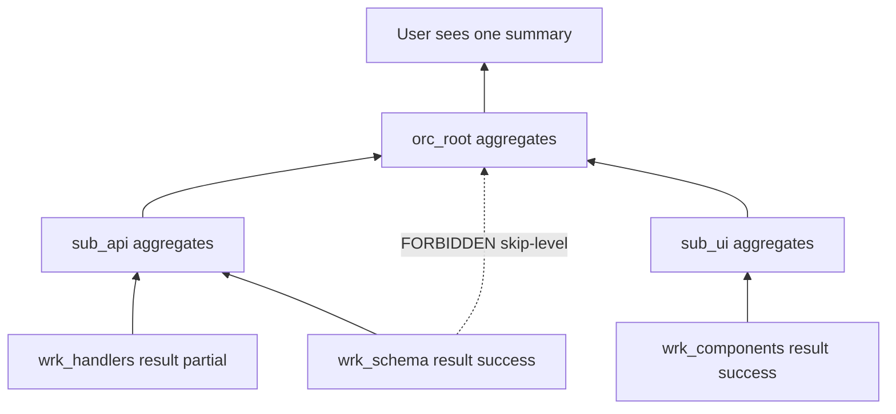

### ASCII Diagram

```text
wrk_schema finishes.

[1] all of wrk_schema's children terminal? it has none (leaf). pass.
[2] build NodeResult { outcome: "success", summary: "...",
                       artifactIds: ["art_9a"] }
[3] build ResultBubbleMessage { fromNodeId: wrk_schema,
                                toNodeId: sub_api, attempt: 1 }
[4] route THROUGH the runtime, never a direct call to sub_api
[5] start 30000 ms ack timer

  ack received:
    -> sub_api PERSISTS result_json FIRST
    -> sub_api THEN acknowledges
    -> refund: sub_api.reservedForChildren -= wrk_schema.allocated
               sub_api.spent               += wrk_schema.spent
    -> wrk_schema -> "completed"
    -> re-run fan-out admission so a queued sibling can start

  no ack:
    attempt 2 after 1000 ms
    attempt 3 after 4000 ms
    attempt 4 after 16000 ms
    still nothing -> does sub_api exist and run?
                       no  -> orphan procedure
                       yes -> wrk_schema failed(ParentUnresponsive)

sub_api MUST NOT report "completed" until BOTH wrk_schema and wrk_handlers
are terminal. That is invariant H12.

sub_api MUST NOT report "success" if wrk_handlers reported "failure" unless
wrk_handlers was marked optional AT DELEGATION TIME, before the outcome was
known.
```

### Sequence Diagram

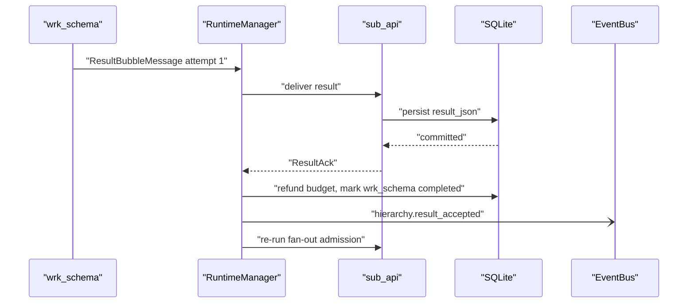

## Orphan Handling

### High-Level Overview

```text
Parent gone plus node not terminal equals orphan.
Preserve artifacts, refund budget, release locks, kill the node.
Never reparent.
```

### Detailed Mermaid Diagram

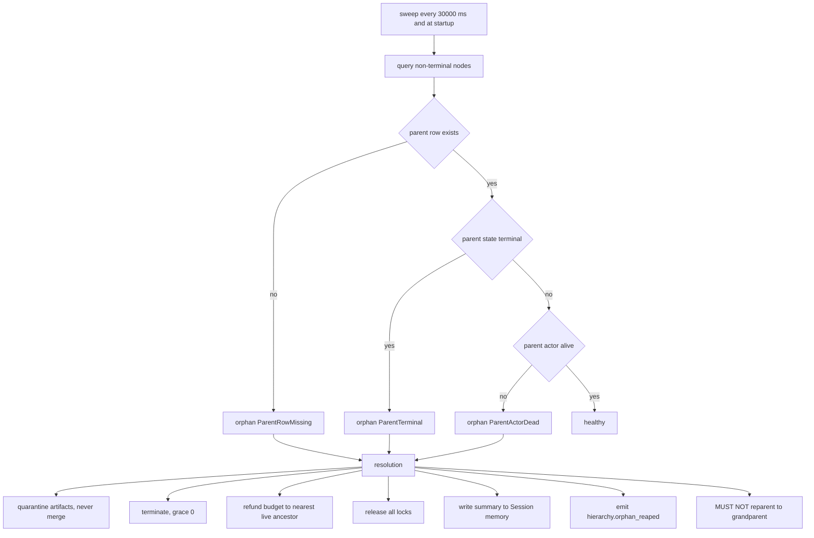

### ASCII Diagram

```text
Runtime crashed mid-session. On restart, BEFORE admitting any node:

  SELECT * FROM hierarchy_nodes
   WHERE state NOT IN ('completed','cancelled','failed')

  node            parentId   parent state  actor  verdict
  --------------  ---------  ------------  -----  -------------------------
  orc_root        user_root  running       dead   orphan ParentActorDead
  sub_api         orc_root   running       dead   orphan ParentActorDead
  wrk_schema      sub_api    running       dead   orphan ParentActorDead
  wrk_handlers    sub_api    cancelled     dead   orphan ParentTerminal

Resolution per node:
  O1 wrk_schema produced art_9a  -> quarantine it, MUST NOT merge.
                                    No live parent can vouch for it.
  O2 terminate all four, grace 0
  O3 do NOT reparent sub_api to user_root. user_root's plan has no slot for
     it and its budget never reserved for it. That would break H5.
  O4 refund each budget to the nearest non-terminal ancestor.
     Here that is user_root for all of them.
  O5 release every lock held by every orphan actor id
  O6 write "Session interrupted: 4 nodes reaped, 1 artifact quarantined"
     to Session memory so the user can see what was lost

emit hierarchy.orphan_reaped x4
```

### Sequence Diagram

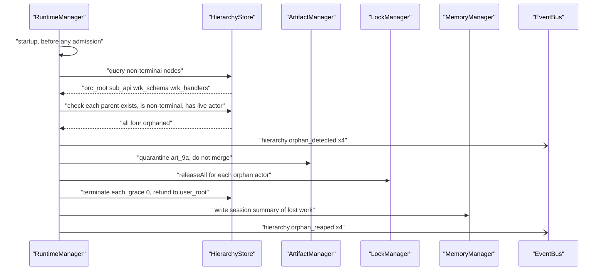

## Related Documents

- [[WorkerHierarchy-Part01]]
- [[WorkerHierarchy-Part03]]
- [[WorkerHierarchy-Part04]]
- [[WorkerHierarchy-Part05]]
- [[WorkerCommunication-Diagrams]]
