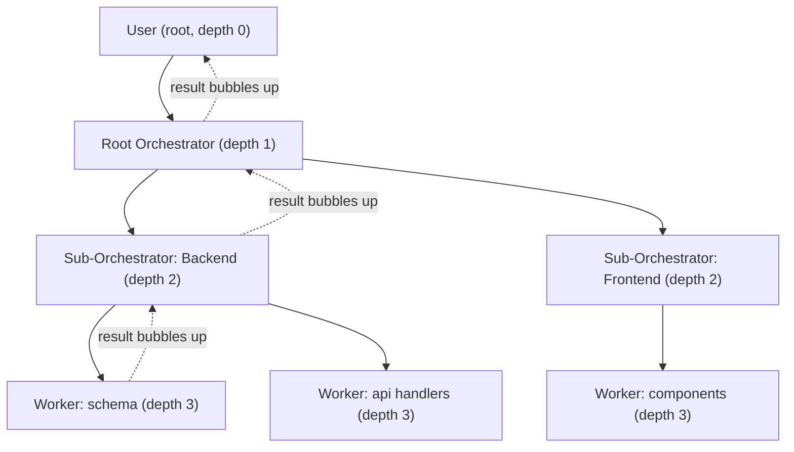

---
title: WorkerHierarchy Specification - Part 01
status: draft
version: 1.0
tags:
  - worker-system
  - worker-hierarchy
  - architecture
related:
  - "[[03-worker-system/README]]"
  - "[[Worker-Part01]]"
  - "[[Orchestrator-Part01]]"
  - "[[WorkerLifecycle-Part01]]"
---

# WorkerHierarchy Specification (Part 01)

## Document Index

```text
WorkerHierarchy-Part01 - Purpose, philosophy, object model, invariants
WorkerHierarchy-Part02 - Tree structure, node kinds, parent and child relationships
WorkerHierarchy-Part03 - Depth limits, fan-out limits, delegation rules
WorkerHierarchy-Part04 - Authority, permission inheritance, budget and cost inheritance
WorkerHierarchy-Part05 - Cascading control, result bubbling, orphans, cycle prevention
WorkerHierarchy-Part06 - Implementation checklist, worked examples, future expansion
WorkerHierarchy-Diagrams - All hierarchy flows rendered four ways
```

# Purpose

The WorkerHierarchy is the tree that describes who asked for work, who is doing the work, and who is accountable for the result.

Eulinx never runs a flat pool of Workers. Every running Worker has exactly one parent, and that parent is accountable for it. The hierarchy is the structure that makes delegation, permission narrowing, budget division, cancellation, and result aggregation all provable rather than hopeful.

The hierarchy is data, not behavior. It is owned by the RuntimeManager and stored in SQLite. Orchestrators read it to plan. The Scheduler reads it to decide admission. The PermissionManager reads it to bound authority. Workers themselves MUST NOT be able to edit it.

# Core Philosophy

A tree is the only shape that makes accountability cheap.

In a graph, "who is responsible for this Worker" requires a search. In a tree, it is one pointer. Every safety property Eulinx needs, permission narrowing, budget division, cascade cancel, orphan detection, follows from the tree property and collapses without it.

```text
The tree is not an organizational chart.
The tree is the authority chain.
Nothing flows up that did not come down.
```

A child is always weaker than its parent. It has less authority, less budget, and a narrower scope. This is the single rule from which most of this document is derived.

# Definition

The WorkerHierarchy is a rooted, directed, acyclic tree stored per Session, in which:

- the root is always the User
- interior nodes are Orchestrators
- leaf nodes are Workers
- every non-root node has exactly one parent
- every node has a depth, a permission set, a budget, and a state
- edges point from parent to child and represent delegated authority

# Responsibilities

The WorkerHierarchy MUST:

- record exactly one parent for every non-root node
- assign every node a stable `HierarchyNodeId` at creation time
- compute and store `depth` at insertion, never at read time
- reject any insertion that would exceed the configured depth limit
- reject any insertion that would exceed the parent's fan-out limit
- reject any insertion whose permission set is not a subset of the parent's
- reject any insertion whose budget is not fully covered by the parent's remaining budget
- reject any edge that would create a cycle
- propagate pause, cancel, and terminate downward to all descendants
- bubble results upward to the parent and only to the parent
- detect and resolve orphaned nodes on runtime restart
- emit an EventBus event for every structural change

The WorkerHierarchy SHOULD:

- keep the tree resident in memory as a `HashMap<HierarchyNodeId, HierarchyNode>` plus a parent index
- store a materialized `path` string for cheap ancestor queries
- expose read-only snapshots to the UI rather than live handles

The WorkerHierarchy MUST NOT:

- allow a Worker to spawn a sibling
- allow a Worker to reparent itself or any other node
- allow a child to hold a permission its parent does not hold
- allow a child to spend budget its parent has not allocated
- allow cross-Session edges
- allow cross-Workspace edges
- allow an Orchestrator to be a leaf that performs implementation work

# Hierarchy Object Model

```ts
type HierarchyNodeId = string;

type HierarchyNodeKind = "user" | "orchestrator" | "worker";

type HierarchyNode = {
  id: HierarchyNodeId;
  kind: HierarchyNodeKind;
  sessionId: string;
  workspaceId: string;
  projectId: string;
  parentId: HierarchyNodeId | null;
  childIds: HierarchyNodeId[];
  depth: number;
  path: string;
  actorId: string | null;
  state: HierarchyNodeState;
  scope: DelegatedScope;
  permissions: PermissionSet;
  budget: BudgetAllocation;
  limits: NodeLimits;
  result: NodeResult | null;
  createdAt: string;
  updatedAt: string;
  terminatedAt: string | null;
};
```

`actorId` is the id of the Worker or Orchestrator this node represents. It is `null` only for the user root node.

`path` is the materialized ancestor path, root first, ids separated by `/`. For a node at depth 3 it looks like `root/orc_a1/orc_b2/wrk_c3`. It MUST be written once at insertion and MUST NOT be recomputed.

```ts
type NodeLimits = {
  maxDepth: number;
  maxDirectChildren: number;
  maxDescendants: number;
  maxConcurrentRunningChildren: number;
};

type DelegatedScope = {
  objective: string;
  allowedPaths: string[];
  deniedPaths: string[];
  allowedToolIds: string[];
  deadlineAt: string | null;
};

type NodeResult = {
  outcome: "success" | "partial" | "failure" | "cancelled";
  summary: string;
  artifactIds: string[];
  producedAt: string;
};
```

# Node States

```text
pending      - node inserted, not yet admitted by Scheduler
admitted     - Scheduler accepted it, actor not yet spawned
running      - actor is live and consuming budget
paused       - actor suspended, budget frozen, descendants also paused
completing   - actor finished, result being bubbled to parent
completed    - result accepted by parent, node is terminal
cancelled    - cancelled by ancestor or user, node is terminal
failed       - actor errored past retry policy, node is terminal
orphaned     - parent vanished, awaiting reaper decision
```

Terminal states are `completed`, `cancelled`, and `failed`. A node in a terminal state MUST NOT gain new children.

# Invariants

The runtime MUST enforce all of the following at every mutation:

```text
H1  Every node except the root has exactly one parent.
H2  node.depth == parent.depth + 1, always. Root depth is 0.
H3  node.path == parent.path + "/" + node.id, always.
H4  child.permissions is a subset of parent.permissions.
H5  sum(child.budget.allocated) <= parent.budget.allocated.
H6  A node MUST NOT appear in its own ancestor path.
H7  parent.childIds.length <= parent.limits.maxDirectChildren.
H8  node.depth <= node.limits.maxDepth.
H9  Only kind == "orchestrator" nodes may have children.
H10 Every node shares sessionId and workspaceId with its parent.
H11 A terminal node MUST have no non-terminal descendants.
H12 A node MUST NOT transition to completed before all children are terminal.
```

Invariant H12 is what makes result bubbling correct. A parent that reports success while a child is still running is reporting a lie.

# Mermaid Diagram



# AI Notes

Do not implement this as a `parentId` column and nothing else. The `depth` and `path` fields are not denormalization for speed, they are the enforcement surface for the depth limit and the cycle check. Without them every insertion needs a recursive walk and implementers will skip it.

Do not let Workers create Workers. A Worker that needs help MUST return a `needs_delegation` result to its parent Orchestrator. Only Orchestrators branch the tree. If your code has `worker.spawnChild()`, it is wrong.

Do not compute permissions by union. Permission inheritance in Eulinx is intersection and narrowing only. A child never gains anything.

Do not treat the User root as decorative. It is a real node. It holds the total budget and the full permission set, and every cascade starts there.

# Related Documents

- [[03-worker-system/README]]
- [[WorkerHierarchy-Part02]]
- [[WorkerHierarchy-Diagrams]]
- [[Worker-Part01]]
- [[Orchestrator-Part01]]
- [[PermissionManager-Part01]]
