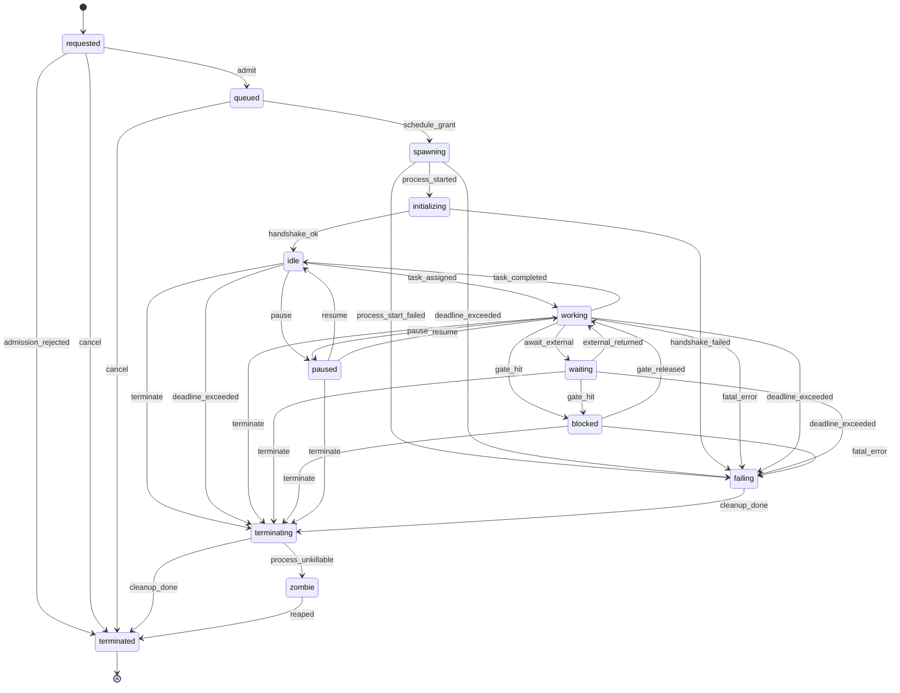
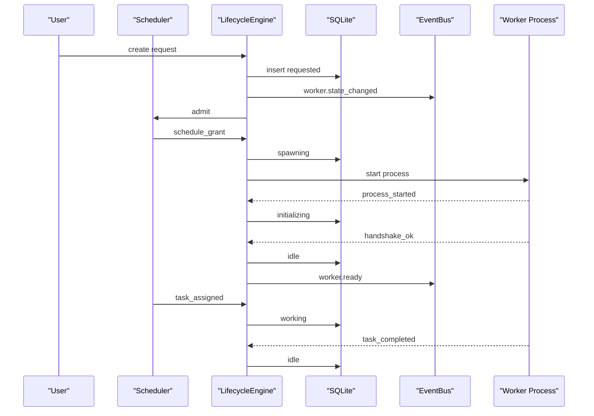
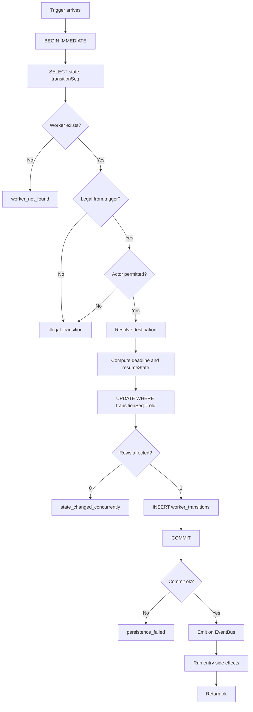
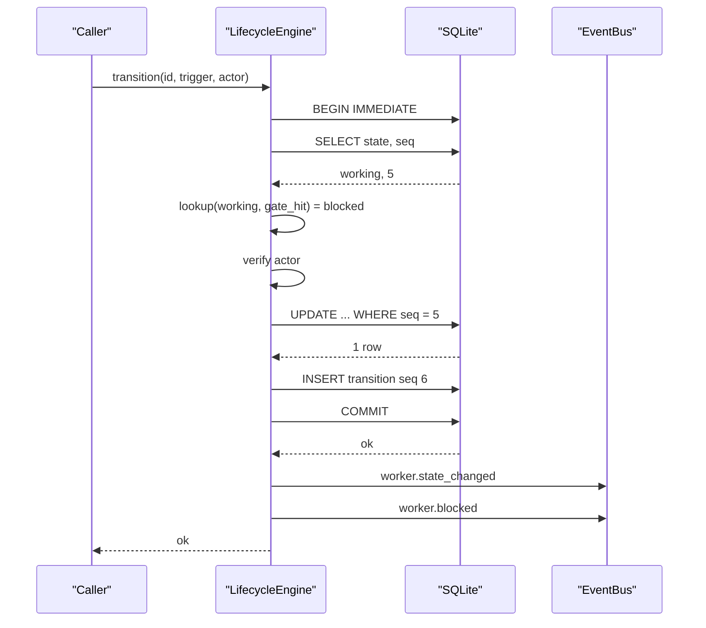
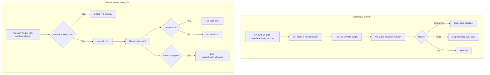
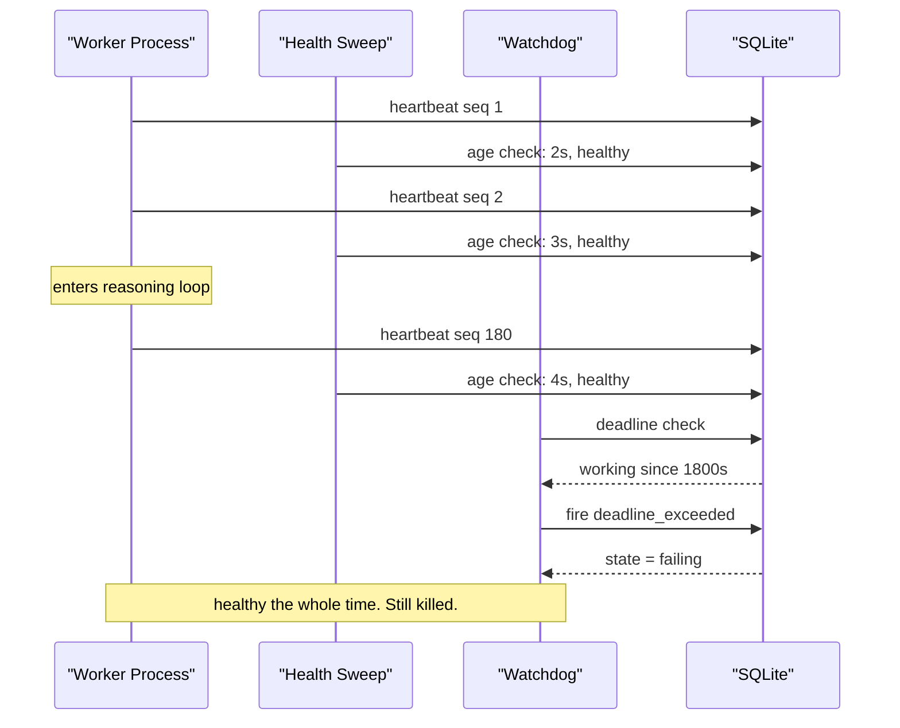
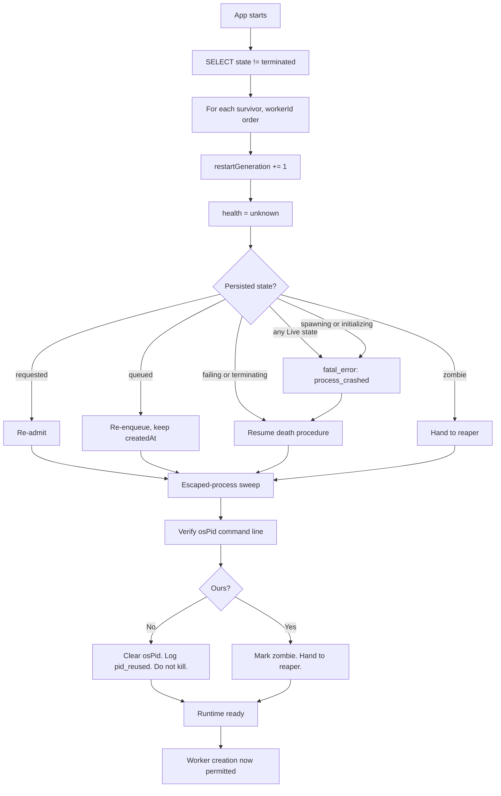
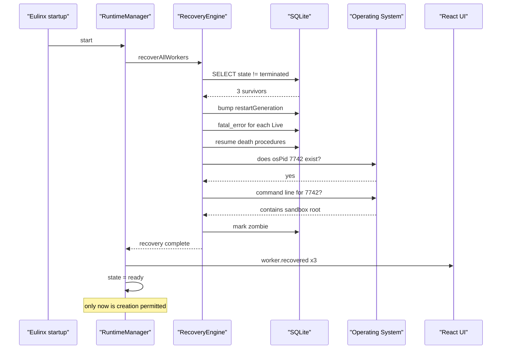

---
title: WorkerLifecycle Diagrams
status: draft
version: 1.0
tags:
  - worker-system
  - worker-lifecycle
  - diagrams
related:
  - "[[WorkerLifecycle-Part01]]"
  - "[[WorkerLifecycle-Part02]]"
---

# WorkerLifecycle Diagrams

## Full State Machine

### High-Level Overview

```text
born -> queued -> started -> alive -> dying -> dead
```

### Detailed Mermaid



### ASCII

```text
  requested
    |  admit
    v
  queued
    |  schedule_grant
    v
  spawning ---------- process_start_failed ---+
    |  process_started                        |
    v                                         |
  initializing ------ handshake_failed -------+
    |  handshake_ok                           |
    v                                         |
  +-------------------------------------+     |
  |  LIVE                               |     |
  |                                     |     |
  |   idle <---- task_completed ----+   |     |
  |    |  task_assigned             |   |     |
  |    v                            |   |     |
  |   working ----------------------+   |     |
  |    |    ^        |                  |     |
  |    |    |        | gate_hit         |     |
  |    |    |        v                  |     |
  |    |    |     blocked               |     |
  |    |    |        |  gate_released   |     |
  |    |    +--------+                  |     |
  |    |                                |     |
  |    | await_external                 |     |
  |    v                                |     |
  |   waiting -- external_returned -->  |     |
  |                                     |     |
  |   paused  (from idle or working)    |     |
  |    |  resume -> resumeState         |     |
  +-------------------------------------+     |
    |  fatal_error / deadline_exceeded        |
    v                                         |
  failing <----------------------------------+
    |  cleanup_done
    v
  terminating ------ process_unkillable ---> zombie
    |  cleanup_done                            |
    v                                          | reaped
  terminated <---------------------------------+
```

### Sequence



## Transition Write Path

### High-Level Overview

```text
trigger -> validate -> persist -> emit -> side effects
```

### Detailed Mermaid



### ASCII

```text
trigger
  |
  v
BEGIN IMMEDIATE
  |
  v
read state + transitionSeq ---- missing ----> worker_not_found
  |
  v
table lookup (from, trigger) -- absent ----> illegal_transition
  |
  v
actor check ------------------- denied ----> illegal_transition
  |
  v
UPDATE ... WHERE transitionSeq = old
  |
  +-- 0 rows ------------------------------> state_changed_concurrently
  |
  v  1 row
INSERT worker_transitions
  |
  v
COMMIT ----------------------- fails -----> persistence_failed
  |
  v  (and only here)
emit event
  |
  v
entry side effects (idempotent)
```

### Sequence



## Timeout and Health Detection

### High-Level Overview

```text
Two sweeps, never merged.
Watchdog watches deadlines and moves state.
Health sweep watches heartbeats and moves nothing.
```

### Detailed Mermaid



### ASCII

```text
WATCHDOG (5s)                    HEALTH SWEEP (10s)
  |                                |
  v                                v
deadline index scan              heartbeat age check
  |                                |
  v                                v
fire ON EXPIRY trigger           missedHeartbeats += 1
  |                                |
  v                                v
STATE MOVES                      health recomputed
                                   |
                                   +-- 0      healthy
                                   +-- 1-2    degraded
                                   +-- 3-5    unresponsive
                                   +-- 6+     unresponsive + fatal_error
                                   |
                                   v
                                 STATE DOES NOT MOVE
                                 (except at 6+)

Heartbeat NEVER resets a deadline.
Progress  NEVER resets a deadline.
Health    NEVER gates an operation.
```

### Sequence



## App Restart Recovery

### High-Level Overview

```text
Nothing alive survives a restart. Only the record does.
```

### Detailed Mermaid



### ASCII

```text
startup
  |
  v
survivors = SELECT WHERE state != terminated
  |
  v
for each (workerId order):
  restartGeneration += 1      <-- stale heartbeats now rejected
  health = unknown
  |
  +-- requested     -> re-admit
  +-- queued        -> re-enqueue (preserve createdAt)
  +-- spawning      -> fatal_error: process_crashed
  +-- initializing  -> fatal_error: process_crashed
  +-- idle          -> fatal_error: process_crashed
  +-- working       -> fatal_error: process_crashed
  +-- waiting       -> fatal_error: process_crashed
  +-- blocked       -> fatal_error: process_crashed  (release gate)
  +-- paused        -> fatal_error: process_crashed
  +-- failing       -> resume death procedure
  +-- terminating   -> resume death procedure
  +-- zombie        -> reaper
  |
  v
escaped-process sweep
  |
  +-- osPid exists?  no  -> clear. clean.
  +-- osPid exists?  yes -> command line contains sandbox root?
                             no  -> clear. pid_reused. DO NOT KILL.
                             yes -> zombie. reaper.
  |
  v
runtime ready        <-- ONLY NOW may a Worker be created
```

### Sequence


</content>
