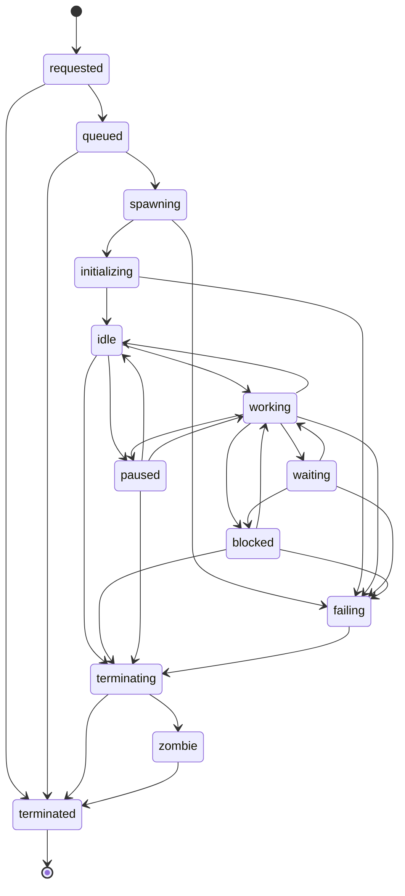

---
title: WorkerLifecycle Specification - Part 01
status: draft
version: 1.0
tags:
  - worker-system
  - worker-lifecycle
  - architecture
related:
  - "[[03-worker-system/README]]"
  - "[[Worker-Part01]]"
  - "[[WorkerCreation-Part01]]"
  - "[[WorkerTermination-Part01]]"
---

# WorkerLifecycle Specification (Part 01)

## Document Index

Part 01 - Purpose, Philosophy, States, and Object Model
Part 02 - Legal Transitions, Triggers, and Illegal Transitions
Part 03 - Per-State Allowed Operations and the Operation Gate
Part 04 - Timeouts, Heartbeats, and Health
Part 05 - Crash, Recovery, and Persistence Across Restart
Part 06 - Implementation Checklist, Examples, and Future Expansion
Diagrams - WorkerLifecycle-Diagrams.md

# Purpose

WorkerLifecycle defines the state machine that every Eulinx Worker follows from the moment it is requested to the moment its record is sealed.

This is the single source of truth for Worker state. No other document, service, or table may define a Worker state, add a state, or permit a transition that this document does not permit.

The state machine exists so that every other part of Eulinx can ask one question and get a reliable answer: **what is this Worker allowed to do right now?**

# Core Philosophy

A Worker is a supervised process, not a conversation.

Lower-capability implementers model a Worker as a chat object with a boolean `isRunning`. That model collapses the moment a Worker stalls, blocks on a lock, waits on a model, gets paused by a user, crashes mid-task, or leaves an OS process behind. Eulinx needs to distinguish all of those. Hence thirteen states, not two.

```text
The state machine is the contract.
Every operation checks the state first.
Every transition is written to SQLite before it is announced.
Every transition emits exactly one event.
There are no silent transitions.
```

The state machine MUST be deterministic. Given a state and a trigger, the next state MUST be computable without reasoning, without heuristics, and without asking a model.

# Definition

WorkerLifecycle is the Worker-owned rule set that defines:

- the thirteen legal Worker states
- every legal transition and the trigger that causes it
- every illegal transition and why it is illegal
- which operations are permitted in which state
- the timeout attached to each state that can stall
- the heartbeat contract between Worker and runtime
- the health model derived from heartbeats and timeouts
- crash detection and recovery
- the lifecycle events emitted on every transition
- how lifecycle state survives an app restart

# Responsibilities

WorkerLifecycle MUST:

- define exactly one current state per Worker at any instant
- reject any transition not in the legal transition table
- persist every transition to SQLite before emitting its event
- emit exactly one event per accepted transition
- attach a timeout to every state listed as stallable
- treat a missed heartbeat as a health signal, never as a transition trigger by itself
- route every abnormal path through `failing` before `terminating`
- guarantee that `terminated` is reachable from every non-terminal state
- reconstruct Worker state on app restart from the persisted record
- record the trigger, actor, and timestamp of every transition

WorkerLifecycle SHOULD:

- expose a pure `canTransition(from, trigger)` function for testing
- expose a pure `allowedOperations(state)` function for the operation gate
- keep transition side effects out of the transition function itself

WorkerLifecycle MUST NOT:

- allow a Worker to occupy two states at once
- allow a state to be inferred from OS process status
- allow AI output to trigger a transition directly
- allow a transition to be skipped because it is "obviously fine"
- add a fourteenth state
- permit any transition out of `terminated`

# Worker States

There are exactly thirteen states.

```text
requested       the creation request exists, nothing has been allocated
queued          admitted, waiting for the Scheduler to grant a slot
spawning        the Scheduler granted; the process is being created
initializing    the process exists; the readiness handshake is running
idle            alive, healthy, holding no task
working         actively reasoning or executing on an assigned task
waiting         suspended on an external response it expects to arrive
blocked         suspended on a gate that requires someone else to act
paused          suspended by explicit human or runtime command
failing         an unrecoverable error occurred; cleanup is being decided
terminating     the death procedure is running
terminated      terminal; the post-mortem record is sealed
zombie          the record says dead; an OS process refuses to die
```

The difference between `waiting` and `blocked` is the most commonly confused pair in this spec, so it is stated as a rule:

- `waiting` means the Worker expects a response from a system that has already accepted the request. A model completion, a tool result, a child Worker's return. Time alone resolves it.
- `blocked` means the Worker cannot proceed until an actor takes an action that has not been requested yet, or has been requested of a human. A lock held by another Worker, a permission escalation awaiting approval, a merge conflict awaiting a decision. Time alone never resolves it.

`waiting` times out into `failing`. `blocked` waits until it is released or cancelled.

# Terminal and Non-Terminal States

```text
Terminal:      terminated
Pre-process:   requested, queued
Transitional:  spawning, initializing, failing, terminating
Live:          idle, working, waiting, blocked, paused
Pathological:  zombie
```

A Worker in a Live state has a process. A Worker in a Pre-process state does not. A Worker in `zombie` has a process it should not have.

# Worker Lifecycle Object Model

```ts
type WorkerState =
  | "requested"
  | "queued"
  | "spawning"
  | "initializing"
  | "idle"
  | "working"
  | "waiting"
  | "blocked"
  | "paused"
  | "failing"
  | "terminating"
  | "terminated"
  | "zombie";

type WorkerLifecycleRecord = {
  workerId: string;
  workspaceId: string;
  sessionId: string;
  state: WorkerState;
  previousState?: WorkerState;
  resumeState?: WorkerState;
  stateEnteredAt: string;
  stateDeadlineAt?: string;
  transitionSeq: number;
  lastHeartbeatAt?: string;
  missedHeartbeats: number;
  health: WorkerHealth;
  terminationReason?: WorkerTerminationReason;
  failureCause?: WorkerFailureCause;
  processId?: string;
  terminalId?: string;
  restartGeneration: number;
  createdAt: string;
  updatedAt: string;
};

type WorkerHealth = "healthy" | "degraded" | "unresponsive" | "unknown";

type WorkerTransition = {
  workerId: string;
  seq: number;
  from: WorkerState;
  to: WorkerState;
  trigger: WorkerTrigger;
  actor: RuntimeActorRef;
  reason: string;
  at: string;
};
```

`resumeState` exists only for `paused`. It records the state the Worker was in when paused, so resume is deterministic rather than guessed. It MUST be null in every other state.

`transitionSeq` is a monotonic per-Worker counter starting at 0. It MUST increment by exactly 1 on every accepted transition. A gap in the sequence means a transition was lost and the Worker MUST be marked `health: "unknown"`.

`restartGeneration` increments each time a Worker record is recovered after an app restart. It is used to distinguish a recovered Worker from its pre-crash self in logs and events.

# Invariants

```text
A Worker has exactly one state at any instant.
A Worker's state is whatever SQLite says it is, not what memory says.
Every transition increments transitionSeq by exactly 1.
Every transition is persisted before its event is emitted.
resumeState is non-null if and only if state is paused.
stateDeadlineAt is non-null if and only if the state is stallable.
processId is non-null in every Live state and in zombie.
processId is null in requested and queued.
terminated is reachable from every non-terminal state.
Nothing transitions out of terminated.
failing always leads to terminating.
zombie always leads to terminated.
A Worker in terminated holds no locks, no process, and no terminal.
```

# Mermaid Diagram



# AI Notes

Do not derive Worker state from the OS process. The OS knows whether a process exists. It does not know whether a Worker is `blocked` or `waiting`, and those need different handling. The process is evidence, not truth.

Do not add an `error` state. `failing` is the error state, and it is transitional on purpose: a Worker that has failed must still release locks, flush artifacts, and reap children. A terminal error state would strand all of that.

Do not merge `waiting` and `blocked`. If you do, you will either time out a Worker that was correctly waiting on a human, or hang forever on a model call that silently died.

Do not let `paused` guess where to resume. That is what `resumeState` is for.

Do not emit the event before the SQLite write. If the app dies between the two, the UI will show a state that the database never recorded, and recovery will disagree with the user's screen.

# Related Documents

- [[03-worker-system/README]]
- [[WorkerLifecycle-Part02]]
- [[WorkerLifecycle-Diagrams]]
- [[WorkerCreation-Part01]]
- [[WorkerTermination-Part01]]
- [[Worker-Part01]]
</content>
