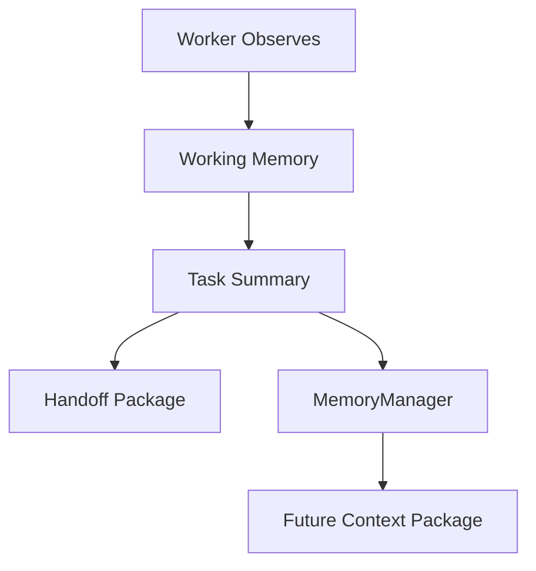

# WorkerMemory Diagrams



```text
Worker Memory
  -> summarize
  -> redact
  -> promote if useful
  -> forget if stale/sensitive
```

# Related Documents

- [[WorkerMemory-Part01]]
- [[WorkerMemory-Part06]]

