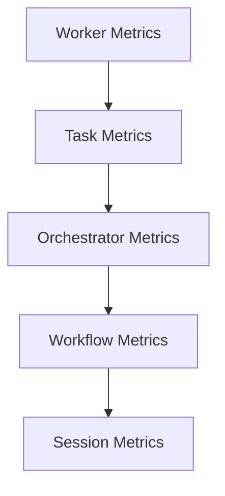

# WorkerMetrics Diagrams



```text
Worker counters
  -> aggregate
  -> threshold
  -> dashboard
  -> runtime decision
```

# Related Documents

- [[WorkerMetrics-Part01]]
- [[WorkerMetrics-Part05]]

