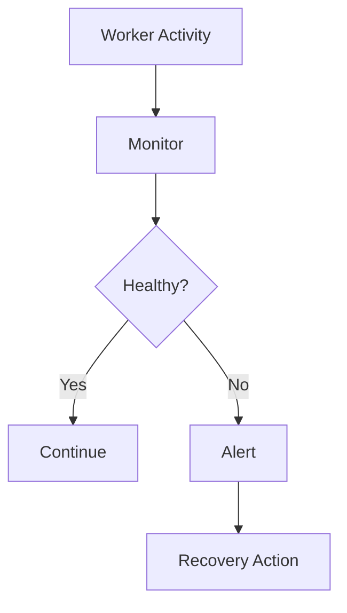

# WorkerMonitoring Diagrams


```mermaid
flowchart TD
  A["Worker Activity"] --> B["Monitor"]
  B --> C{"Healthy?"}
  C -->|"Yes"| D["Continue"]
  C -->|"No"| E["Alert"]
  E --> F["Recovery Action"]
```

```text
Observe
  -> classify
  -> alert
  -> recover
  -> record
```

# Related Documents

- [[WorkerMonitoring-Part01]]
- [[WorkerMonitoring-Part05]]

