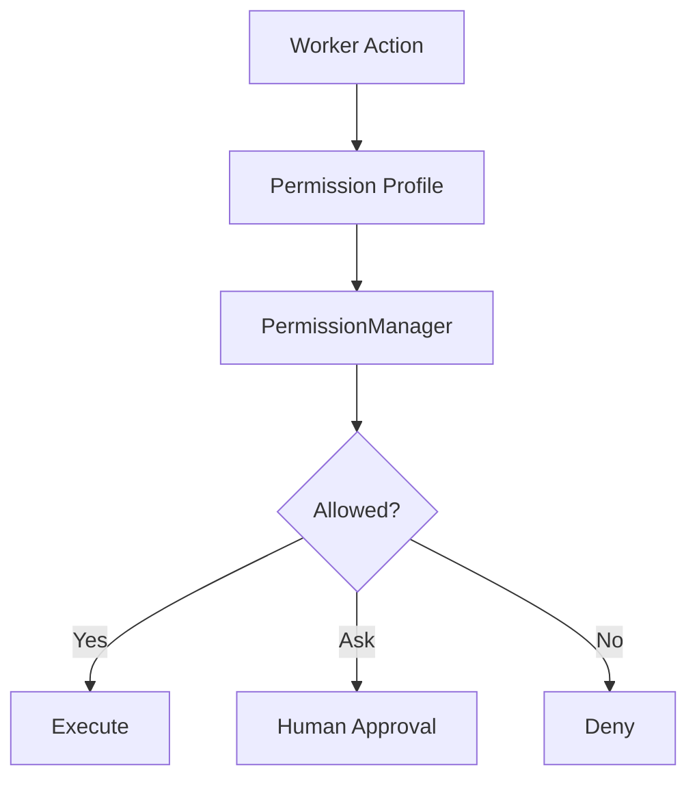

# WorkerPermissions Diagrams


```mermaid
flowchart TD
  A["Worker Action"] --> B["Permission Profile"]
  B --> C["PermissionManager"]
  C --> D{"Allowed?"}
  D -->|"Yes"| E["Execute"]
  D -->|"Ask"| F["Human Approval"]
  D -->|"No"| G["Deny"]
```

```text
Worker
  -> profile
  -> grant
  -> constraint
  -> decision
```

# Related Documents

- [[WorkerPermissions-Part01]]
- [[WorkerPermissions-Part06]]

