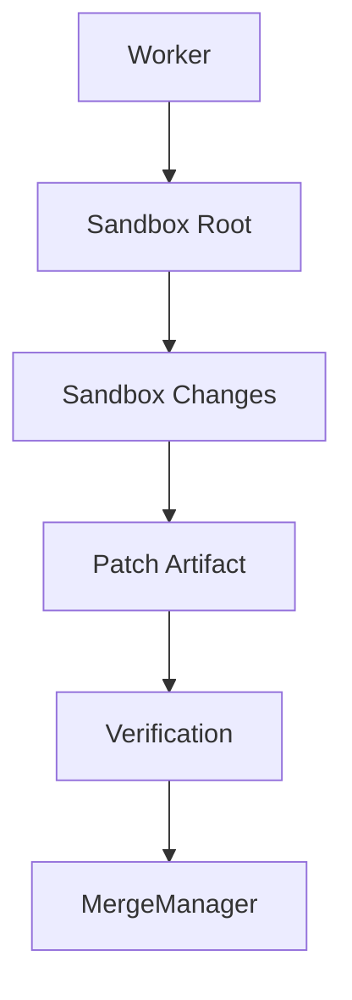

# WorkerSandbox Diagrams


```mermaid
flowchart TD
  A["Worker"] --> B["Sandbox Root"]
  B --> C["Sandbox Changes"]
  C --> D["Patch Artifact"]
  D --> E["Verification"]
  E --> F["MergeManager"]
```

```text
Sandbox
  -> isolate
  -> work
  -> diff
  -> artifact
  -> verify
  -> merge
```

# Related Documents

- [[WorkerSandbox-Part01]]
- [[WorkerSandbox-Part06]]

