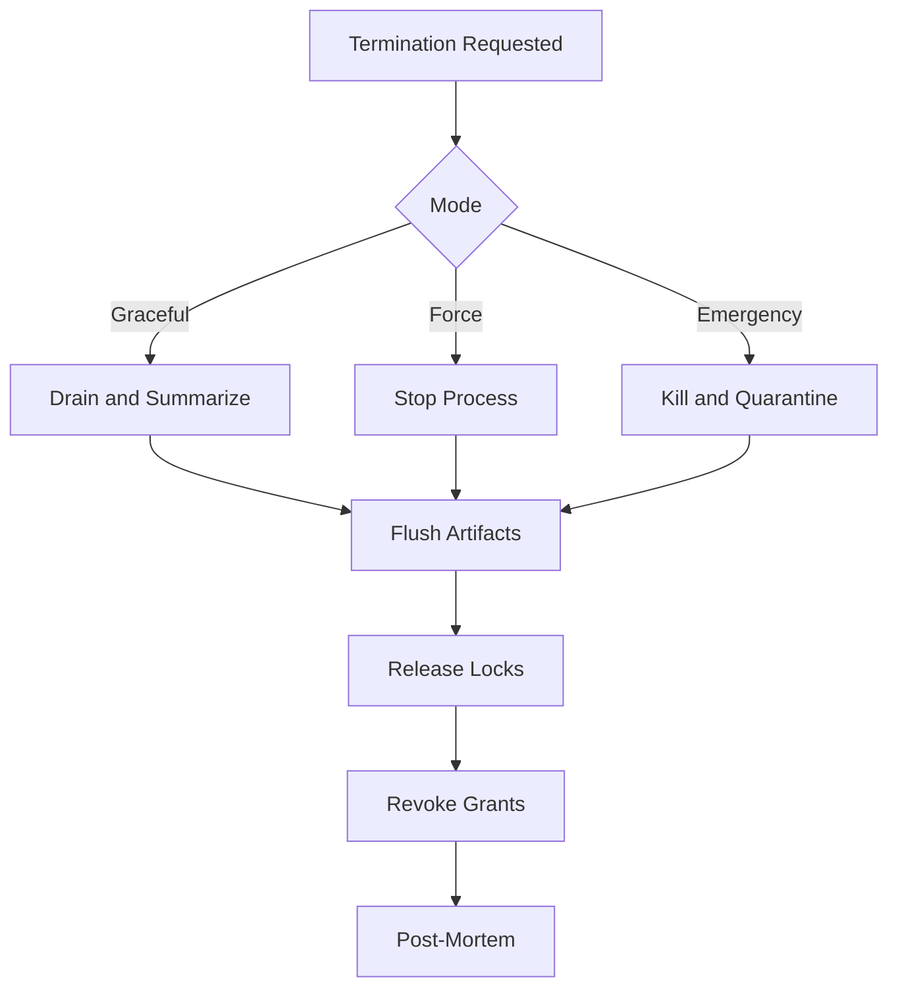

# WorkerTermination Diagrams



```text
Stop Worker
  -> preserve useful output
  -> cleanup resources
  -> record why
  -> notify parent
```

# Related Documents

- [[WorkerTermination-Part01]]
- [[WorkerTermination-Part05]]

