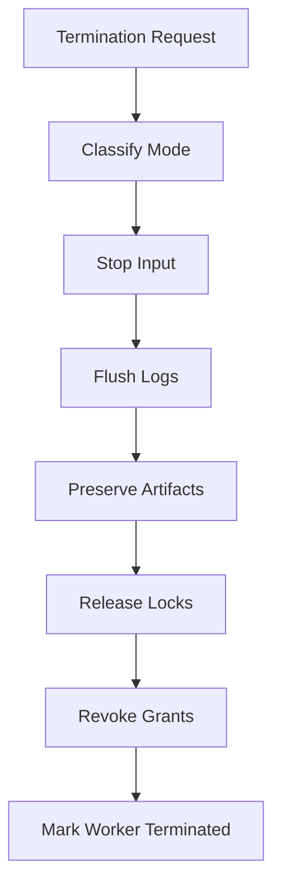

---
title: WorkerTermination Specification - Part 01
status: draft
version: 1.0
tags:
  - worker-system
  - worker-termination
  - lifecycle
related:
  - "[[WorkerLifecycle-Part01]]"
  - "[[WorkerSpawner-Part01]]"
  - "[[ProcessLifecycle-Part01]]"
---

# WorkerTermination Specification (Part 01)

## Document Index

Part 01 - Purpose, Philosophy, and Termination Types
Part 02 - Graceful Shutdown, Forced Kill, and Cleanup
Part 03 - Artifacts, Memory, Logs, and Handoff
Part 04 - Failures, Events, UI, and Implementation Checklist

# Purpose

WorkerTermination defines how Eulinx stops Workers safely.

A Worker is usually backed by an AI CLI terminal, process, context package, permissions, artifacts, memory, and runtime state. Stopping it is not as simple as closing a terminal.

Termination must preserve useful work, clean up resources, revoke temporary power, and leave a clear history.

# Philosophy

Eulinx should treat Worker termination as a controlled lifecycle transition.

The Runtime should avoid:

- losing partial artifacts
- leaving child processes alive
- leaving locks held
- leaving permissions active
- losing logs
- hiding why the Worker stopped

# Termination Types

```text
natural_completion
user_stop
orchestrator_stop
task_cancelled
runtime_shutdown
permission_violation
budget_exhausted
timeout
process_crash
emergency_kill
```

# Termination Request

```ts
type WorkerTerminationRequest = {
  id: string;
  workerId: string;
  workspaceId: string;
  requestedBy: "user" | "orchestrator" | "runtime" | "scheduler" | "permission_manager";
  reason: string;
  mode: "graceful" | "force" | "emergency";
  preserveArtifacts: boolean;
  preserveLogs: boolean;
  createdAt: string;
};
```

# Required Guarantees

Worker termination MUST:

- update Worker lifecycle state
- stop or detach terminal input
- stop owned processes when required
- release locks
- revoke temporary permissions
- flush logs
- preserve artifacts
- summarize memory if configured
- emit events

# Mermaid Diagram



# AI Notes

Do not implement Worker termination as only `kill process`.

Worker termination is a runtime cleanup and history-preservation operation.

# Related Documents

- [[WorkerTermination-Part02]]
- [[WorkerLifecycle-Part01]]
- [[ProcessLifecycle-Part01]]

