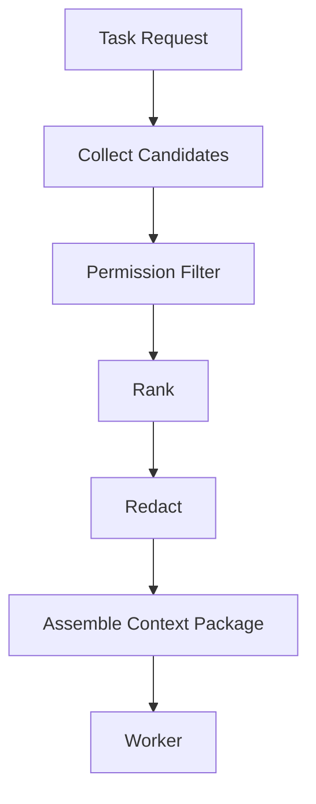

# ContextInjection Diagrams

```mermaid
flowchart TD
  A["Task Request"] --> B["Collect Candidates"]
  B --> C["Permission Filter"]
  C --> D["Rank"]
  D --> E["Redact"]
  E --> F["Assemble Context Package"]
  F --> G["Worker"]
```

