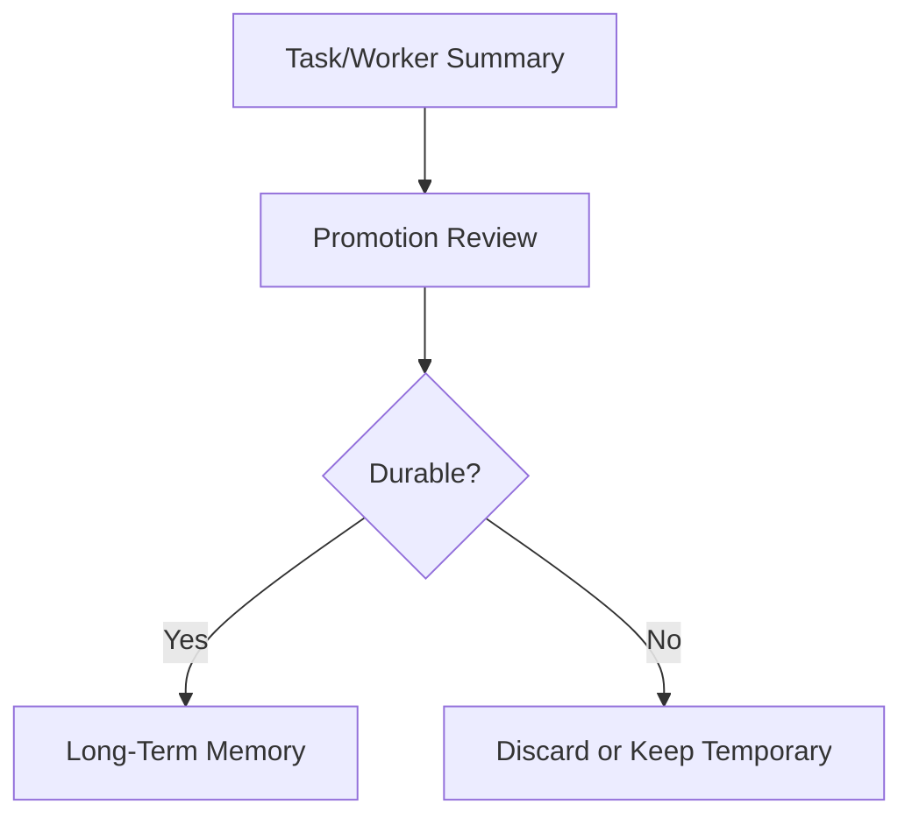

# LongTermMemory Diagrams

```mermaid
flowchart TD
  A["Task/Worker Summary"] --> B["Promotion Review"]
  B --> C{"Durable?"}
  C -->|"Yes"| D["Long-Term Memory"]
  C -->|"No"| E["Discard or Keep Temporary"]
```

