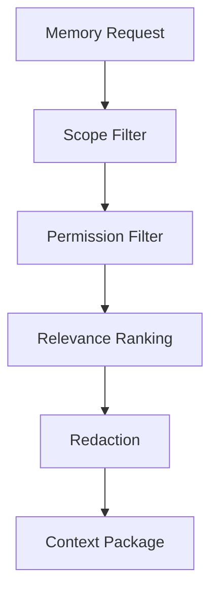

# MemoryArchitecture Diagrams


```mermaid
flowchart TD
  A["Memory Request"] --> B["Scope Filter"]
  B --> C["Permission Filter"]
  C --> D["Relevance Ranking"]
  D --> E["Redaction"]
  E --> F["Context Package"]
```

```text
Memory
  -> scope
  -> filter
  -> rank
  -> redact
  -> inject
```

# Related Documents

- [[MemoryArchitecture-Part01]]

