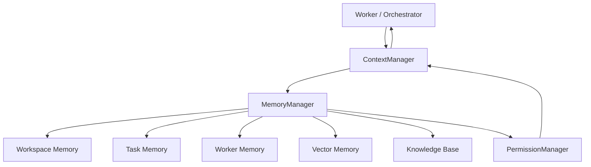

---
title: 04 Memory
status: draft
version: 1.0
tags:
  - memory
  - architecture
  - Eulinx
  - flow:P04-STATE-RUNTIME
  - flow:P07-SESSION-CTX
  - flow:P09-MEM-STM
  - flow:P09-MEM-LTM
  - flow:P09-MEM-EPISODIC
  - flow:P09-MEM-SEMANTIC
  - flow:P09-MEM-WORKING
  - flow:P09-MEM-EMBED
  - flow:P09-MEM-SUMMARY
  - flow:P09-MEM-COMPRESS
  - flow:P09-MEM-PRUNE
  - flow:P09-MEM-POLICIES
  - flow:P09-MEM-MANAGER
  - flow:P12-PROMPT-CTXBUILD
  - flow:P17-CLI-MEMORY
  - flow:P18-UI-MEMBROWSER
related:
  - "[[Memory-Part01]]"
  - "[[MemoryManager-Part01]]"
  - "[[ContextManager-Part01]]"
  - "[[01-core-concepts/README]]"
  - "[[02-runtime/README]]"
  - "[[03-worker-system/README]]"
  - "[[06-workflow-engine/README]]"
  - "[[08-database/README]]"
---

# 04 Memory

## Purpose

The `04-memory` folder defines Eulinx's memory architecture.

Memory is how Eulinx preserves useful information across Workers, Tasks, Sessions, Workflows, and Projects without flooding every AI terminal with every previous conversation.

Eulinx memory must be scoped, searchable, explainable, permissioned, redacted, and useful to lower-cost coding models.

## Folder Structure

```text
04-memory/
  README.md
  MemoryArchitecture/
    MemoryArchitecture-Part01.md ... Part04.md
    MemoryArchitecture-Diagrams.md
  WorkspaceMemory/
    WorkspaceMemory-Part01.md ... Part03.md
    WorkspaceMemory-Diagrams.md
  WorkerMemory/
    WorkerMemory-Part01.md ... Part03.md
    WorkerMemory-Diagrams.md
  TemporaryMemory/
    TemporaryMemory-Part01.md ... Part02.md
    TemporaryMemory-Diagrams.md
  LongTermMemory/
    LongTermMemory-Part01.md ... Part03.md
    LongTermMemory-Diagrams.md
  ContextInjection/
    ContextInjection-Part01.md ... Part04.md
    ContextInjection-Diagrams.md
  VectorMemory/
    VectorMemory-Part01.md ... Part04.md
    VectorMemory-Diagrams.md
  KnowledgeBase/
    KnowledgeBase-Part01.md ... Part04.md
    KnowledgeBase-Diagrams.md
  Replay/
    Replay-Part01.md ... Part03.md
    Replay-Diagrams.md
  Snapshots/
    Snapshots-Part01.md ... Part03.md
    Snapshots-Diagrams.md
  History/
    History-Part01.md ... Part03.md
    History-Diagrams.md
  MemoryRules/
    MemoryRules-Part01.md ... Part02.md
    MemoryRules-Diagrams.md
```

## Total Size

```text
12 memory topic folders
35 specification parts
12 diagram files
1 root README
```

## Core Principles

Memory MUST be scoped.

Memory MUST respect Workspace boundaries.

Memory MUST NOT expose secrets by default.

Memory SHOULD be summarized before injection.

Memory SHOULD prefer references to Artifacts over raw copied content.

Memory MUST be auditable when sensitive data is read.

Memory MUST be deletable or forgettable according to retention policy.

## Architecture Overview



## AI Notes

Do not treat memory as a single global chat history.

Eulinx memory exists to feed the right context to the right Worker at the right time.

# Related Documents

- [[Memory-Part01]]
- [[MemoryManager-Part01]]
- [[ContextManager-Part01]]
- [[01-core-concepts/README]]
- [[02-runtime/README]]
- [[03-worker-system/README]]
- [[06-workflow-engine/README]]
- [[08-database/README]]

