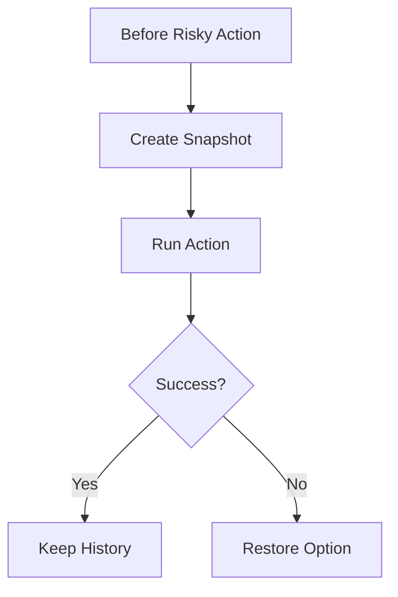

# Snapshots Diagrams

```mermaid
flowchart TD
  A["Before Risky Action"] --> B["Create Snapshot"]
  B --> C["Run Action"]
  C --> D{"Success?"}
  D -->|"Yes"| E["Keep History"]
  D -->|"No"| F["Restore Option"]
```

