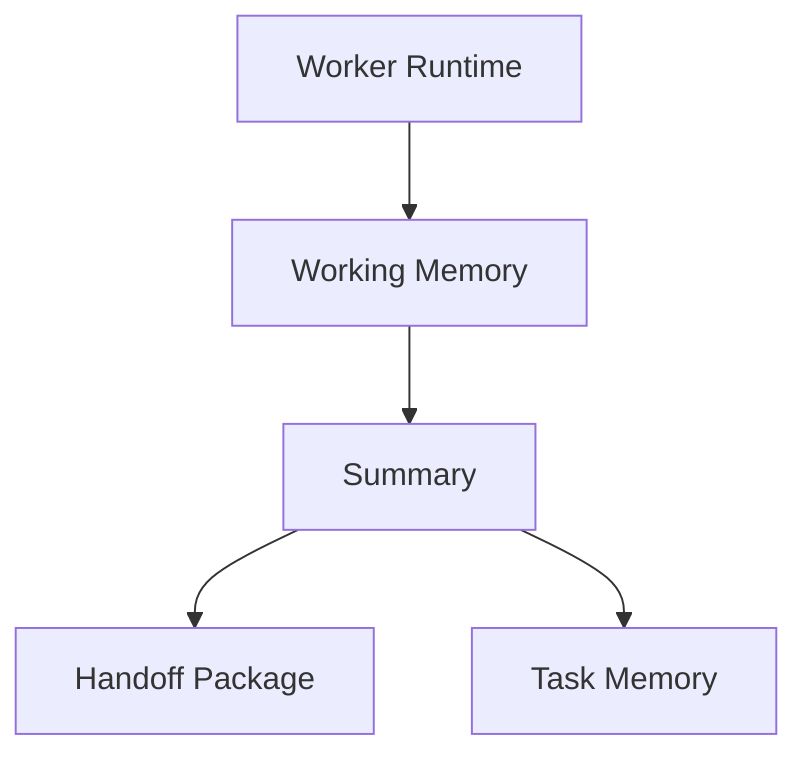

# WorkerMemory Diagrams


```mermaid
flowchart TD
  A["Worker Runtime"] --> B["Working Memory"]
  B --> C["Summary"]
  C --> D["Handoff Package"]
  C --> E["Task Memory"]
```

```text
Observe -> remember briefly -> summarize -> handoff or forget
```

