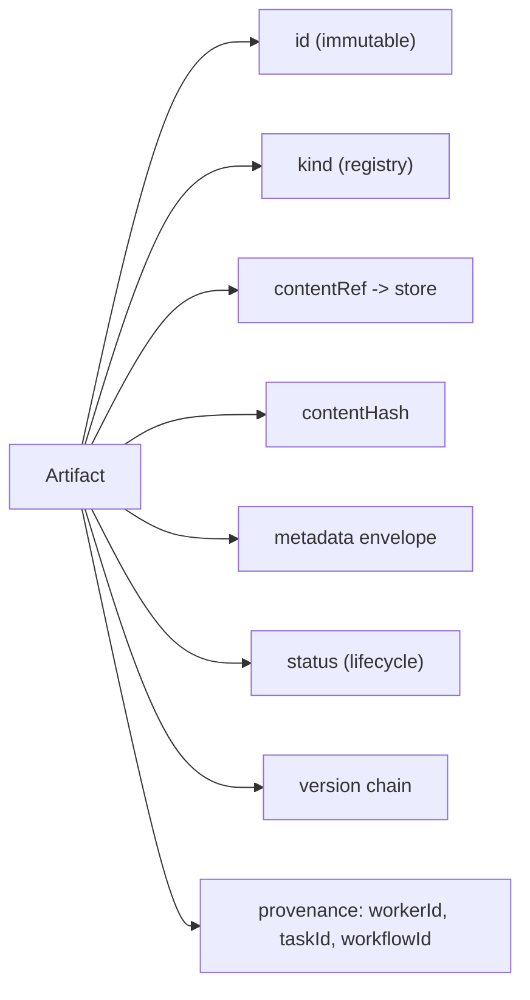
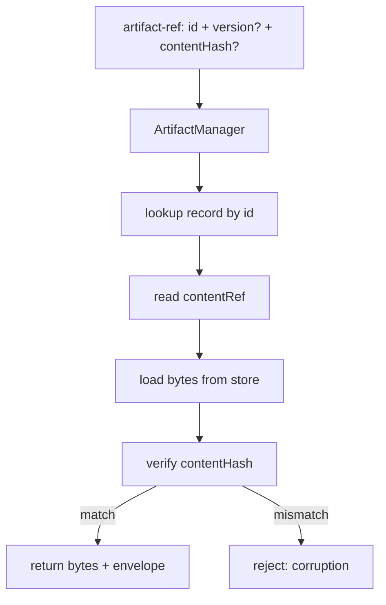

# ArtifactArchitecture Diagrams

## Artifact Object And Its Envelope



## Content Addressing And Resolution



## Proposed vs Trusted Boundary

```text
  proposed side                          trusted side
  ---------------------------------      -------------------------------
  Builder/Worker emits Artifact
        |
        v
  ArtifactManager: store + validate
        |
        v
  Verification: Verdict
        |
        +-- fail (deterministic) -----> rejected, never merged
        |
        +-- pass ---------------------> MergeManager acquires lock
                                            |
                                            v
                                       workspace changes
```

## AI Notes

Do not draw the Artifact as a file. Draw it as a record wrapped around a content reference, because that is what it is.

# Related Documents

- [[ArtifactArchitecture-Part01]]
- [[ArtifactArchitecture-Part02]]
- [[ArtifactArchitecture-Part03]]
- [[ArtifactArchitecture-Part04]]
- [[ArtifactArchitecture-Part05]]
