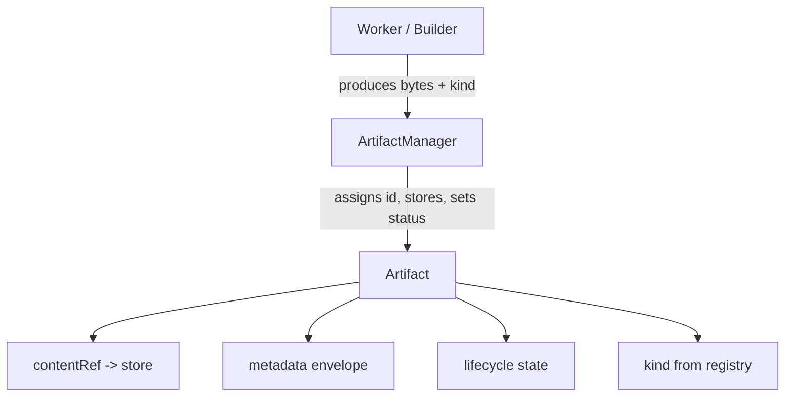

---
title: ArtifactArchitecture Specification - Part 01
status: draft
version: 1.0
tags:
  - artifacts
  - artifact-architecture
  - artifact-contract
related:
  - "[[05-artifacts/README]]"
  - "[[ArtifactArchitecture-Diagrams]]"
  - "[[ArtifactLifecycle-Part01]]"
  - "[[02-runtime/ArtifactManager/ArtifactManager-Part01]]"
---

# ArtifactArchitecture Specification (Part 01)

## Document Index

Part 01 - What an Artifact IS, the Artifact contract, and the propose/don't-mutate boundary
Part 02 - The metadata envelope (every field and its meaning)
Part 03 - Content addressing, immutability, and the content reference
Part 04 - Artifact kinds catalog and the type registry
Part 05 - Addressing, resolution, and how everything refers to an Artifact

# Purpose

ArtifactArchitecture defines the core object that the entire artifact system revolves around: the Artifact.

An Artifact is the unit of proposed work in Eulinx. It is the thing a Builder produces, a Verifier inspects, and the MergeManager applies. Everything else in this section — lifecycle, relationships, versioning, patch format, the typed kinds — is built on this one definition.

# What An Artifact IS

An Artifact is a content-addressed, metadata-rich, immutable record of a piece of work produced by a Worker, Tool, Orchestrator, or Runtime service.

It is not:

- a direct file write to the project
- a chat message
- a temporary buffer
- a mutable draft that someone edits in place
- an opinion (that is a Verdict, not an Artifact)

The defining property is that an Artifact lives on the proposed side of the boundary. It can be inspected, verified, rejected, versioned, related, and eventually merged — but only by the MergeManager, and only after verification.

# The Artifact Contract

Every Artifact obeys the same contract regardless of `kind`:

- It has a stable `id` assigned by the ArtifactManager at creation.
- It carries a `kind` drawn from the type registry.
- It carries a `contentRef` pointing to where its bytes live.
- It carries a `status` from the lifecycle state machine.
- It is immutable once `created` is reached; revisions produce new versions.
- It is addressed by reference, never by embedding its bytes into another record.
- It records provenance: who produced it, under which task, workflow, execution, and workspace.

The contract deliberately says nothing about what the bytes contain. That is the job of the typed kind specs (CodeArtifacts, MarkdownArtifacts, JSONArtifacts, ImageArtifacts, TestArtifacts, PatchArtifacts). The contract guarantees that whatever the bytes are, they are findable, traceable, verifiable, and mergeable.

# The Propose / Don't-Mutate Boundary

The single most important rule in Eulinx is the boundary between proposed and trusted state:

```text
proposed side                          trusted side
-------------                          -----------
Builder emits Artifact   ------>       (nothing happens to project)
ArtifactManager stores it  ------>     (still nothing)
Verification checks it    ------>      (still nothing)
MergeManager applies it   ------>      project changes, under lock + permission
```

A Worker may be granted writes under explicit permission. A Builder MUST NOT be. The Artifact is the only thing that crosses from the proposed side to the trusted side, and it crosses only through the MergeManager after verification.

# Invariants

```text
An Artifact is created by ArtifactManager, never hand-written by a Worker.
An Artifact's bytes are immutable after creation.
An Artifact is referenced by id, not copied into other records.
An Artifact's status moves forward only through the lifecycle state machine.
An Artifact's provenance is recorded at creation and cannot be altered.
An Artifact is resolved through ArtifactManager, never by reading the filesystem directly.
```

# Mermaid Diagram



# AI Notes

Do not model an Artifact as "a file with a name". The file is only the `contentRef`. The Artifact is the record around it: id, metadata, status, version, provenance.

Do not let a Worker that happens to write a file call that file an Artifact. An Artifact is created through the ArtifactManager with its full envelope; a stray file on disk is not an Artifact and cannot be merged.

Do not weaken immutability. The refine loop depends on old Artifacts staying exactly as they were so Verifiers and Replay can agree on what was checked.

# Related Documents

- [[05-artifacts/README]]
- [[ArtifactArchitecture-Part02]]
- [[ArtifactArchitecture-Diagrams]]
- [[ArtifactLifecycle-Part01]]
- [[02-runtime/ArtifactManager/ArtifactManager-Part01]]
- [[06-workflow-engine/BuilderNodes/BuilderNodes-Part01]]
