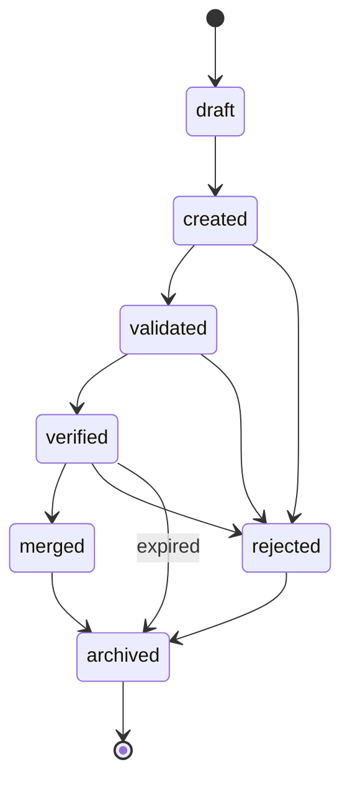
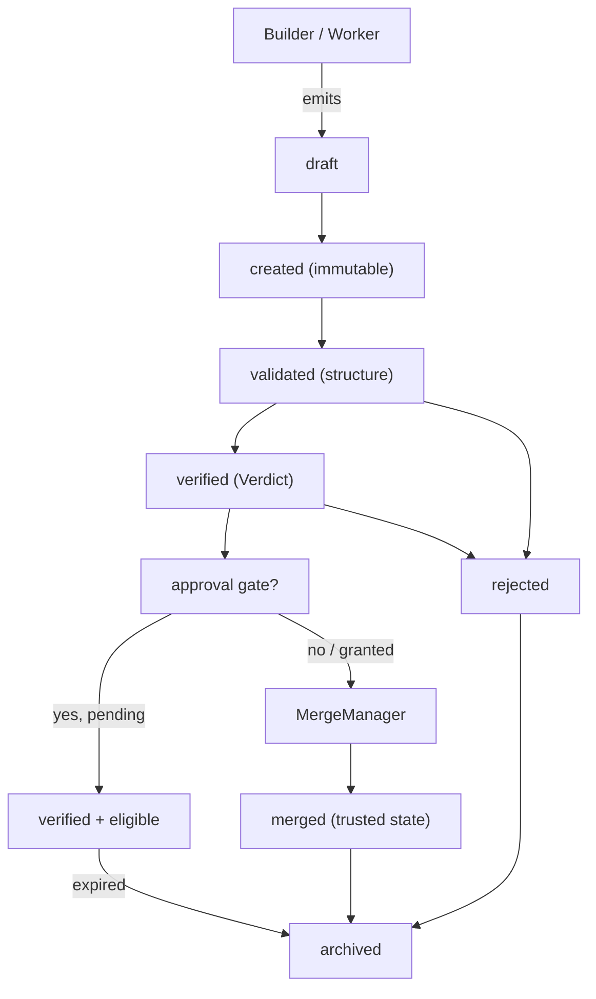

# ArtifactLifecycle Diagrams

## State Machine



## Lifecycle To Trusted State



## Merge Transition Detail

```text
verified
  |
  +-- approval required? -> wait for human -> granted?
  |                                 |
  |                                 v
  |                              acquire lock
  |                                 |
  +-- no approval      -> acquire lock
                                        |
                                        v
                                   conflict-free?
                                        |
                              +---------+---------+
                              |                   |
                           yes                  no
                            |                   |
                            v                   v
                        apply hunks      escalate / reject (fail-closed)
                            |
                            v
                        status = merged
```

## AI Notes

Do not draw `rejected` as reversible to `merged`. Once rejected, the only forward path is a new Artifact.

# Related Documents

- [[ArtifactLifecycle-Part01]]
- [[ArtifactLifecycle-Part02]]
- [[ArtifactLifecycle-Part03]]
- [[ArtifactLifecycle-Part04]]
- [[ArtifactLifecycle-Part05]]
- [[ArtifactLifecycle-Part06]]
