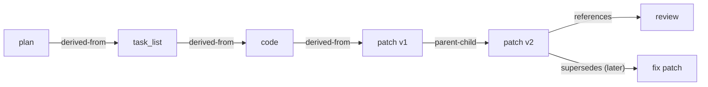
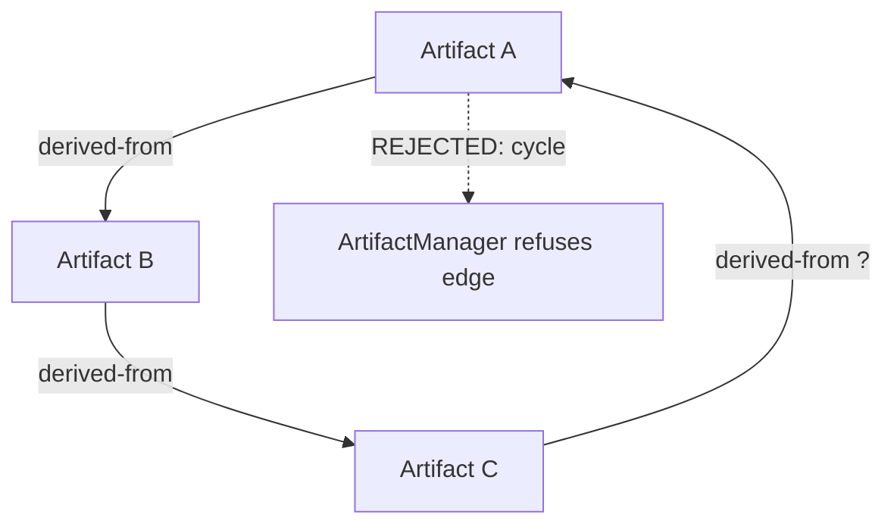

# ArtifactRelationships Diagrams

## Relationship Types



## Context Injection Via Relationships

```text
Worker continuing a task
        |
        v
resolve task's latest descendant Artifacts (relationship walk)
        |
        v
filter by sensitivity clearance
        |
        v
inject minimal relevant set (not full transcript)
```

## Cycle Rejection



## AI Notes

Do not draw relationships as free text inside Artifacts. They are explicit, queryable edges.

# Related Documents

- [[ArtifactRelationships-Part01]]
- [[ArtifactRelationships-Part02]]
- [[ArtifactRelationships-Part03]]
