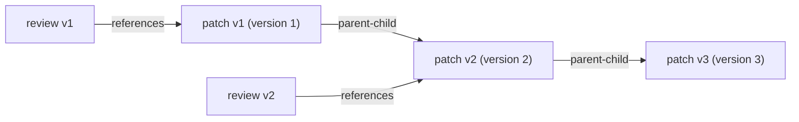
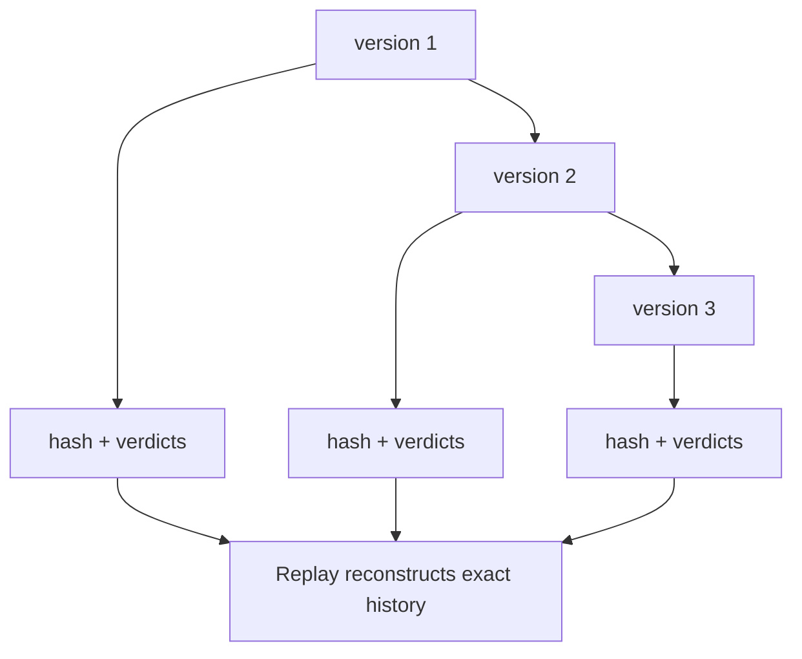

# ArtifactVersioning Diagrams

## Version Chain



## Refine Loop -> Versions -> Merge

```text
base draft -> version 1
critic reviews v1
refine worker -> version 2 (parent = v1)
judge diffs v1..v2, scores
   |
   +-- improve & under budget -> version 3 ...
   +-- no improvement / budget hit -> select best verified version -> MergeManager
```

## Reconstruction



## AI Notes

Do not draw versions as mutations of one object. Draw them as a chain of distinct immutable Artifacts.

# Related Documents

- [[ArtifactVersioning-Part01]]
- [[ArtifactVersioning-Part02]]
- [[ArtifactVersioning-Part03]]
