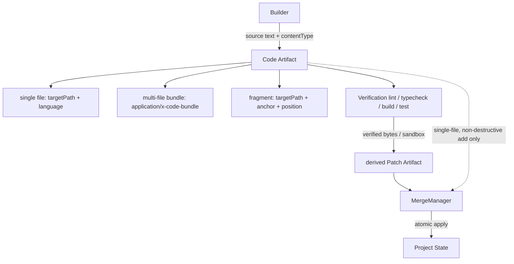

# CodeArtifacts Diagrams



```text
Builder --source--> Code Artifact
  shape: single | bundle | fragment
  language via contentType (no per-language core logic)
        |
        v
  Verification (lint/typecheck/build/test) against bytes or sandbox
        |
        v
  derived Patch Artifact --MergeManager--> Project (atomic)
  code IS-USUALLY merged via patch, not directly
  direct merge only: single-file, non-destructive, allowing profile
```

# Related Documents

- [[CodeArtifacts-Part01]]
- [[ArtifactArchitecture-Part01]]
- [[Verification-Part01]]
- [[MergeFlow-Part01]]
- [[ArtifactManager-Part01]]
