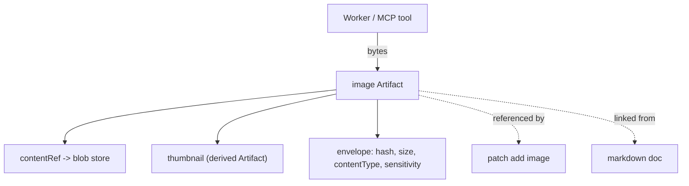

# ImageArtifacts Diagrams

## Storage And References



## Binary Constraints

```text
image Artifact
  |
  +-- stored as blob (never inline)
  +-- contentHash over raw bytes
  +-- verified: format + size policy only (no lint/typecheck)
  +-- diff: similarity score, not lines
  +-- embed: metadata only by default
  +-- merge: copy bytes to targetPath via MergeManager
```

## AI Notes

Do not draw images as if they were text Artifacts. They have no lines to diff and no lint; show the blob + reference model.

# Related Documents

- [[ImageArtifacts-Part01]]
- [[ImageArtifacts-Part02]]
- [[PatchArtifacts-Part02]]
- [[ArtifactArchitecture-Part03]]
