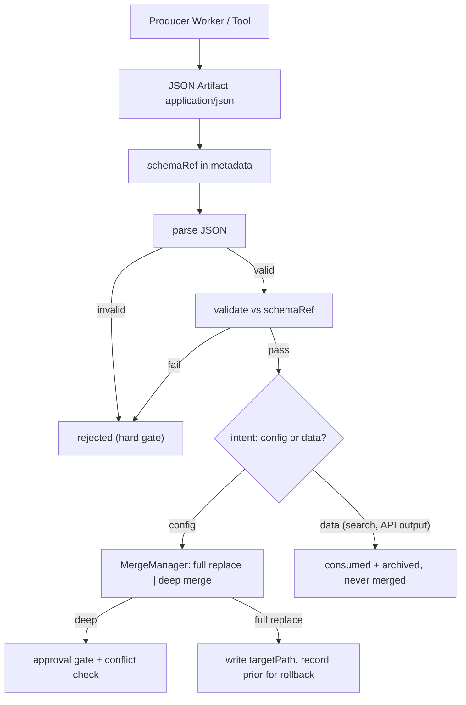

# JSONArtifacts Diagrams



```text
JSON Artifact (application/json)
  -> parse (hard gate; invalid => rejected)
  -> if schemaRef: validate (hard gate; fail => not merged)
  -> intent decides merge:
       config  -> MergeManager (full replace default;
                  deep merge = explicit + approval-gated + conflict-aware)
       data    -> consumed by Worker, archived, NEVER merged
  conflicts:
       two full-replace -> later wins after earlier recorded; concurrent = lock conflict
       deep vs full     -> intent conflict, escalate
       deep key overlap -> per-key conflict
```

# Related Documents

- [[JSONArtifacts-Part01]]
- [[ArtifactArchitecture-Part01]]
- [[Verification-Part01]]
- [[MergeFlow-Part01]]
- [[ArtifactManager-Part01]]
