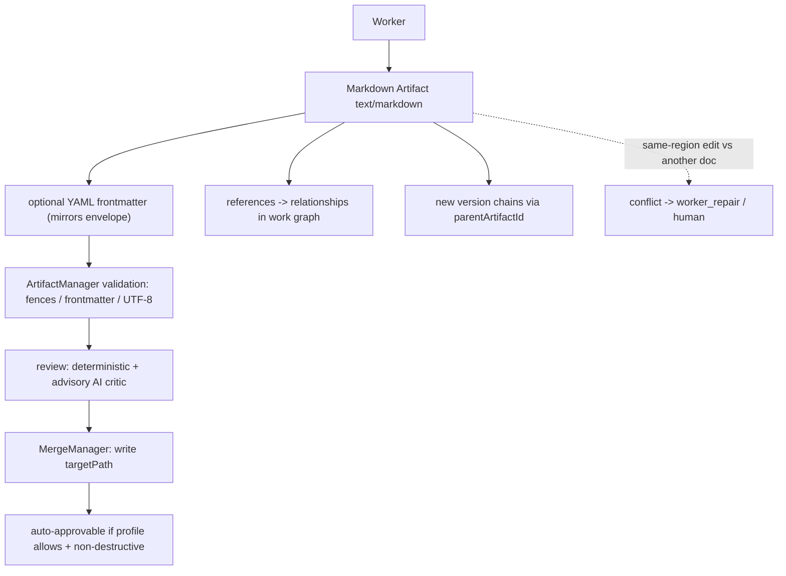

# MarkdownArtifacts Diagrams



```text
Worker --emit--> Markdown Artifact (text/markdown)
  frontmatter supplementary; envelope is source of truth
        |
        v
  validation: balanced fences, valid frontmatter YAML, UTF-8
  review: deterministic structure + advisory AI (clarity/accuracy)
        |
        v
  MergeManager writes targetPath (non-destructive => often auto-approvable)
  doc-internal references -> recorded as relationships
  versions chain like code (parentArtifactId)
  conflict: same heading edited by two -> escalate, fail-closed on ambiguity
```

# Related Documents

- [[MarkdownArtifacts-Part01]]
- [[ArtifactArchitecture-Part01]]
- [[Verification-Part01]]
- [[MergeFlow-Part01]]
- [[ArtifactManager-Part01]]
