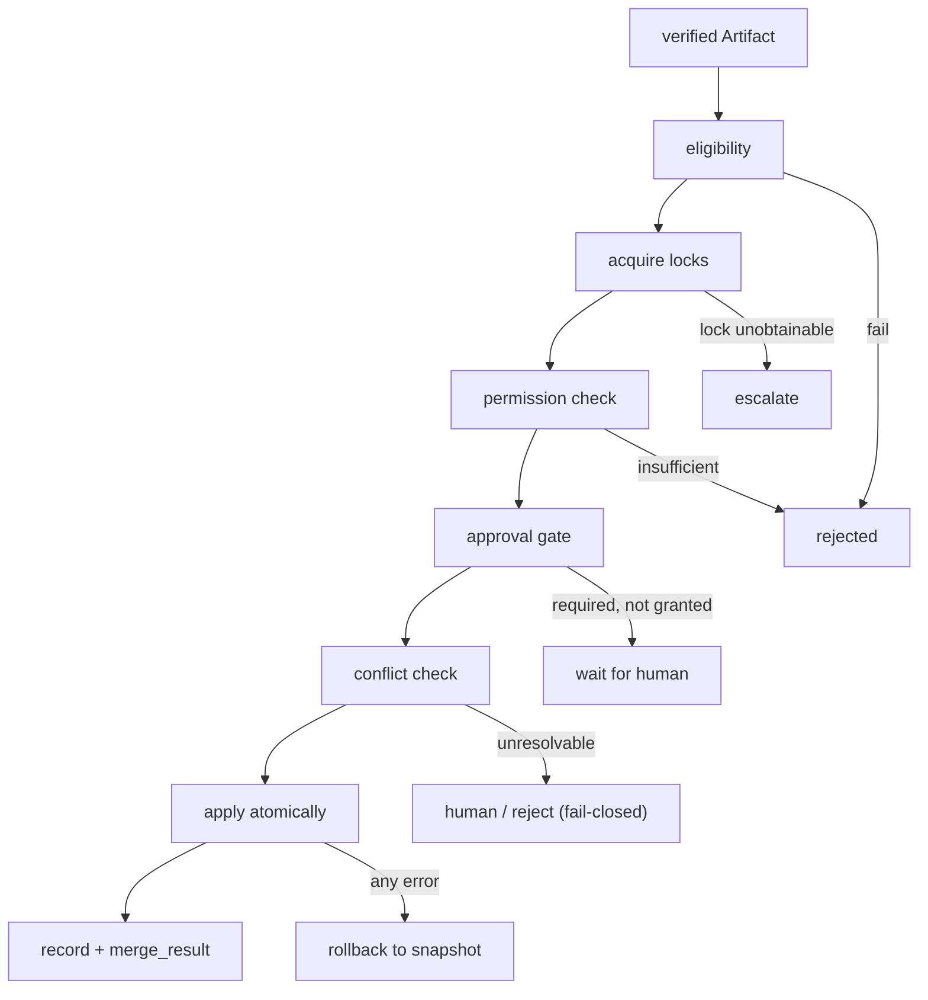

# MergeFlow Diagrams

## Fail-Closed Pipeline



## Conflict Resolution Order

```text
detect conflict
   |
   +-- auto_rebase (context relocate)
   +-- three_way_merge (text safe)
   +-- worker_repair (new Artifact, re-verify)
   +-- reviewer_worker (new Artifact, re-verify)
   +-- human_merge (escalate)
   +-- reject (fail-closed)
```

## Apply And Rollback

```text
snapshot pre-merge state (content + mode)
   |
   v
apply all hunks / write all files
   |
   +-- success -> status = merged, emit event, write merge_result
   +-- failure -> restore snapshot under lock -> merge_failed
```

## AI Notes

Do not draw the merge as a single "apply" step. Show every gate; fail-closed means each gate can stop it.

# Related Documents

- [[MergeFlow-Part01]]
- [[MergeFlow-Part02]]
- [[MergeFlow-Part03]]
- [[MergeFlow-Part04]]
- [[MergeFlow-Part05]]
- [[MergeFlow-Part06]]
- [[02-runtime/MergeManager/MergeManager-Part01]]
