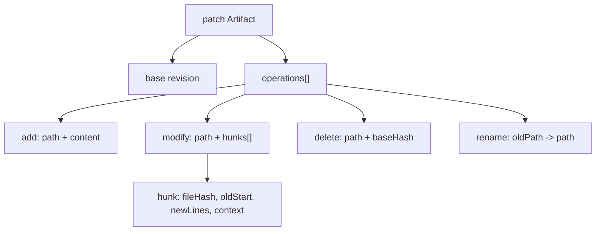
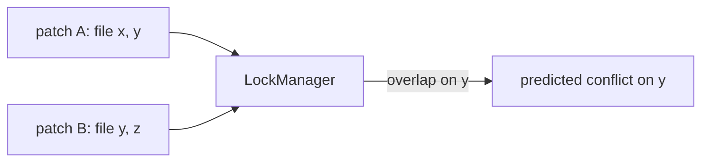

# PatchArtifacts Diagrams

## Patch Structure



## Application And Rollback

```text
MergeManager
   |
   +-- acquire lock on paths
   |
   +-- for each hunk: drift-check base hash
   |        |
   |        +-- match -> apply
   |        +-- mismatch -> conflict
   |
   +-- all applied? -> record reverse patch -> status = merged
   |
   +-- any unresolvable conflict? -> roll back all -> fail-closed
```

## Conflict Surface For Locking



## AI Notes

Do not draw a patch as "a command". Draw it as operations + hunks anchored to base hashes.

# Related Documents

- [[PatchArtifacts-Part01]]
- [[PatchArtifacts-Part02]]
- [[PatchArtifacts-Part03]]
- [[PatchArtifacts-Part04]]
