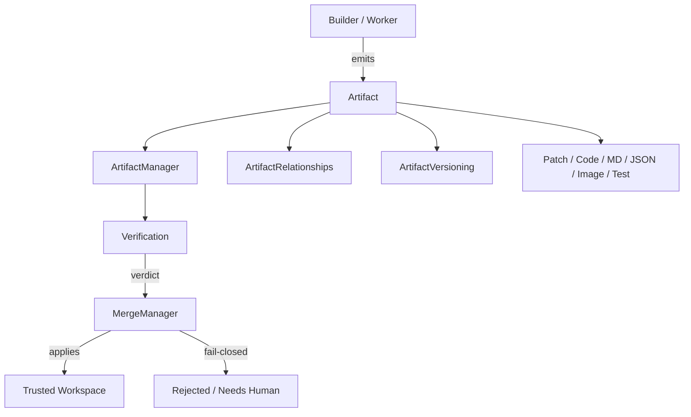

---
title: 05 Artifacts
status: draft
version: 1.0
tags:
  - artifacts
  - architecture
  - artifact-contract
  - Eulinx
  - flow:P04-STATE-ARTIFACT
  - flow:P10-ART-REGISTRY
  - flow:P10-ART-META
  - flow:P10-ART-VERSION
  - flow:P10-ART-STORAGE
  - flow:P10-ART-REF
  - flow:P10-ART-GRAPH
  - flow:P10-ART-SEARCH
  - flow:P10-ART-IMPORT
  - flow:P10-ART-EXPORT
  - flow:P10-ART-LIFECYCLE
  - flow:P10-ART-VERIFY
  - flow:P18-UI-ARTBROWSER
related:
  - "[[ArtifactArchitecture-Part01]]"
  - "[[ArtifactLifecycle-Part01]]"
  - "[[MergeFlow-Part01]]"
  - "[[Verification-Part01]]"
  - "[[02-runtime/ArtifactManager/ArtifactManager-Part01]]"
  - "[[06-workflow-engine/README]]"
---

# 05 Artifacts

## Purpose

The `05-artifacts` folder defines what an Artifact IS in Eulinx, how it is created, verified, related, versioned, stored, and finally applied to trusted project state.

Eulinx's central safety thesis is that AI Workers should propose changes as Artifacts rather than mutate the project directly. A Builder produces an Artifact. A Verifier checks it. Only the MergeManager applies a verified Artifact. This folder is the canonical specification of that object model and the rules surrounding it.

This section is the "noun" counterpart to the workflow engine "verb" sections. The runtime `ArtifactManager` and `MergeManager` are the services that implement these rules; this section defines the contract those services MUST obey.

## Folder Structure

```text
05-artifacts/
  README.md
  ArtifactArchitecture/
    ArtifactArchitecture-Part01.md ... Part05.md
    ArtifactArchitecture-Diagrams.md
  ArtifactLifecycle/
    ArtifactLifecycle-Part01.md ... Part06.md
    ArtifactLifecycle-Diagrams.md
  ArtifactRelationships/
    ArtifactRelationships-Part01.md ... Part03.md
    ArtifactRelationships-Diagrams.md
  ArtifactVersioning/
    ArtifactVersioning-Part01.md ... Part03.md
    ArtifactVersioning-Diagrams.md
  PatchArtifacts/
    PatchArtifacts-Part01.md ... Part04.md
    PatchArtifacts-Diagrams.md
  CodeArtifacts/
    CodeArtifacts-Part01.md ... Part03.md
  MarkdownArtifacts/
    MarkdownArtifacts-Part01.md ... Part02.md
  JSONArtifacts/
    JSONArtifacts-Part01.md ... Part02.md
  ImageArtifacts/
    ImageArtifacts-Part01.md ... Part02.md
    ImageArtifacts-Diagrams.md
  TestArtifacts/
    TestArtifacts-Part01.md ... Part02.md
  Verification/
    Verification-Part01.md ... Part04.md
    Verification-Diagrams.md
  MergeFlow/
    MergeFlow-Part01.md ... Part06.md
    MergeFlow-Diagrams.md
```

## Total Artifact Specification Size

```text
12 artifact topic folders
42 specification parts
8 diagram files
1 root README
```

## Topic Responsibilities

### ArtifactArchitecture
What an Artifact IS, the Artifact contract, its metadata envelope, content addressing, and how Artifacts are addressed and resolved everywhere in Eulinx.
Parts: 5

### ArtifactLifecycle
The full lifecycle from creation by a Builder/Worker through validation, verification, approval, merge, and expiry. Includes states, transitions, and the events emitted at each stage.
Parts: 6

### ArtifactRelationships
How Artifacts relate to each other: parent/child derivation, `derived-from`, `references`, and how the graph of work is reconstructed for replay and audit.
Parts: 3

### ArtifactVersioning
The version model for Artifacts, content-addressed immutability, diffs between versions, and how refine-loop iterations produce new versions.
Parts: 3

### PatchArtifacts
The patch/diff Artifact format, its application model, hunk addressing, and how a patch Artifact is the primary mergeable unit.
Parts: 4

### CodeArtifacts
Source-code Artifacts: review rules, language-agnostic handling, and the special verification obligations of code.
Parts: 3

### MarkdownArtifacts
Documentation Artifacts: structure, frontmatter, and review rules for human-readable outputs.
Parts: 2

### JSONArtifacts
Structured-data Artifacts: schema obligations, validation, and merge semantics for config/data blobs.
Parts: 2

### ImageArtifacts
Image/binary Artifacts: storage model, thumbnails, embedding, and the constraints of binary content in a text-first system.
Parts: 2

### TestArtifacts
Test-result and coverage Artifacts: the shape of a test report, how it feeds the Verifier, and coverage recording.
Parts: 2

### Verification
How a Verifier checks an Artifact: deterministic checks are authoritative, AI checks are advisory, and the precedence rules that keep the boundary closed.
Parts: 4

### MergeFlow
How the MergeManager applies verified Artifacts to trusted project state: fail-closed, lock-scoped, conflict-handled, rollback-capable.
Parts: 6

## Global Artifact Principles

A Builder or Worker MUST NOT write to the trusted project; it emits Artifacts.

An Artifact MUST be verified before it can be merged.

Only the MergeManager applies Artifacts. No other node, Worker, Tool, or service may mutate trusted state from an Artifact.

Merge MUST be fail-closed: any uncertainty stops the merge, it never proceeds silently.

An Artifact, once stored, MUST be immutable; a revised result is a new Artifact version, not an edit.

Deterministic verification MUST take precedence over AI verdicts. An AI verdict MUST NOT flip a failing deterministic verdict.

Verification MUST NOT be performed by the same Worker that produced the Artifact.

Conflicts MUST NOT silently discard another Worker's prior merged changes.

Sensitive or secret Artifacts MUST be access-controlled and redacted before exposure to other Workers.

Artifact metadata MUST be preserved for traceability, replay, and audit.

## Artifact Architecture Overview



```text
Builder emits Artifact (proposed)
        |
        v
ArtifactManager stores + validates + indexes
        |
        v
Verification produces Verdict
        |
        +-- fail (deterministic) -> rejected, never merged
        +-- pass  -> MergeManager acquires lock
                        |
                        v
                   conflict-free? -> apply to workspace
                        |
                        v
                   conflict -> resolve or require human (fail-closed)
```

## AI Notes

Do not treat an Artifact as a loose file. It is a content-addressed, metadata-rich, immutable record addressed by reference.

Do not let a Builder "helpfully" write its result to disk. That collapses the verify-then-merge boundary.

Do not cache or compare Artifacts by ID alone. Content hash plus kind plus fingerprint is the identity used for verification and diffing.

Do not let an AI verdict stand in for a build/test check. The deterministic verdict is the floor; the AI verdict is a suggestion.

Do not merge on uncertainty. When in doubt, stop and ask the human.

## Related Documents

- [[ArtifactArchitecture-Part01]]
- [[ArtifactLifecycle-Part01]]
- [[MergeFlow-Part01]]
- [[Verification-Part01]]
- [[02-runtime/ArtifactManager/ArtifactManager-Part01]]
- [[02-runtime/MergeManager/MergeManager-Part01]]
- [[06-workflow-engine/BuilderNodes/BuilderNodes-Part01]]
- [[06-workflow-engine/VerifierNodes/VerifierNodes-Part01]]
- [[04-memory/README]]
- [[09-plugin-system/README]]
