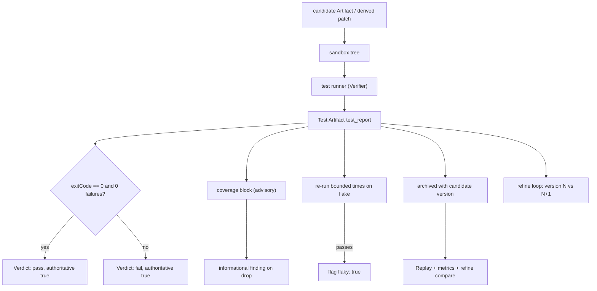

# TestArtifacts Diagrams



```text
candidate Artifact/sandbox --tests--> Test Artifact (test_report)
  fields: summary, suite, durationMs, tests[], exitCode, targetArtifactRef
  Verdict (deterministic, authoritative):
       exitCode 0 & 0 failures -> pass
       otherwise               -> fail
  coverage: advisory, never flips Verdict (gate optional)
  flaky: re-run bounded; pass flagged flaky: true
  each version keeps immutable test_report -> exact refine compare + Replay
```

# Related Documents

- [[TestArtifacts-Part01]]
- [[ArtifactArchitecture-Part01]]
- [[Verification-Part01]]
- [[MergeFlow-Part01]]
- [[ArtifactManager-Part01]]
