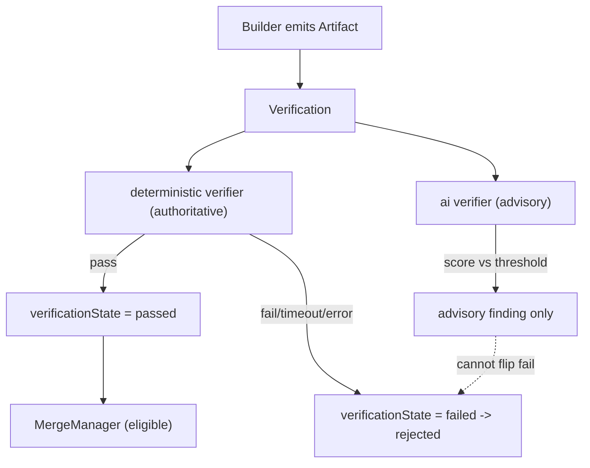
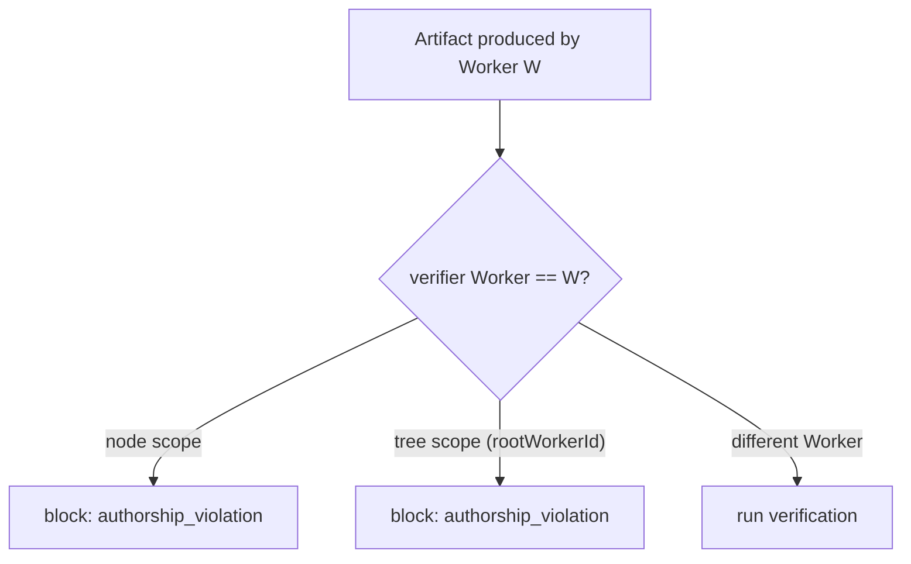

# Verification Diagrams

## Verify Before Merge



## Precedence Rule

```text
deterministic pass  +  ai pass     -> verified (merge eligible)
deterministic pass  +  ai fail     -> verified (ai is advisory)
deterministic fail  +  ai pass     -> REJECTED (ai cannot override)
deterministic fail  +  ai fail     -> REJECTED
```

## Authorship Exclusion



## AI Notes

Do not draw AI verification as equal-weight with deterministic. Show deterministic as the floor and AI as a suggestion above it.

# Related Documents

- [[Verification-Part01]]
- [[Verification-Part02]]
- [[Verification-Part03]]
- [[Verification-Part04]]
- [[06-workflow-engine/VerifierNodes/VerifierNodes-Part01]]
