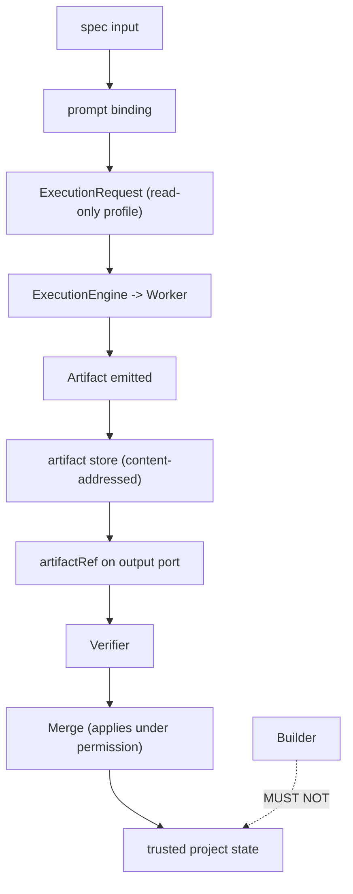
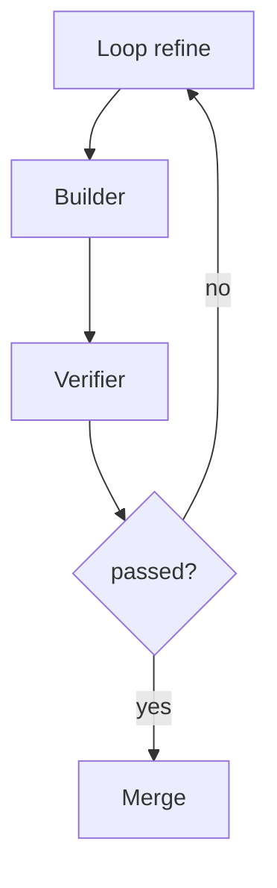

# BuilderNodes Diagrams

## The Artifact Boundary



## Refine Loop Integration



## ASCII: Read-Only Enforcement

```text
Builder writes ONLY to artifact store.
Project tree is a separate location.
No code path reaches project except via Merge.
Permission profile = read-only by default.
```

## Related Documents

- [[06-workflow-engine/README]]
- [[BuilderNodes-Part01]]
- [[BuilderNodes-Part04]]
- [[VerifierNodes-Part01]]
- [[MergeManager-Part01]]
- [[Artifact-Part01]]
