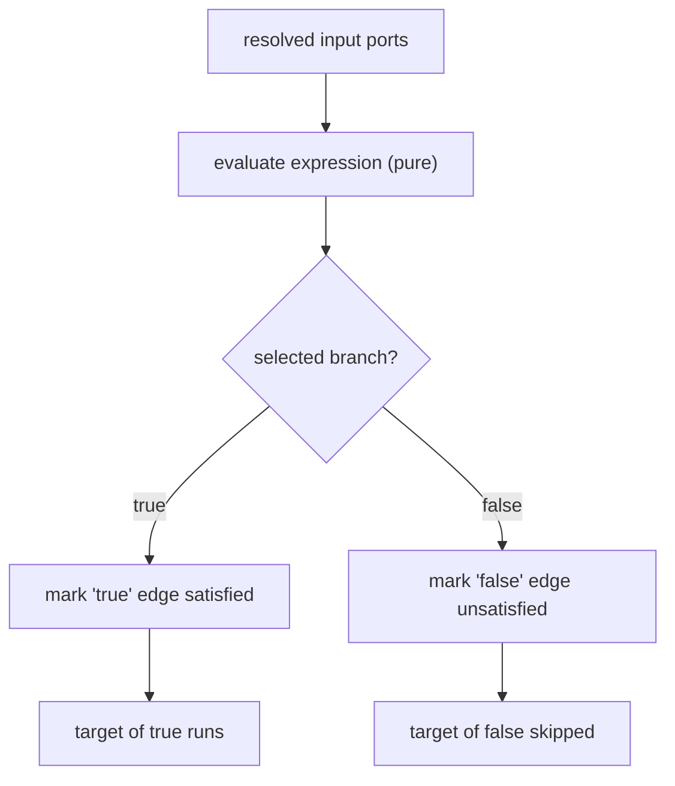
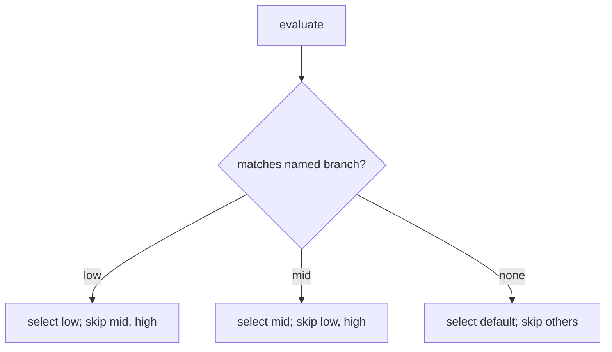

# ConditionNodes Diagrams

## Branch Selection



## Multi-Way With Default



## ASCII: Skipped Not Pending

```text
Condition selects B
  -> other branches: edges unsatisfied
  -> their targets: skipped (terminal, recorded)
  -> run can terminate (no node hangs in pending)
```

## Related Documents

- [[06-workflow-engine/README]]
- [[ConditionNodes-Part01]]
- [[ConditionNodes-Part02]]
- [[ConditionNodes-Part04]]
- [[EdgeTypes-Part01]]
- [[NodeArchitecture-Part05]]
