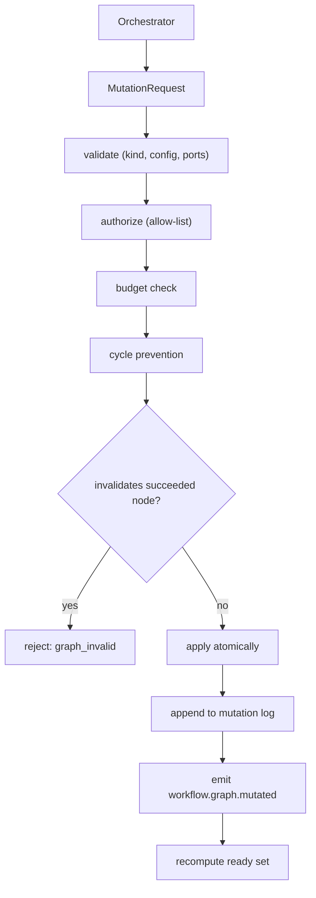
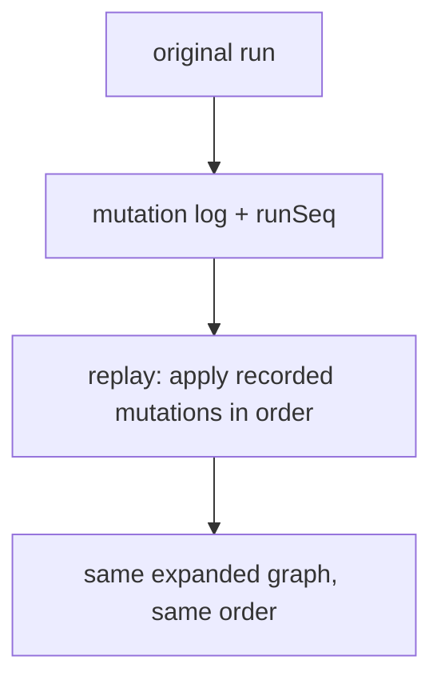

# DynamicGraphs Diagrams

## Mutation Request Path



## Subgraph Expansion

```text
before:
  A --> PLACEHOLDER --> B

mutation expands PLACEHOLDER into X -> Y -> Z:

after (atomic):
  A --> X -> Y -> Z --> B
  PLACEHOLDER removed; edges rewired
```

## Replay of Mutations



## Related Documents

- [[06-workflow-engine/README]]
- [[DynamicGraphs-Part01]]
- [[DynamicGraphs-Part04]]
- [[DynamicGraphs-Part05]]
- [[NodeTypes-Part02]]
- [[WorkflowEngine-Part07]]
