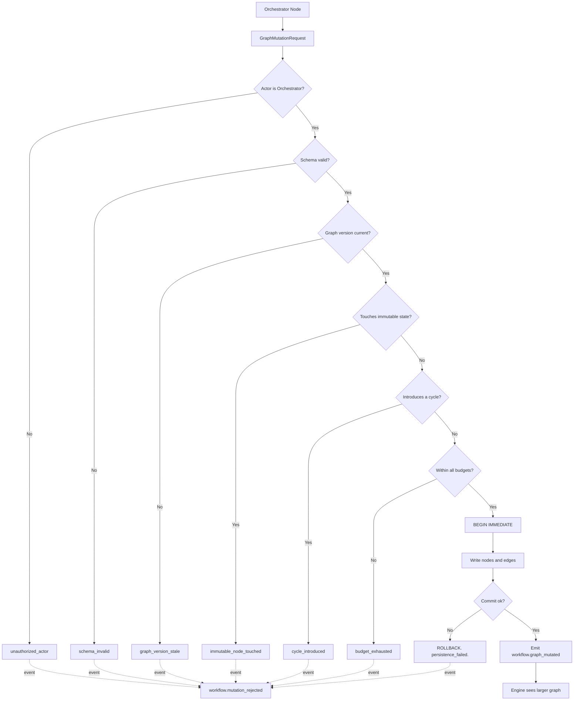

---
title: DynamicGraphs Specification - Part 01
status: draft
version: 1.0
tags:
  - workflow-engine
  - dynamic-graphs
  - architecture
related:
  - "[[06-workflow-engine/README]]"
  - "[[WorkflowEngine-Part01]]"
  - "[[NodeArchitecture-Part01]]"
  - "[[EdgeTypes-Part01]]"
  - "[[ExecutionFlow-Part01]]"
  - "[[Orchestrator-Part01]]"
---

# DynamicGraphs Specification (Part 01)

## Document Index

Part 01 - Purpose, Philosophy, Definition, Object Model, States, Invariants
Part 02 - The Mutation Request Type and Full Validation
Part 03 - Authorization: Who May Mutate, and the Rejection of Workers
Part 04 - Adding Nodes and Edges, Subgraph Expansion, Cycle Prevention
Part 05 - Budgets, Determinism, Replay, Rollback, The Complete Algorithm
Part 06 - Implementation Checklist, Worked Examples, Common Mistakes, Future Expansion
Diagrams - DynamicGraphs-Diagrams.md

# Purpose

DynamicGraphs defines how a Eulinx workflow graph may **change while it is running**.

Most workflow engines are static. You author a graph, you press run, the engine walks it. The graph the engine finishes with is the graph the author wrote. That model is honest and simple, and it is also useless for the problem Eulinx exists to solve, because the shape of real work is not knowable before the work starts.

An Orchestrator that plans "refactor the auth module" does not know how many files it will touch until it reads them. It cannot author a static graph with the right number of Builder nodes, because the right number is discovered, not declared.

So Eulinx permits a running graph to grow.

```text
Static engine:   author graph -> run graph -> done
Eulinx:             author graph -> run graph -> Orchestrator learns something
                                           -> Orchestrator proposes a mutation
                                           -> runtime validates it
                                           -> graph grows
                                           -> run continues on the larger graph
```

This is a signature Eulinx capability and it is also the single most dangerous thing in the workflow engine. A graph that can rewrite itself at runtime is a graph that can loop forever, expand without bound, corrupt its own history, and become unreplayable. Every rule in this document exists to make growth safe.

# Core Philosophy

Four ideas govern everything here. If an implementer holds these four, the rest of the specification is mechanical.

**One. Growth is additive, never destructive.**

A mutation may **add**. It may not rewrite what already happened. A completed node's record, a completed edge traversal, an emitted event, and a running node's own definition are all beyond reach. The graph is an append-mostly structure. The past is immutable; only the future is negotiable.

**Two. Only a planner may mutate.**

Orchestrators plan. Workers reason. A Worker that proposes a graph mutation is a Worker attempting to rewrite the plan that governs it, and that is precisely the escalation Eulinx's whole security model exists to prevent. The check is not advisory. It fails closed. See [[DynamicGraphs-Part03]].

**Three. A mutation is a proposal, not a command.**

This is the cardinal rule wearing a workflow-engine costume.

```text
AI output MUST NOT directly mutate trusted state.

Worker      -> Artifact         -> Verify   -> Merge
Orchestrator -> MutationRequest -> Validate -> Apply
```

The Orchestrator is an AI. The graph is trusted state. Therefore the Orchestrator does not touch the graph. It emits a typed `GraphMutationRequest`, which is data, and the deterministic GraphMutator validates and applies it. An Orchestrator with a direct handle to the node table is the same category of bug as a Worker with a direct handle to the project files.

**Four. A mutation that is not recorded did not happen.**

The graph's shape is part of the execution's history. If a mutation is applied without an EventBus event, the run is no longer replayable, because a replay would reach the mutation point with no way to know the graph grew. Recording is not observability decoration here. It is the mechanism by which a non-deterministic decision becomes a deterministic fact. Part 05 gives this its own long treatment; it is the hardest idea in the document.

# Definition

DynamicGraphs is the rule set governing runtime mutation of a workflow graph. It defines:

- what a mutation is, and the exact set of operations that qualify
- when a mutation is legal, and what it may never touch
- who may propose one, and the authorization check that rejects everyone else
- the `GraphMutationRequest` type and every validation rule applied to it
- the addition of nodes and edges to a live graph
- the subgraph expansion pattern, in which one placeholder node becomes many
- cycle prevention, run on every mutation, without exception
- depth and node-count budgets that stop runaway expansion
- the recording of mutations as EventBus events, and their application during Replay
- atomic rollback of a partially applied mutation
- the complete numbered mutation algorithm with every rejection branch

DynamicGraphs does **not** define the node types themselves (see [[NodeTypes-Part01]]), the edge semantics (see [[EdgeTypes-Part01]]), or how the engine walks the graph (see [[ExecutionFlow-Part01]]). It defines only how the graph's shape changes underneath that walk.

# Responsibilities

The GraphMutator MUST:

- accept only a typed, schema-valid `GraphMutationRequest`
- verify the proposing actor is an Orchestrator before any other check
- reject a mutation proposed by a Worker with `unauthorized_actor`
- validate the entire mutation before applying any part of it
- run cycle detection on every mutation that adds an edge, without exception
- enforce the expansion depth budget, the total node budget, and the per-orchestrator budget
- apply the mutation atomically inside a single SQLite transaction
- emit `workflow.graph_mutated` on the EventBus after commit, and only after commit
- record enough in that event to reconstruct the mutation exactly during Replay
- apply recorded mutations during Replay instead of re-asking the Orchestrator
- roll back completely on any failure, leaving zero partial state
- assign every mutation a monotonic `mutationSeq` unique within the run

The GraphMutator SHOULD:

- support a dry-run mode that validates without applying
- report the specific node or edge that caused a cycle rejection, not just "cycle"
- cache the reachability index between mutations to keep cycle detection fast
- report remaining budget in every successful result so the Orchestrator can plan

The GraphMutator MUST NOT:

- allow a Worker to mutate the graph, under any circumstance, including via a parent Orchestrator's identity
- allow mutation of a node in state `running`, `completed`, or `failed`
- allow deletion of any node that has ever started
- allow modification of a completed edge traversal record
- allow a mutation to introduce a cycle, except a `loop_back` edge declared per [[LoopNodes-Part01]]
- allow an AI-produced string to be applied to the graph without passing through validation
- apply any part of a mutation whose validation failed
- emit `workflow.graph_mutated` before the transaction commits
- call the AI during a Replay
- exceed any budget, even by one node

# Graph Mutation Object Model

```ts
type GraphMutationRequest = {
  mutationId: string;
  runId: string;
  workflowId: string;
  proposedBy: MutationActorRef;
  proposedAtNodeId: string;
  operations: GraphMutationOperation[];
  reason: string;
  mode: MutationMode;
  expectedGraphVersion: number;
  proposedAt: string;
};

type MutationActorRef = {
  kind: "orchestrator" | "worker" | "user" | "runtime" | "plugin";
  id: string;
  nodeId: string;
  depth: number;
};

type MutationMode = "normal" | "dry_run" | "replay";

type GraphMutationOperation =
  | { op: "add_node"; node: WorkflowNodeSpec }
  | { op: "add_edge"; edge: WorkflowEdgeSpec }
  | { op: "expand_subgraph"; placeholderNodeId: string; subgraph: SubgraphSpec }
  | { op: "retarget_pending_edge"; edgeId: string; newTargetNodeId: string }
  | { op: "cancel_pending_node"; nodeId: string; cancelReason: string };

type WorkflowNodeSpec = {
  nodeId: string;
  nodeType: string;
  label: string;
  config: Record<string, unknown>;
  roleId?: string;
  expansionDepth: number;
  createdByMutationId: string;
  createdByNodeId: string;
};

type WorkflowEdgeSpec = {
  edgeId: string;
  fromNodeId: string;
  toNodeId: string;
  edgeType: "sequence" | "conditional" | "parallel_fan_out" | "parallel_join" | "loop_back" | "error";
  condition?: string;
  createdByMutationId: string;
};

type SubgraphSpec = {
  nodes: WorkflowNodeSpec[];
  edges: WorkflowEdgeSpec[];
  entryNodeId: string;
  exitNodeIds: string[];
};
```

The result type is closed. There is no third possibility.

```ts
type GraphMutationResult =
  | {
      ok: true;
      mutationId: string;
      mutationSeq: number;
      newGraphVersion: number;
      addedNodeIds: string[];
      addedEdgeIds: string[];
      budgetAfter: MutationBudgetState;
    }
  | { ok: false; error: GraphMutationError };

type GraphMutationError = {
  kind: GraphMutationErrorKind;
  mutationId: string;
  failedAtStep: number;
  offendingNodeId?: string;
  offendingEdgeId?: string;
  cyclePath?: string[];
  message: string;
  retryable: boolean;
  at: string;
};

type GraphMutationErrorKind =
  | "unauthorized_actor"
  | "schema_invalid"
  | "graph_version_stale"
  | "unknown_node_reference"
  | "duplicate_node_id"
  | "duplicate_edge_id"
  | "immutable_node_touched"
  | "immutable_history_touched"
  | "cycle_introduced"
  | "depth_budget_exhausted"
  | "node_budget_exhausted"
  | "orchestrator_budget_exhausted"
  | "unreachable_node_added"
  | "placeholder_not_expandable"
  | "subgraph_malformed"
  | "replay_divergence"
  | "persistence_failed";
```

Every one of those sixteen kinds is defined with concrete handling in Part 02 through Part 05. None is a catch-all. There is no `other`.

```ts
type MutationBudgetState = {
  runId: string;
  totalNodeCount: number;
  totalNodeBudget: number;
  maxExpansionDepth: number;
  deepestExpansionDepth: number;
  perOrchestrator: Record<string, OrchestratorBudget>;
};

type OrchestratorBudget = {
  orchestratorId: string;
  nodesAdded: number;
  nodeBudget: number;
  mutationsApplied: number;
  mutationBudget: number;
};
```

# States

A mutation is a small state machine of its own. It is not a function call with a boolean return.

```text
proposed -> validating -> authorized -> checked -> applying -> applied
                |             |            |          |
                |             |            |          +-> rolled_back
                |             |            +-> rejected
                |             +-> rejected
                +-> rejected
```

| State | Meaning | Graph touched? |
| --- | --- | --- |
| `proposed` | Request received, nothing examined | No |
| `validating` | Schema and reference checks running | No |
| `authorized` | Actor confirmed to be an Orchestrator | No |
| `checked` | Cycle and budget checks passed | No |
| `applying` | Inside the SQLite transaction | Yes, uncommitted |
| `applied` | Committed, event emitted | Yes, durable |
| `rejected` | Failed a check before `applying` | No, never was |
| `rolled_back` | Failed during `applying`, transaction reversed | No, as if never was |

The distinction between `rejected` and `rolled_back` matters for the audit trail and nothing else. In both, the observable graph is unchanged. `rejected` means nothing was ever written; `rolled_back` means something was written and then unwritten inside a transaction that never committed.

# Invariants

```text
Only an Orchestrator may propose a mutation. Workers are rejected, always.
A mutation is validated in full before any part of it is applied.
A mutation is applied atomically. Partial application MUST NOT persist.
The graph after a rejected mutation is byte-identical to the graph before it.
Cycle detection runs on every mutation that adds an edge. No exceptions.
The only legal cycle is a loop_back edge declared by a LoopNode.
A running node's definition MUST NOT be modified.
A completed node's record MUST NOT be modified or deleted.
An emitted event MUST NOT be retracted.
Every added node has expansionDepth = parent expansionDepth + 1.
No node exists with expansionDepth > maxExpansionDepth.
totalNodeCount never exceeds totalNodeBudget.
Every applied mutation emits exactly one workflow.graph_mutated event.
The event is emitted after commit, never before.
A Replay applies recorded mutations. A Replay never calls the AI.
Replaying a run reproduces the identical graph, node for node, edge for edge.
mutationSeq is monotonic and gap-free within a run.
Every added node is reachable from the graph entry node.
```

The reachability invariant is easy to miss and worth stating plainly. An Orchestrator that adds a node without an inbound edge has added a node that will never run. That is not a harmless no-op; it is a planning bug that will burn node budget and confuse the UI graph view. Part 04 rejects it with `unreachable_node_added`.

# Mermaid Diagram



# AI Notes

Do not give the Orchestrator a function that writes to the node table. It will feel efficient and it destroys the cardinal rule. The Orchestrator returns a `GraphMutationRequest` as data. The GraphMutator, which is deterministic infrastructure with no AI in it, decides whether that data becomes graph. If your Orchestrator implementation imports the graph store, you have already failed.

Do not skip the cycle check when the mutation "obviously" cannot cycle. Every Orchestrator believes its plan is acyclic. The check is cheap, it is deterministic, and it is the only thing standing between a plausible-looking plan and an engine that walks in a circle until the process is killed. Run it every time.

Do not treat the budget as a warning. When the node budget is exhausted the mutation is rejected, not trimmed to fit. Partial application of an expansion is worse than no expansion, because it produces a subgraph with dangling edges. Reject the whole thing and let the Orchestrator replan with the remaining budget it was told about.

Do not emit the mutation event before the commit. If you emit first and the commit fails, the UI shows nodes that do not exist and the Replay log contains a mutation that was never applied. That log is now a lie, and every future replay of that run reconstructs a graph the run never had.

Do not call the Orchestrator during a Replay. This is the single most common way to break determinism in this subsystem. During a Replay the mutation already happened; its exact operations are in the event log. Read them and apply them. Asking the AI again will produce a different plan, and a Replay that produces a different graph is not a replay, it is a new run wearing the old run's ID. See [[DynamicGraphs-Part05]].

Do not let a Worker mutate by proxy. A Worker cannot escalate by asking its parent Orchestrator to relay a mutation without the Orchestrator's own reasoning; `proposedBy.kind` must be the actor that actually decided, and Part 03 defines how the runtime establishes that rather than trusting the field.

# Related Documents

- [[06-workflow-engine/README]]
- [[DynamicGraphs-Part02]]
- [[DynamicGraphs-Part03]]
- [[DynamicGraphs-Part04]]
- [[DynamicGraphs-Part05]]
- [[DynamicGraphs-Part06]]
- [[DynamicGraphs-Diagrams]]
- [[WorkflowEngine-Part01]]
- [[NodeArchitecture-Part01]]
- [[NodeTypes-Part01]]
- [[EdgeTypes-Part01]]
- [[ExecutionFlow-Part01]]
- [[LoopNodes-Part01]]
- [[Orchestrator-Part01]]
- [[EventBus-Part01]]
- [[Replay-Part01]]
</content>
