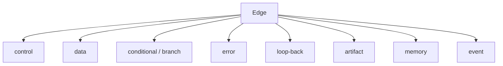
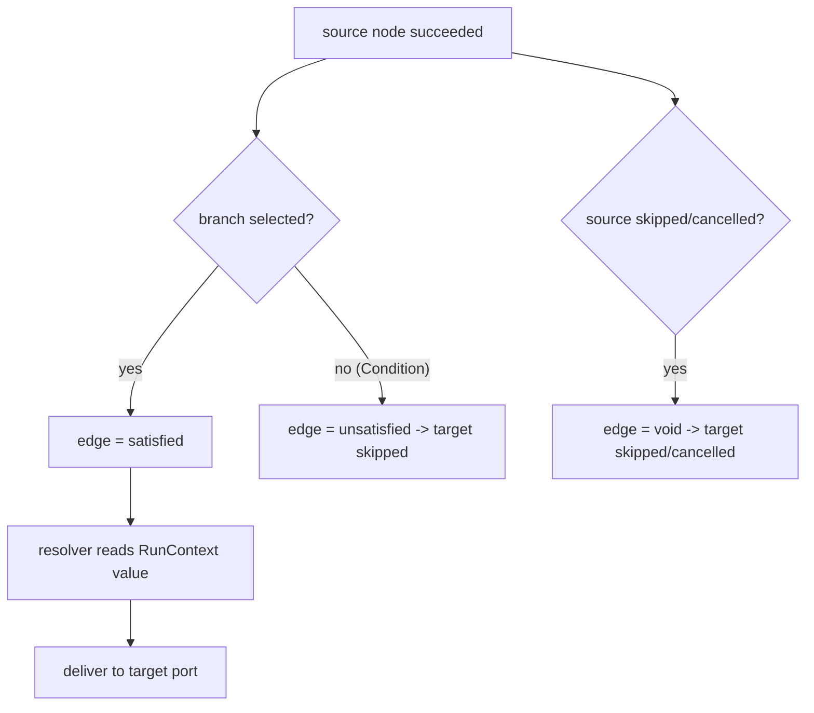

# EdgeTypes Diagrams

## Edge Kind Catalog



## Edge Run-Time Satisfaction



## ASCII: Type Lattice (subset)

```text
any
 |-- json -- text -- number -- boolean
 |-- artifact-ref (only from artifact/memory edges)
 |-- worker-handle (only from Worker)
 |-- tool-handle (only from Tool)
 |-- bytes
```

## Related Documents

- [[06-workflow-engine/README]]
- [[EdgeTypes-Part01]]
- [[EdgeTypes-Part04]]
- [[EdgeTypes-Part05]]
- [[EdgeTypes-Part06]]
- [[NodeArchitecture-Part02]]
- [[ConditionNodes-Part01]]
