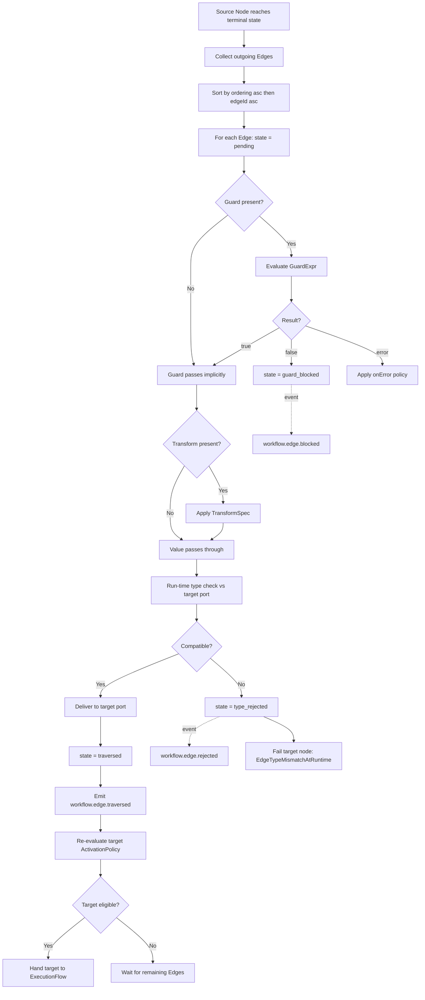

---
title: EdgeTypes Specification - Part 01
status: draft
version: 1.0
tags:
  - workflow-engine
  - edge-types
  - architecture
related:
  - "[[06-workflow-engine/README]]"
  - "[[NodeArchitecture-Part01]]"
  - "[[WorkflowEngine-Part01]]"
  - "[[ExecutionFlow-Part01]]"
---

# EdgeTypes Specification (Part 01)

## Document Index

Part 01 - Purpose, Philosophy, Definition, Base Edge Object Model, States, Invariants
Part 02 - The Edge Kind Catalog: control, data, conditional, error edges
Part 03 - The Edge Kind Catalog: loop-back, artifact, memory, event edges
Part 04 - Ports, the Type Lattice, Coercion, and the Compatibility Algorithm
Part 05 - Cardinality, Transforms, the Two Validators, Illegal Configurations, Checklist, Examples
Diagrams - EdgeTypes-Diagrams.md

# Purpose

EdgeTypes defines what a connection between two Workflow nodes IS.

A Eulinx Workflow is a directed graph. [[NodeArchitecture-Part01]] specifies the vertices. This document specifies the arcs. It is not a description of arrows on a canvas. An Edge is a typed, validated, persisted runtime object that the ExecutionFlow engine reads to decide three things and only three things:

```text
1. WHEN may the target node become eligible to run?
2. WHAT value arrives at the target node's input port?
3. WHAT happens when the answer to 1 or 2 is "never" or "nothing"?
```

Everything else an Edge appears to do is one of those three in disguise.

The Edge is the only mechanism by which one node influences another. There is no shared mutable scratch space between nodes. There is no global workflow variable bag that a node may write and another may read. If node B needs a value that node A produced, an Edge carries it. This is not a stylistic preference. It is what makes a Workflow statically analyzable, replayable, and safe to run with AI-authored graph fragments in it.

# Core Philosophy

An Edge is a contract, not a wire.

A wire is passive. It carries whatever you put in it and fails at the far end. A contract is checked before anything flows, and the check is the point. Eulinx validates every Edge twice: once when the graph is built, before a single node runs, and once at the instant a value crosses it at run time. Part 05 explains why both are mandatory and why removing either one produces a specific, named class of bug.

```text
Nodes do work.
Edges decide whether that work is allowed to reach anyone.
```

The second load-bearing idea is that **an Edge is a place where AI influence is contained**. A Root Orchestrator may author a graph. A Builder node may emit a subgraph. Those are AI outputs, and the cardinal rule of Eulinx applies without exception:

```text
AI output MUST NOT directly mutate trusted state.
Worker -> Artifact -> Verify -> Merge.
```

An AI-authored Edge is therefore an Artifact until a validator accepts it. It does not become a live Edge in a running graph because a model emitted it. It becomes a live Edge because the build-time validator in Part 05 proved it legal. An Edge that carries a `transform` MUST NOT execute AI-authored code without a PermissionManager grant, and the transform kinds in Part 05 are a closed, non-Turing-complete set specifically so that the common case never needs one.

The third idea is that **Edges are deterministic**. Given the same graph, the same node outputs, and the same seed, edge traversal order MUST be identical on every run. The engine sorts by `edgeId` wherever an ordering is otherwise unspecified. A `HashMap` iteration order MUST NOT be observable in traversal. Replay depends on this.

# Definition

An Edge is a persisted, immutable-after-validation, directed connection from an output port on a source node to an input port on a target node, carrying a declared kind, an optional guard, an optional transform, and a cardinality contract, and producing a defined result on every failure mode.

EdgeTypes owns:

- the base `Edge` type and every field on it
- the eight edge kinds, each with a full type, traversal semantics, cardinality rules, and failure modes
- the port model and the port type lattice
- the type compatibility algorithm and the coercion table
- fan-in and fan-out rules per kind
- the transform specification and its closed set of allowed kinds
- the build-time validator and the run-time validator
- every illegal edge configuration, named as an error variant, with defined handling

EdgeTypes does NOT own:

- what a node does internally (see [[NodeArchitecture-Part01]])
- the scheduling policy that picks which eligible node runs next (see [[ExecutionFlow-Part01]])
- graph mutation at run time (see [[DynamicGraphs-Part01]])
- the storage schema for edges (see [[WorkflowEngine-Part01]])

# Responsibilities

EdgeTypes MUST:

- assign every Edge exactly one `kind` from the closed set of eight
- resolve `sourcePort` and `targetPort` to concrete declared ports before the graph is admitted
- prove port type compatibility at build time using the algorithm in Part 04
- re-check the actual runtime value against the declared target port type at run time
- enforce the per-kind cardinality table in Part 05 at build time
- emit `workflow.edge.traversed` on the EventBus for every traversal
- emit `workflow.edge.blocked` when a guard evaluates false
- emit `workflow.edge.rejected` when a run-time type check fails
- record enough per-traversal detail for Replay to reproduce the traversal without re-running the source node
- fail closed: an Edge whose validity cannot be determined is invalid
- order traversal deterministically by `edgeId` ascending

EdgeTypes SHOULD:

- cache the compatibility result per `(sourcePortTypeId, targetPortTypeId)` pair
- report all build-time edge errors in one pass rather than stopping at the first
- include the offending `edgeId` and both port type names in every error message

EdgeTypes MUST NOT:

- allow an Edge to exist whose source or target node is absent from the graph
- allow an Edge to carry a value that never passed the run-time check
- allow a `transform` of kind `custom_script` to run without an explicit PermissionManager grant
- allow an AI-authored Edge into a live graph without the build-time validator accepting it
- allow two Edges to occupy the same `(targetNodeId, targetPortId)` slot when that port declares `fanIn: "one"`
- allow a data edge to be traversed before its source node has reached a terminal success state
- allow edge traversal order to depend on hash iteration order

# Edge Object Model

Every Edge in every Eulinx Workflow is this type. The eight kinds in Parts 02 and 03 each narrow `kind` and `payload`; none of them add or remove a base field.

```ts
type Edge = {
  edgeId: string;
  workflowId: string;
  graphVersion: number;

  kind: EdgeKind;

  sourceNodeId: string;
  sourcePortId: string;
  targetNodeId: string;
  targetPortId: string;

  guard?: EdgeGuard;
  transform?: TransformSpec;
  payload: EdgePayload;

  cardinality: EdgeCardinality;
  ordering: number;

  required: boolean;
  activationPolicy: ActivationPolicy;

  origin: EdgeOrigin;
  validation: EdgeValidationRecord;

  createdAt: string;
  createdBy: RuntimeActorRef;
  label?: string;
};

type EdgeKind =
  | "control"
  | "data"
  | "conditional"
  | "error"
  | "loop_back"
  | "artifact"
  | "memory"
  | "event";
```

Field meanings, one per line, no inference required:

```text
edgeId          Opaque unique id. Sort key for deterministic traversal. Never reused.
workflowId      Owning Workflow. An Edge never crosses Workflows.
graphVersion    The graph revision this Edge belongs to. DynamicGraphs bumps this.
kind            Exactly one of eight. Decides traversal semantics. Immutable.
sourceNodeId    Node the Edge leaves. MUST exist in the same graphVersion.
sourcePortId    Output port on that node. MUST be declared by the node's port spec.
targetNodeId    Node the Edge enters. MUST exist in the same graphVersion.
targetPortId    Input port on that node. MUST be declared by the node's port spec.
guard           Optional boolean predicate. If present and false, no traversal.
transform       Optional value mapping. Closed kind set. See Part 05.
payload         Kind-specific data. Discriminated by kind. See Parts 02 and 03.
cardinality     Declared fan-in and fan-out contract. Enforced at build time.
ordering        Tie-break integer for sibling edges. Lower runs first. Default 0.
required        If true, target cannot become eligible until this Edge resolves.
activationPolicy How this Edge contributes to target eligibility. See below.
origin          Who authored it: user, orchestrator, builder_node, template, system.
validation      The stamped result of the build-time validator. See Part 05.
createdAt       ISO 8601 UTC. Replay ordering aid.
createdBy       RuntimeActorRef of the author. Audit trail.
label           Human display string. Never semantic. UI only.
```

`ordering` is not decoration. When three data edges feed a single `fanIn: "many"` port, the collected array order MUST be `ordering` ascending, then `edgeId` ascending as tie-break. Without this rule the array order is hash order and Replay breaks.

## Activation Policy

```ts
type ActivationPolicy =
  | { mode: "all" }
  | { mode: "any" }
  | { mode: "count"; n: number }
  | { mode: "quorum"; numerator: number; denominator: number };
```

`ActivationPolicy` is declared per Edge but evaluated per target port. All Edges into one port MUST declare the same `mode`, or the build-time validator raises `MixedActivationPolicy`. The rules:

```text
all      Target eligible when every incoming required Edge has resolved. Default.
any      Target eligible when the first incoming Edge resolves. Others are cancelled.
count    Target eligible when exactly n incoming Edges have resolved. n >= 1.
quorum   Target eligible when numerator/denominator of incoming Edges resolved.
```

For `mode: "any"`, the engine MUST record which `edgeId` won in the traversal record. Replay reads that field rather than racing again. This is the single most common source of non-deterministic Workflows and the reason the field exists.

## Guards

```ts
type EdgeGuard = {
  guardId: string;
  expr: GuardExpr;
  onError: "block" | "traverse" | "fail_node";
  timeoutMs: number;
};

type GuardExpr =
  | { op: "always" }
  | { op: "never" }
  | { op: "eq"; left: GuardOperand; right: GuardOperand }
  | { op: "neq"; left: GuardOperand; right: GuardOperand }
  | { op: "lt"; left: GuardOperand; right: GuardOperand }
  | { op: "lte"; left: GuardOperand; right: GuardOperand }
  | { op: "gt"; left: GuardOperand; right: GuardOperand }
  | { op: "gte"; left: GuardOperand; right: GuardOperand }
  | { op: "in"; needle: GuardOperand; haystack: GuardOperand }
  | { op: "has_key"; obj: GuardOperand; key: string }
  | { op: "matches"; value: GuardOperand; pattern: string }
  | { op: "and"; terms: GuardExpr[] }
  | { op: "or"; terms: GuardExpr[] }
  | { op: "not"; term: GuardExpr };

type GuardOperand =
  | { src: "literal"; value: JsonValue }
  | { src: "source_output"; portId: string; path?: string }
  | { src: "node_status"; nodeId: string }
  | { src: "workflow_input"; key: string }
  | { src: "loop_counter"; loopNodeId: string };
```

Note what `GuardExpr` is not. It is not a string of JavaScript. It is not an expression to `eval`. It is a closed algebraic tree with fifteen operators. A guard is total: it terminates, it cannot allocate, it cannot call out. An AI can author a `GuardExpr` safely because there is nothing dangerous it can express. `matches` takes a regex `pattern` and MUST be run with a step budget of 100000; exceeding it produces `GuardEvaluationTimeout` handled per `onError`.

`onError` semantics, exactly:

```text
block       Guard errored. Treat as false. Do not traverse. Emit workflow.edge.blocked.
traverse    Guard errored. Treat as true. Traverse. Emit workflow.edge.guard_error.
fail_node   Guard errored. Fail the target node with EdgeGuardFailed. Default for safety.
```

## Origin and Trust

```ts
type EdgeOrigin = {
  authorKind: "user" | "orchestrator" | "builder_node" | "template" | "system";
  authorId: string;
  trusted: boolean;
  artifactId?: string;
};
```

`trusted` is computed, never supplied. It is `true` only when `authorKind` is `user`, `template`, or `system`. An Edge from `orchestrator` or `builder_node` is AI output and is `trusted: false` forever, even after validation. Validation makes an Edge legal. It does not make it trusted. The distinction matters at exactly one place: a `transform` of kind `custom_script` on an untrusted Edge MUST be denied by the PermissionManager unless a human grant exists for that specific `edgeId`. See Part 05.

`artifactId` MUST be present when `trusted` is false. It points at the Artifact the Edge arrived in, which is what makes the Worker -> Artifact -> Verify -> Merge chain auditable for graph fragments the same way it is for code.

# States

An Edge has a lifecycle within a single node's activation. It is short, and it is per graph run, not per Edge definition.

```ts
type EdgeRuntimeState =
  | "inactive"
  | "pending"
  | "guard_blocked"
  | "type_rejected"
  | "traversed"
  | "cancelled";
```

```text
inactive       Source node has not reached a terminal state. Nothing to decide yet.
pending        Source finished. Edge is queued for guard and type evaluation.
guard_blocked  Guard evaluated false. Terminal. Target may still activate via others.
type_rejected  Run-time type check failed. Terminal. Target node fails.
traversed      Value delivered to the target port. Terminal. Success.
cancelled      An "any" sibling won, or the target node was skipped. Terminal.
```

Legal transitions, and only these:

```text
inactive -> pending          source node reached terminal state
pending  -> guard_blocked    guard returned false, or errored with onError=block
pending  -> type_rejected    run-time value failed the target port type check
pending  -> traversed        guard passed and type check passed
pending  -> cancelled        sibling won an "any" race, or target was pruned
inactive -> cancelled        target node pruned before source finished
```

Anything else is `IllegalEdgeStateTransition`, which is a bug in the engine, not in the graph. It MUST be logged at error level with the `edgeId`, the from-state, and the trigger, and MUST fail the workflow run rather than being swallowed. A silently swallowed edge-state bug produces a workflow that hangs forever waiting on a target that will never be eligible, which is the worst failure mode this system has.

# Invariants

```text
Every Edge has exactly one kind, and kind never changes after creation.
Every Edge's sourceNodeId and targetNodeId exist in the same graphVersion.
Every Edge's sourcePortId is a declared output port of sourceNodeId.
Every Edge's targetPortId is a declared input port of targetNodeId.
Source port type is compatible with target port type under the Part 04 lattice.
No Edge crosses a workflowId boundary.
No Edge crosses a graphVersion boundary.
A data edge never delivers a value the run-time validator did not accept.
An untrusted Edge never runs custom_script without a PermissionManager grant.
Traversal order within a node's outgoing set is ordering asc, then edgeId asc.
Every traversal emits exactly one workflow.edge.traversed event.
Every Edge reaches exactly one terminal runtime state per graph run.
A loop_back edge is the only kind permitted to create a cycle.
Every Edge carries a stamped EdgeValidationRecord before the graph may run.
Replay of a run traverses the same Edges in the same order with the same values.
```

The cycle invariant is worth restating because it is the one implementers break. The graph MUST be a DAG after every `loop_back` Edge is removed. If removing all `loop_back` edges still leaves a cycle, that is `IllegalCycle`, and the graph is rejected at build time. This is how Eulinx gets loops without giving up static analysis.

# Mermaid Diagram



# AI Notes

Do not model an Edge as a pair of node ids. The moment you write `type Edge = { from: string; to: string }` you have thrown away ports, and without ports there is no type checking, no fan-in rules, and no way for a node with three distinct outputs to mean three different things. Ports are not optional. A node with one output still has a named output port.

Do not merge the build-time validator and the run-time validator into one function because "they both check types". They check different things against different inputs at different times. The build-time validator checks declared port types against each other with no values in existence. The run-time validator checks an actual value against one declared type. Part 05 lists what each one catches that the other cannot. Collapsing them silently deletes an entire error class.

Do not implement `guard` as `eval(edge.guardString)`. A guard is authored by an AI in the common case. `GuardExpr` is a closed tree with fifteen operators precisely so that the answer to "what is the worst thing a hostile guard can do" is "return the wrong boolean". If you accept a string and evaluate it, the answer becomes "anything", and you have handed a language model arbitrary code execution inside the deterministic runtime.

Do not let `kind` be advisory. A data edge and a control edge are not the same Edge with a cosmetic tag. A control edge carries no value and MUST NOT be type-checked for payload compatibility. A data edge carries a value and MUST NOT be traversed before its source succeeded. If your traversal function does not branch on `kind`, it is wrong for at least six of the eight kinds.

Do not iterate outgoing edges from a `HashMap` and traverse in whatever order you get. It works. It passes tests. It makes Replay produce a different result than the original run, and you will spend two days finding it. Sort by `ordering`, then `edgeId`. Always.

Do not treat a `loop_back` edge as "a normal edge that happens to point backwards". It is the one kind exempt from the acyclicity check, it carries iteration state, and it has its own termination contract in Part 03. If it were a normal edge, every loop would be `IllegalCycle`.

Do not allow an Edge emitted by a Builder node to be inserted straight into the live graph. It is AI output. It becomes an Artifact, it gets validated, and only then does DynamicGraphs merge it at a new `graphVersion`. Writing it directly into the running graph violates the cardinal rule and skips the validator that exists to catch exactly the mistakes models make.

# Related Documents

- [[06-workflow-engine/README]]
- [[EdgeTypes-Part02]]
- [[EdgeTypes-Part03]]
- [[EdgeTypes-Part04]]
- [[EdgeTypes-Part05]]
- [[EdgeTypes-Diagrams]]
- [[NodeArchitecture-Part01]]
- [[NodeTypes-Part01]]
- [[WorkflowEngine-Part01]]
- [[ExecutionFlow-Part01]]
- [[DynamicGraphs-Part01]]
- [[Workflow-Part01]]
- [[EventBus-Part01]]
- [[PermissionManager-Part01]]
