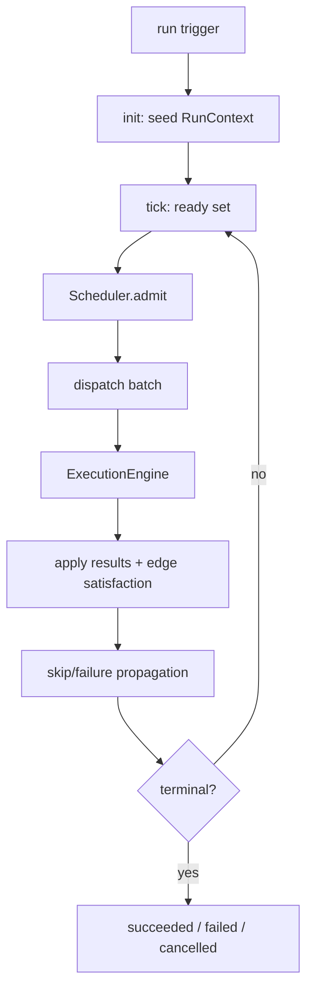
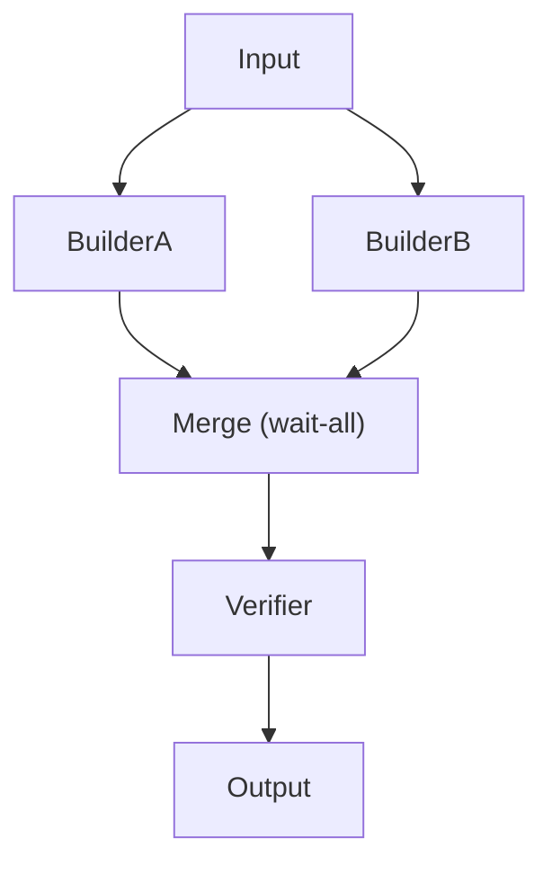

# ExecutionFlow Diagrams

## End-to-End Flow



## Parallel Branches and Join



## Fan-In Collection Order

```text
BuilderA (nodeId a...) --satisfied--> collect [refA, refB]
BuilderB (nodeId b...) --satisfied-->   ordered by nodeId
                                       Merge receives [refA, refB]
```

## Related Documents

- [[06-workflow-engine/README]]
- [[ExecutionFlow-Part01]]
- [[ExecutionFlow-Part04]]
- [[ExecutionFlow-Part05]]
- [[WorkflowEngine-Part08]]
- [[Scheduler-Part01]]
