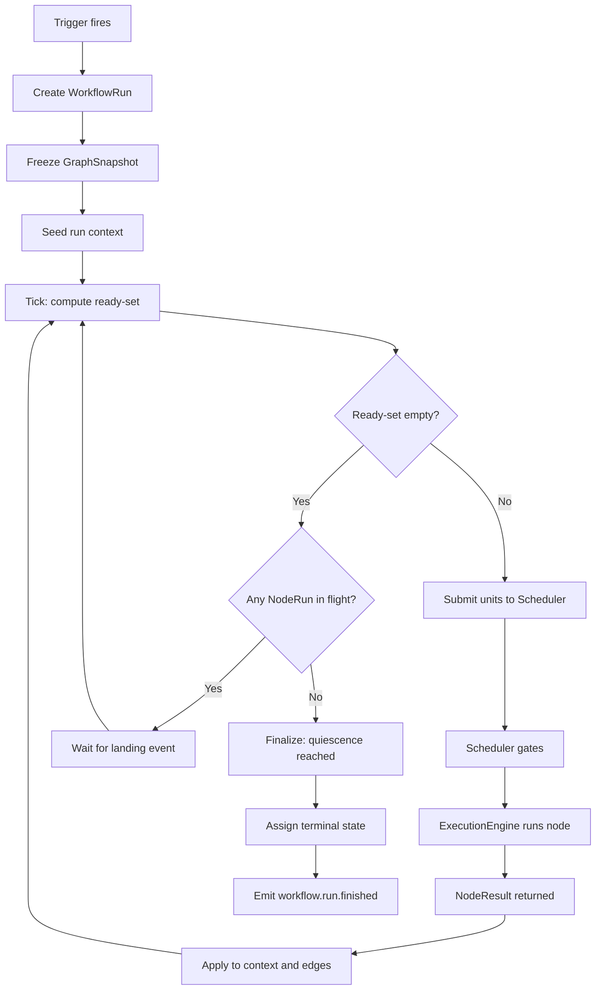

---
title: ExecutionFlow Specification - Part 01
status: draft
version: 1.0
tags:
  - workflow-engine
  - execution-flow
  - architecture
related:
  - "[[06-workflow-engine/README]]"
  - "[[WorkflowEngine-Part01]]"
  - "[[NodeArchitecture-Part01]]"
  - "[[EdgeTypes-Part01]]"
  - "[[DynamicGraphs-Part01]]"
  - "[[Scheduler-Part01]]"
  - "[[ExecutionEngine-Part01]]"
---

# ExecutionFlow Specification (Part 01)

## Document Index

Part 01 - Purpose, Philosophy, Boundaries, Object Model, States, Invariants
Part 02 - Triggers, Run Initialization, and Context Seeding
Part 03 - The Tick Loop and the Ready-Set Algorithm
Part 04 - Dispatch, Parallel Branches, and Join Semantics
Part 05 - Skip Propagation, Failure, Cancellation, Completion, Terminal States
Part 06 - Implementation Checklist, Worked Examples, Common Mistakes, Future Expansion
Diagrams - ExecutionFlow-Diagrams.md

# Purpose

ExecutionFlow defines the end-to-end journey of exactly one workflow run, from the trigger that creates it to the terminal state that ends it.

A workflow in Eulinx is a directed graph of nodes joined by edges. See [[NodeArchitecture-Part01]] for what a node is and [[EdgeTypes-Part01]] for what an edge means. ExecutionFlow is the thing that walks that graph while it is actually running. It is the traversal layer.

The traversal layer answers exactly one question, over and over, until there is nothing left to answer:

```text
Given the current state of every node and every edge in this run,
which nodes are ready to run RIGHT NOW?
```

Everything in this document exists to make that question answerable deterministically, and to define what happens to the answer.

# Core Philosophy

ExecutionFlow is a pure function of recorded state plus a clock.

Given the same `WorkflowRun` record, the same node results, and the same event ordering, the ready-set computation MUST produce byte-identical output. This is not an aspiration. It is the property that makes Replay work, and Replay is a cardinal rule of Eulinx (see [[Replay-Part01]]).

The traversal itself is deterministic infrastructure. It is not an AI. It does not guess. It does not "decide the plan". A node may contain an AI Worker, and that Worker's output is nondeterministic, but the Worker's output enters the traversal only as a recorded `NodeResult` value. The traversal reads the recorded value. It never asks a model what to do next.

```text
The graph decides the shape of the work.
The node results decide which branch of that shape is taken.
ExecutionFlow decides nothing. It computes.
```

The second philosophical commitment is that the run is edge-driven, not node-driven. A node does not "know" what runs after it. Edges know. This keeps [[DynamicGraphs-Part01]] possible: a node may add edges at runtime, and the traversal picks them up on the next tick without any node holding a stale successor list.

# Definition

ExecutionFlow is the workflow-level traversal component that:

- accepts a trigger and constructs a `WorkflowRun`
- seeds the run context (the blackboard)
- computes, once per tick, the set of nodes whose gating conditions are satisfied
- submits each ready node to the [[Scheduler-Part01]] as a `SchedulingUnit` of kind `workflow_node`
- receives the node's `NodeResult` back after the [[ExecutionEngine-Part01]] has run it
- applies that result to the run context and to downstream edge state
- propagates skips, failures, and cancellations across the graph
- detects quiescence and assigns a terminal run state
- emits an EventBus event at every state change

# The Three-Layer Boundary

This is the most misunderstood part of the design. Read it twice.

```text
Scheduler        decides WHETHER a unit may run right now.
                 It owns queues, priority, concurrency caps,
                 permission gates, lock gates, budget gates.
                 It does not know the workflow graph exists.

ExecutionEngine  RUNS the unit. It owns adapters, process supervision,
                 output streaming, timeouts, and the structured result.
                 It does not know what runs next.

ExecutionFlow    computes WHAT IS READY in this graph, and hands it over.
                 It owns the graph walk, the run context, joins, skips,
                 and completion. It does not queue. It does not execute.
```

ExecutionFlow MUST NOT reimplement any of the following, because they belong to the Scheduler: priority ordering between runs, concurrency caps, lock acquisition, permission checks, budget admission. ExecutionFlow computes readiness with respect to the *graph*. The Scheduler computes readiness with respect to the *machine*. A node that ExecutionFlow considers ready may sit in the Scheduler's blocked queue for ten minutes. That is normal and correct.

Restated as a rule a small model can apply mechanically:

```text
If the question is "does this node's upstream allow it to start?"  -> ExecutionFlow.
If the question is "do we have a slot, a lock, and permission?"    -> Scheduler.
If the question is "how do we actually run it?"                    -> ExecutionEngine.
```

# Responsibilities

ExecutionFlow MUST:

- construct exactly one `WorkflowRun` per trigger firing
- freeze the graph definition into a `GraphSnapshot` at run start
- seed the run context from the trigger payload before the first tick
- recompute the ready-set on every tick from persisted state only
- submit ready nodes to the Scheduler and never to the ExecutionEngine directly
- record a `NodeRun` row for every node it dispatches
- apply every `NodeResult` to the run context inside a single transaction
- evaluate every outgoing edge of a finished node exactly once
- propagate skip status downstream according to the rules in Part 05
- honour `failurePolicy` per node, not per run
- propagate cancellation to every in-flight `NodeRun`
- detect quiescence and terminate the run
- emit `workflow.run.*` and `workflow.node.*` events on the [[EventBus-Part01]]
- persist enough history for [[Replay-Part01]] to reconstruct every tick

ExecutionFlow SHOULD:

- batch the ready-set into a single Scheduler submission per tick
- coalesce redundant ticks that arrive within the same event-loop turn
- record the reason a node was NOT ready, for UI display

ExecutionFlow MUST NOT:

- call the ExecutionEngine directly, bypassing the Scheduler
- ask an AI model what should run next
- mutate project files
- let a node read another branch's private scope without a connecting edge
- start a node whose join condition is unsatisfied
- consider a run complete while any `NodeRun` is in flight
- write to the run context outside the result-application transaction
- reuse a `runId` across restarts

# ExecutionFlow Object Model

```ts
type WorkflowRun = {
  runId: string;
  workflowId: string;
  workflowVersion: number;
  workspaceId: string;
  projectId: string;
  sessionId: string;
  graphSnapshotId: string;
  trigger: RunTrigger;
  state: RunState;
  contextId: string;
  tickSeq: number;
  parentRunId?: string;
  rootRunId: string;
  depth: number;
  budget: RunBudget;
  budgetSpent: RunBudgetSpent;
  failurePolicyDefault: FailurePolicy;
  startedAt: string;
  endedAt?: string;
  terminalReason?: TerminalReason;
  restartGeneration: number;
};

type NodeRun = {
  nodeRunId: string;
  runId: string;
  nodeId: string;
  attempt: number;
  state: NodeRunState;
  readyAt?: string;
  dispatchedAt?: string;
  startedAt?: string;
  endedAt?: string;
  schedulingUnitId?: string;
  executionId?: string;
  result?: NodeResult;
  skipReason?: SkipReason;
  failure?: NodeFailure;
  branchId: string;
  scopeId: string;
  notReadyReason?: NotReadyReason;
};

type EdgeState = {
  runId: string;
  edgeId: string;
  fromNodeId: string;
  toNodeId: string;
  status: EdgeStatus;
  evaluatedAt?: string;
  carriedValueRef?: string;
};

type EdgeStatus =
  | "pending"
  | "satisfied"
  | "not_taken"
  | "skipped"
  | "failed"
  | "cancelled";
```

`EdgeStatus` is the load-bearing structure of the whole traversal. A node is ready when its incoming edges say so. Nothing else. `pending` means the upstream node has not finished. `satisfied` means the upstream finished and this edge's condition held. `not_taken` means the upstream finished and this edge's condition did not hold (a condition node chose the other way; see [[ConditionNodes-Part01]]). `skipped`, `failed`, and `cancelled` carry the upstream's terminal disposition downstream.

```ts
type RunTrigger = {
  triggerId: string;
  kind: TriggerKind;
  firedAt: string;
  firedBy: RuntimeActorRef;
  payload: Record<string, JsonValue>;
  idempotencyKey?: string;
};

type TriggerKind =
  | "user_manual"
  | "orchestrator_plan"
  | "parent_workflow_node"
  | "schedule_cron"
  | "file_watch"
  | "event_subscription"
  | "api_call"
  | "retry_of_run"
  | "replay";

type RunBudget = {
  maxWallClockMs: number;
  maxNodeRuns: number;
  maxCostUsd: number;
  maxTokens: number;
  maxConcurrentNodes: number;
  maxDepth: number;
};

type RunBudgetSpent = {
  wallClockMs: number;
  nodeRuns: number;
  costUsd: number;
  tokens: number;
};
```

Note what the trigger cannot do. There is no `permissions` field, no `sandboxRoot`, no `nodeOverrides`. A trigger names a workflow and hands it a payload. The workflow definition decides everything else. This mirrors [[WorkerCreation-Part01]] exactly, and for the same reason: if the caller can name its own powers, the security model is decoration.

# States

## Run States

```text
initializing     record written, context not yet seeded
seeding          context being seeded from trigger payload
running          at least one tick has executed, run is live
pausing          pause requested, waiting for in-flight nodes to land
paused           no in-flight nodes, no ticks scheduled
cancelling       cancel requested, in-flight nodes being told to stop
finalizing       quiescent, computing terminal state
completed        TERMINAL
failed           TERMINAL
cancelled        TERMINAL
timed_out        TERMINAL
budget_exhausted TERMINAL
aborted          TERMINAL
```

The six terminal states have exact entry conditions defined in Part 05. Do not invent a seventh.

## Node Run States

```text
pending          exists in the snapshot, incoming edges not resolved
ready            all incoming edges resolved and satisfying, not yet submitted
dispatched       submitted to the Scheduler, not yet running
running          ExecutionEngine reported start
succeeded        TERMINAL
failed           TERMINAL
skipped          TERMINAL
cancelled        TERMINAL
```

A `NodeRun` in `pending`, `ready`, `dispatched`, or `running` is **in flight** for the purposes of the quiescence rule in Part 05. A `NodeRun` in any of the four terminal states is **landed**.

# Invariants

```text
Exactly one WorkflowRun exists per trigger firing, keyed by idempotencyKey when present.
The GraphSnapshot is frozen at run start and never changes for that run.
tickSeq increases by exactly 1 per tick and never repeats within a run.
A node is dispatched at most once per attempt number.
Every dispatched NodeRun eventually reaches a terminal NodeRunState.
Every edge in the snapshot reaches a terminal EdgeStatus before the run finalizes.
A node is never dispatched while any incoming edge is pending.
The run context is written only inside a result-application transaction.
A node MUST NOT read a scope it is not connected to by a path of edges.
A run is complete only when zero NodeRuns are in flight and zero edges are pending.
Terminal state is assigned exactly once and never revised.
Every state change emits an EventBus event before the transaction is considered done.
```

The frozen-snapshot invariant deserves the same emphasis it gets in WorkerCreation. If a run held a live reference to a workflow definition and a user edited the graph mid-run, the run would change shape under itself and Replay would be impossible. The run resolves the graph to a value at start and stores that value as `graphSnapshotId`. Nodes added at runtime by [[DynamicGraphs-Part01]] are appended to the run's own snapshot copy, never to the definition.

# Mermaid Diagram



# AI Notes

Do not implement the tick as a recursive walk from the trigger node. The obvious implementation ("run node, then run its successors") breaks the instant you have a join: the successor gets invoked once per incoming branch and runs N times. The ready-set is computed by scanning node state, not by following pointers forward. Part 03 gives the exact algorithm.

Do not cache the ready-set between ticks. It is cheap to recompute and it is the only thing keeping the traversal deterministic under [[DynamicGraphs-Part01]] edge insertion. If you cache it, a node added at tick 12 is invisible until something else forces a recompute.

Do not call the ExecutionEngine from ExecutionFlow. Every dispatch goes through the Scheduler. Implementers skip this because "the Scheduler just forwards it anyway" during the happy path. It does not. It is where concurrency caps, locks, and permissions live, and bypassing it means two nodes edit the same file.

Do not treat a skipped node as a failed node. They propagate differently and joins treat them differently. Part 05 defines both. Collapsing them is the single most common bug in workflow engines.

Do not let the run context be a plain shared object every node can write. That is how branch A silently clobbers branch B's value and the run produces a different answer on every execution. Scoping rules are in Part 04 and they are MUST-level.

Do not decide the run is over because the ready-set is empty. An empty ready-set with three nodes still running is a completely normal mid-run state. The quiescence rule has two conditions, not one.

# Related Documents

- [[06-workflow-engine/README]]
- [[ExecutionFlow-Part02]]
- [[ExecutionFlow-Diagrams]]
- [[WorkflowEngine-Part01]]
- [[NodeArchitecture-Part01]]
- [[EdgeTypes-Part01]]
- [[DynamicGraphs-Part01]]
- [[Scheduler-Part01]]
- [[ExecutionEngine-Part01]]
- [[EventBus-Part01]]
- [[Replay-Part01]]
</content>
</invoke>
