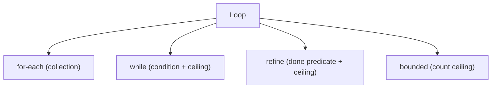
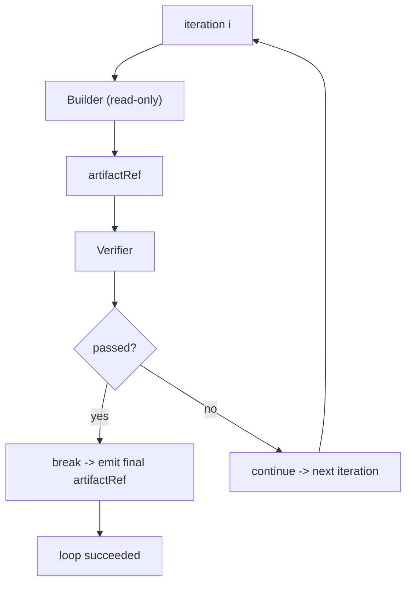

# LoopNodes Diagrams

## The Four Loop Kinds



## Refine Loop (Builder -> Verifier)



## Termination Guarantee

```text
every loop has maxIterations (hard ceiling)
  |
  v
exhaustion OR soft condition OR break -> terminate
exceeding ceiling -> failed: iteration_limit_exceeded
NEVER hangs
```

## Related Documents

- [[06-workflow-engine/README]]
- [[LoopNodes-Part01]]
- [[LoopNodes-Part04]]
- [[LoopNodes-Part05]]
- [[BuilderNodes-Part01]]
- [[VerifierNodes-Part01]]
