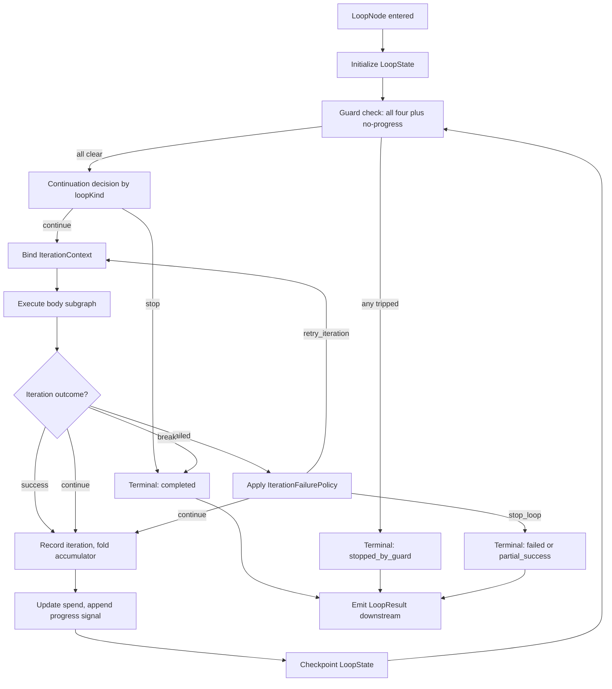

---
title: LoopNodes Specification - Part 01
status: draft
version: 1.0
tags:
  - workflow-engine
  - loop-nodes
  - architecture
related:
  - "[[NodeArchitecture-Part01]]"
  - "[[NodeTypes-Part01]]"
  - "[[WorkflowEngine-Part01]]"
  - "[[ExecutionFlow-Part01]]"
---

# LoopNodes Specification (Part 01)

## Document Index

Part 01 - Purpose, Philosophy, Definition, Config Type, and Invariants
Part 02 - The Four Loop Kinds and Their Individual Semantics
Part 03 - The Loop Body Subgraph, Iteration State, and Iteration Context
Part 04 - Parallel For-Each, Concurrency Limits, and Accumulator Semantics
Part 05 - Termination Guards, Break and Continue, and Iteration Failure
Part 06 - The Loop Execution Algorithm, Checklist, and Worked Examples
Diagrams - LoopNodes-Diagrams.md

# Purpose

A LoopNode is the workflow node that executes a subgraph more than once.

Every other node in Eulinx runs exactly once per execution. A BuilderNode produces one Artifact. A ConditionNode evaluates one expression. A VerifierNode returns one verdict. The graph is otherwise a directed acyclic graph, and its cost is bounded by counting its nodes.

The LoopNode is the single construct that breaks that property. It is the only place in the Eulinx workflow engine where a cycle is legal, and therefore the only place where the cost of a workflow is not knowable by reading the graph.

```text
Every node except a LoopNode:
  cost is a function of the graph.

A LoopNode:
  cost is a function of the graph TIMES a number
  that AI output is allowed to influence.
```

That last sentence is the entire reason this document is six parts long.

# Core Philosophy

An unbounded AI loop is the single most dangerous construct in Eulinx.

This is not rhetoric and it is not a style preference. Reason about it concretely. A LoopNode whose continuation condition is decided by a model, whose body spawns a Worker, and whose Worker calls a paid API, is a program that spends the user's money in a `while` loop with a condition that the spender writes.

The classic failure is not a crash. A crash is loud and cheap. The classic failure is a refine-until-verified loop where the Builder produces output the Verifier rejects, the Builder reads the rejection, produces a near-identical output, and the Verifier rejects it again. Nothing errors. Every iteration is individually correct. The loop is making no progress and it will not stop, because "not verified yet" is indistinguishable from "not verified yet, and never will be" to a condition that only looks at the current verdict.

At three dollars an iteration and four seconds of latency, that loop costs the user two thousand dollars overnight and produces nothing. There is no exception thrown, no log line marked ERROR, and no state that looks wrong. It looks like work.

Eulinx's answer is absolute:

```text
A LoopNode MUST NOT be able to run forever.
Not "should not". Not "in practice will not".
MUST NOT, enforced by the engine, with guards
the workflow author cannot disable.
```

The guards in Part 05 are not optional configuration with sensible defaults. They are mandatory fields with engine-enforced ceilings. A LoopNode config that omits them fails validation at graph-build time and the workflow never runs. A LoopNode config that sets `maxIterations: 100000` fails validation against the engine ceiling. The workflow author gets to choose a number inside a range. The author does not get to choose whether there is a number.

The second philosophical commitment is that the loop is deterministic infrastructure even when its body is not.

The body of a loop may spawn Workers, and Workers reason. The loop itself does not reason. It counts, it checks guards, it evaluates a condition through the sandboxed evaluator defined in [[ConditionNodes-Part02]], it binds an iteration context, and it stops. Every decision the LoopNode itself makes is reproducible from the recorded iteration history. See [[Replay-Part01]].

# Definition

A LoopNode is a workflow node of `kind: "loop"` that:

- owns a **body subgraph**, which is a complete Eulinx workflow subgraph with a single entry node and a single exit node
- executes that body subgraph zero or more times
- binds a fresh **iteration context** into each execution of the body
- maintains **iteration state** across executions of the body
- evaluates a **continuation decision** before each iteration and a **termination decision** after each iteration
- enforces **four independent termination guards** on every iteration boundary
- optionally **accumulates** the body's output into a single reduced value
- emits exactly one **loop result** to its downstream edges

A LoopNode is not a control-flow keyword compiled into the engine. It is a node with a config record, a state record, and an execution algorithm, exactly like every other node. The base node contract that a LoopNode implements is defined in [[NodeArchitecture-Part01]] and is not restated here.

# What A LoopNode Is Not

A LoopNode is not a ConditionNode. A ConditionNode chooses an outgoing edge once and never repeats. See [[ConditionNodes-Part01]].

A LoopNode is not a retry policy. Node-level retry, defined in [[BuilderNodes-Part05]], re-runs one node after a transient failure and is invisible to the graph. A LoopNode is a graph structure with its own state, its own budget, and its own history. Do not implement retry as a one-node loop and do not implement a loop as a retry with a large count.

A LoopNode is not a Worker. It spawns no process, holds no model binding, and has no permission profile of its own. Its body may contain BuilderNodes that do all of those things.

A LoopNode is not the Scheduler. It does not decide when the workflow runs. It decides how many times its own body runs, and it hands each body execution to the ExecutionEngine through the normal path in [[ExecutionFlow-Part01]].

# Responsibilities

A LoopNode MUST:

- declare all four termination guards in its config, with values inside the engine ceilings
- evaluate every guard before every iteration, in the fixed order given in Part 05
- stop immediately and deterministically when any guard trips
- record every iteration in the iteration history, including its outcome, duration, token spend, and cost
- bind an immutable `IterationContext` into the body before each iteration
- treat the body subgraph as a value, not as a mutable structure the body can rewrite
- produce exactly one `LoopResult` on completion, including a machine-readable `stopReason`
- emit `loop.iteration_started`, `loop.iteration_completed`, and `loop.completed` on the EventBus
- propagate the iteration's Worker budget spend up into the loop's own budget counter
- fail closed: any guard evaluation that itself errors stops the loop

A LoopNode SHOULD:

- emit a `loop.no_progress_warning` event before the no-progress guard actually trips
- surface the current iteration number and remaining budget to the UI on every iteration boundary
- checkpoint iteration state to SQLite after every iteration so a restart resumes rather than restarts

A LoopNode MUST NOT:

- run an iteration when any guard has tripped, even if the condition says continue
- allow a model, a Worker, or a body node to modify its own guards
- allow a body node to increment or reset the iteration counter
- allow `maxIterations` to be absent, null, zero-meaning-infinite, or above the engine ceiling
- treat a `break` signal from body AI output as trusted without validating it as a typed control signal
- merge, write, or otherwise mutate trusted state; only the MergeManager does that
- continue after an iteration failure unless `onIterationFailure` explicitly says to

# The Loop Node Config Type

```ts
type LoopNodeConfig = {
  nodeId: string;
  kind: "loop";
  label: string;

  loopKind: LoopKind;

  body: LoopBodyRef;

  guards: LoopGuards;

  parallelism: LoopParallelism;

  accumulator?: LoopAccumulator;

  onIterationFailure: IterationFailurePolicy;

  emitIterationEvents: boolean;
  checkpointEveryIteration: boolean;
};

type LoopKind =
  | { kind: "for_each"; collection: ValueRef; itemBinding: string; indexBinding: string }
  | { kind: "while"; condition: ConditionExpr; evaluateBefore: true }
  | { kind: "retry_until_success"; successExpr: ConditionExpr; backoff: BackoffPolicy }
  | { kind: "refine_until_verified"; verifierNodeId: string; acceptOn: VerdictAcceptRule };

type LoopBodyRef = {
  subgraphId: string;
  entryNodeId: string;
  exitNodeId: string;
  outputSpec: LoopBodyOutputSpec;
};

type LoopBodyOutputSpec = {
  valuePath: string;
  expectedType: ValueType;
  requiredOnSuccess: boolean;
};

type LoopGuards = {
  maxIterations: number;
  maxWallClockMs: number;
  maxTokens: number;
  maxCostUsd: number;
  noProgress: NoProgressGuard;
};

type NoProgressGuard = {
  enabled: true;
  signalPath: string;
  comparison: "exact" | "normalized_text" | "numeric_delta";
  minDelta?: number;
  windowSize: number;
};

type LoopParallelism =
  | { mode: "sequential" }
  | { mode: "parallel"; maxConcurrent: number; failFast: boolean; preserveOrder: boolean };

type LoopAccumulator = {
  initial: JsonValue;
  reducer: ReducerSpec;
  resultBinding: string;
};

type IterationFailurePolicy =
  | { on: "stop_loop"; markLoop: "failed" }
  | { on: "stop_loop"; markLoop: "partial_success" }
  | { on: "continue"; recordAs: "failed_iteration"; maxFailedIterations: number }
  | { on: "retry_iteration"; maxRetriesPerIteration: number; thenPolicy: "stop_loop" | "continue" };

type ValueRef = { source: "node_output" | "loop_context" | "workflow_input" | "literal"; path: string };
type ValueType = "string" | "number" | "boolean" | "array" | "object" | "artifact_ref" | "null";
type BackoffPolicy = { initialMs: number; multiplier: number; maxMs: number; jitter: boolean };
type VerdictAcceptRule = { requireDeterministicPass: true; minAdvisoryScore?: number };
```

Note what is absent from `LoopGuards`. There is no `unbounded: boolean`. There is no `maxIterations?: number`. There is no `disableGuards`. The type system itself refuses to represent an unbounded loop, and Part 05 defines the runtime validation that refuses to represent one at any other layer.

`NoProgressGuard.enabled` is typed as the literal `true`, not as `boolean`. This is deliberate. An implementer cannot write `enabled: false` and have it compile. If a workflow genuinely has no meaningful progress signal, the author must still pick a `signalPath`; Part 05 defines the fallback signal for that case.

# The Loop State Record

```ts
type LoopState = {
  nodeId: string;
  executionId: string;
  status: LoopStatus;

  iteration: number;
  startedAt: string;
  lastIterationAt: string | null;

  spend: LoopSpend;

  accumulatorValue: JsonValue;
  progressWindow: string[];

  iterations: IterationRecord[];
  failedIterationCount: number;

  stopReason: LoopStopReason | null;
};

type LoopStatus =
  | "pending"
  | "running"
  | "completed"
  | "stopped_by_guard"
  | "failed"
  | "partial_success"
  | "cancelled";

type LoopSpend = {
  elapsedMs: number;
  tokensUsed: number;
  costUsd: number;
  toolCalls: number;
};

type IterationRecord = {
  index: number;
  startedAt: string;
  endedAt: string;
  outcome: "success" | "failed" | "skipped_by_continue" | "cancelled";
  bodyOutput: JsonValue | null;
  progressSignal: string | null;
  spend: LoopSpend;
  error: IterationError | null;
};

type LoopStopReason =
  | { reason: "condition_false" }
  | { reason: "collection_exhausted"; itemCount: number }
  | { reason: "success_reached"; atIteration: number }
  | { reason: "verified"; atIteration: number; verdictId: string }
  | { reason: "break_signal"; atIteration: number; source: "body_control_node" }
  | { reason: "guard_max_iterations"; limit: number }
  | { reason: "guard_wall_clock"; limitMs: number; elapsedMs: number }
  | { reason: "guard_tokens"; limit: number; used: number }
  | { reason: "guard_cost"; limitUsd: number; usedUsd: number }
  | { reason: "guard_no_progress"; windowSize: number; repeatedSignal: string }
  | { reason: "iteration_failed"; atIteration: number; error: IterationError }
  | { reason: "too_many_failed_iterations"; failedCount: number; limit: number }
  | { reason: "guard_evaluation_error"; guard: string; message: string }
  | { reason: "cancelled"; by: string };
```

`stopReason` is never null on a terminal `LoopStatus`. It is the field the UI renders, the field Replay reads, and the field a downstream ConditionNode branches on. A loop that completed and a loop that was killed by the cost guard are both `status: "completed"` from the graph's perspective only if the author says so; the `stopReason` is what tells them apart, and Part 06 requires that downstream logic read it.

# Invariants

```text
A LoopNode's guards are fixed at graph-build time and immutable for the run.
Every guard is checked before every iteration, in fixed order, with no early exit.
iteration is monotonically increasing and only the loop engine increments it.
iteration never exceeds guards.maxIterations. Not "rarely". Never.
Every iteration appends exactly one IterationRecord before the next begins.
spend is cumulative across the whole loop and includes every Worker its body spawned.
The body subgraph is immutable during the loop's execution.
An IterationContext is immutable once bound.
A terminal LoopStatus always carries a non-null stopReason.
Loop output reaches downstream nodes exactly once, after the loop is terminal.
The loop mutates no trusted state. Its body's Artifacts go through Verify then Merge.
A guard that cannot be evaluated stops the loop. It never defaults to continue.
```

The last line is the fail-closed rule applied to loops. If the cost guard cannot read the current spend because the metrics store is unreachable, the loop stops. It does not assume spend is zero. It does not skip the check. An unevaluable guard is a tripped guard.

# Mermaid Diagram



# AI Notes

Do not implement the LoopNode as a `while (true)` with the guards checked somewhere inside the body. The guard block is the loop condition. If your code can reach the body without having evaluated all five guards on this exact iteration, the specification is not implemented, regardless of how the tests look.

Do not treat `maxIterations` as a safety net for the "real" condition. It is not a net. It is a limit that trips in normal operation and whose tripping is a normal, expected, non-error outcome that downstream logic must handle. Half of all refine-until-verified loops end on `guard_max_iterations` in a healthy system.

Do not let the no-progress guard be the thing you implement last and disable when it is annoying. It is the only guard that catches the expensive failure. `maxCostUsd` catches it after the money is gone. `noProgress` catches it after three identical outputs. That is the difference between a nine dollar loss and a two thousand dollar loss.

Do not let a Worker's text output be parsed for the word "done" to decide continuation. Continuation is decided by the sandboxed evaluator in [[ConditionNodes-Part02]] over typed values, or by a deterministic Verifier verdict per [[Verification-Part01]]. Free text is never a control signal. Part 05 defines the typed break protocol.

Do not share mutable state between parallel iterations because "it is just a counter". Part 04 defines exactly what parallel iterations may touch, and the answer is: their own IterationContext and nothing else. The accumulator is folded by the loop engine on the loop's thread, never by the body.

Do not resume a loop after a restart by starting at iteration zero. The spend counters survive; a restarted loop that forgets it already spent forty dollars will spend forty more. Part 06 defines resume.

# Related Documents

- [[06-workflow-engine/README]]
- [[LoopNodes-Part02]]
- [[LoopNodes-Diagrams]]
- [[NodeArchitecture-Part01]]
- [[ConditionNodes-Part01]]
- [[BuilderNodes-Part01]]
- [[VerifierNodes-Part01]]
- [[ExecutionFlow-Part01]]
- [[Verification-Part01]]
- [[Replay-Part01]]
