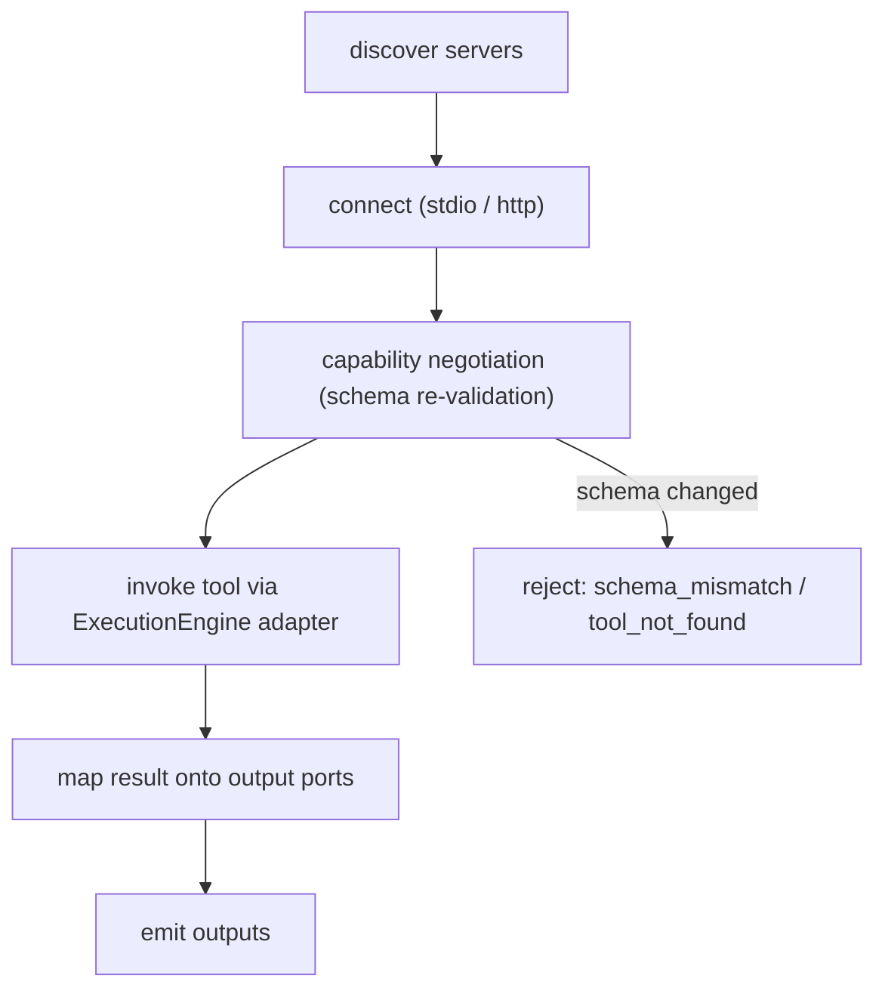

# MCPNodes Diagrams

## Server Lifecycle and Invocation



## Untrusted Boundary

```text
MCP Node (declares intent)
   |
   v
ExecutionEngine MCP Adapter (supervised, permission-checked)
   |
   v
External MCP Server (untrusted code, elsewhere)
   |
   v
Result mapped to ports; server CANNOT forge artifact-ref / worker-handle
```

## ASCII: Secret Handling

```text
node config: serverId, toolName        (no secrets in cleartext)
permission system: secret by reference
adapter at invoke: receives secret     (never persisted in RunContext)
```

## Related Documents

- [[06-workflow-engine/README]]
- [[MCPNodes-Part01]]
- [[MCPNodes-Part03]]
- [[MCPNodes-Part04]]
- [[MCPNodes-Part05]]
- [[ExecutionEngine-Part01]]
- [[PermissionManager-Part01]]
