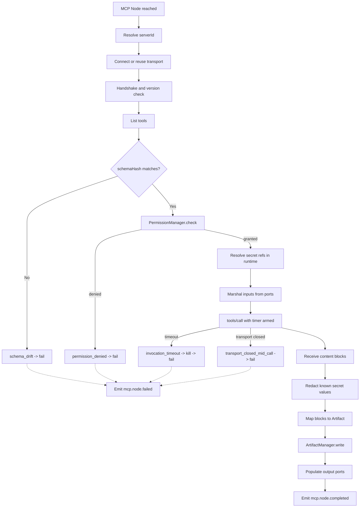

---
title: MCPNodes Specification - Part 01
status: draft
version: 1.0
tags:
  - workflow-engine
  - mcp-nodes
  - architecture
related:
  - "[[06-workflow-engine/README]]"
  - "[[NodeArchitecture-Part01]]"
  - "[[NodeTypes-Part01]]"
  - "[[ToolRegistry-Part01]]"
  - "[[PermissionManager-Part01]]"
  - "[[MCPIntegration-Part01]]"
---

# MCPNodes Specification (Part 01)

## Document Index

```text
MCPNodes-Part01 - Purpose, philosophy, definition, object model, states, invariants
MCPNodes-Part02 - Server discovery, connection lifecycle, stdio and HTTP transports
MCPNodes-Part03 - Tool listing, schema import, the JSON Schema to Eulinx port mapping algorithm
MCPNodes-Part04 - Invocation, result mapping, secrets, sandboxing, failure and retry
MCPNodes-Part05 - Implementation checklist, worked examples, common mistakes, future expansion
MCPNodes-Diagrams - MCPNodes-Diagrams.md
```

# Purpose

An MCP Node is a workflow node whose behavior is supplied by an external MCP server rather than by Eulinx.

Every other node type in `06-workflow-engine` is code Eulinx ships and Eulinx controls. A BuilderNode calls a model Eulinx configured. A VerifierNode runs a check Eulinx wrote. A ConditionNode evaluates an expression Eulinx parses. See [[NodeTypes-Part01]] for the full taxonomy.

An MCP Node is different in exactly one way, and that one way governs this entire document:

```text
The code behind an MCP Node is not ours.
It was written by someone else.
It runs on the user's machine or on a remote host we do not operate.
It can lie about its schema, hang forever, return garbage,
  read the filesystem, and exfiltrate anything we hand it.

Therefore an MCP Node is a HOSTILE BOUNDARY, not a function call.
```

MCPNodes specifies how that hostile boundary is crossed safely: how servers are discovered and connected, how their advertised tools become typed Eulinx ports, how invocations are gated and timed out, how results become Artifacts, and how every failure mode is named and handled.

## What MCP Is

The Model Context Protocol (MCP) is an open JSON-RPC 2.0 protocol by which an external process, called an MCP server, advertises three kinds of capability to a model host: **tools** (callable functions with JSON Schema input contracts), **resources** (readable URI-addressed content), and **prompts** (parameterized prompt templates); the host connects over a transport, performs a version handshake, lists what the server offers, and thereafter invokes tools by name with JSON arguments and receives back a list of typed content blocks. Eulinx is the **host**. Eulinx is never a server. An MCP server is a third-party program that Eulinx launches or dials; it is not a Eulinx component, it is not trusted, and it has no privileges except those the PermissionManager grants at each individual invocation.

# Core Philosophy

Four rules, in priority order. When they conflict, the lower number wins.

**1. Fail closed.** An MCP Node that cannot prove it is allowed to run does not run. A missing permission, an expired credential, an unmappable schema, an unreachable server, an ambiguous verdict: all of these produce a node failure, never a silent skip and never a default-allow. This is the general Eulinx rule from [[PermissionManager-Part01]] and MCP gets no exception.

**2. Secrets never leave the runtime.** A credential handed to an MCP server exists as a resolved plaintext value for the duration of one invocation, inside the Rust runtime, and nowhere else. It MUST NOT appear in an Artifact, a prompt, a log line, an EventBus payload, the node graph, the SQLite store, or a UI panel. Part 04 gives the exact enforcement mechanism.

**3. The server is untrusted code.** Every invocation is bounded by a timeout. Every stdio server runs sandboxed. Every invocation passes the PermissionManager first. There is no "trusted server" flag and there will never be one, because the user cannot audit a binary they downloaded and neither can we.

**4. MCP output is Artifact material, never trusted state.** An MCP tool result is AI-adjacent third-party data. It becomes an Artifact. Artifacts are verified. The MergeManager applies them. An MCP Node MUST NOT write to the project. This is the cardinal Eulinx rule and MCP is the most likely place for an implementer to break it.

# Definition

MCPNodes is the workflow-engine-owned specification of:

- the `MCPNodeConfig` type and every field in it
- MCP server discovery, connection, handshake, and disconnection
- the stdio transport, its config, and its failure modes
- the HTTP transport, its config, and its failure modes
- tool listing and the import of JSON Schema tool contracts
- the deterministic algorithm mapping a JSON Schema onto Eulinx node ports
- invocation, argument marshalling, and result mapping to Artifacts and ports
- authentication, secret references, and redaction
- timeouts, sandboxing, and permission gating
- every connection and invocation error variant and its handling

MCPNodes does NOT specify the plugin-system-level MCP integration: server registries, install flows, marketplace entries, or the user-facing server manager. That is [[MCPIntegration-Part01]]. See section `## 09` in Part 04.

# Responsibilities

An MCP Node MUST:

- resolve to exactly one `serverId` and one `toolName`, both frozen at node creation
- import the tool's input schema and freeze a `schemaHash` at import time
- expose ports derived only by the Part 03 mapping algorithm, never by hand
- call `PermissionManager.check` before every invocation, with no cache
- enforce `timeoutMs` on every invocation, with a hard kill on expiry
- resolve secret refs at invocation time, inside the runtime, per-call
- redact every known secret value on every egress path
- verify the live tool schema against `schemaHash` before invoking
- produce every result as an Artifact via the ArtifactManager
- emit an EventBus event for connect, list, invoke, result, and every failure
- fail the node on any error not explicitly listed as retryable in Part 04

An MCP Node SHOULD:

- reuse a live connection across nodes bound to the same `serverId`
- prefetch the tool list at workflow validation time so schema drift is caught early
- surface the server's own error text to the user, redacted, for diagnosis

An MCP Node MUST NOT:

- write to the project working tree
- mutate any trusted state directly
- run without a timeout, under any configuration
- embed a plaintext secret in its config
- accept a schema it cannot fully map (fail, do not guess)
- treat a server-reported success as verification
- widen the permissions of the Worker or workflow that owns it
- retry a non-idempotent invocation that may have partially applied

# MCP Node Object Model

```ts
type MCPNodeConfig = {
  nodeId: string;
  nodeType: "mcp";
  workflowId: string;
  label: string;

  serverId: string;
  toolName: string;

  schemaHash: string;
  schemaImportedAt: string;
  onSchemaDrift: "fail" | "reimport_and_fail" | "reimport_and_run";

  ports: {
    inputs: MCPInputPort[];
    outputs: MCPOutputPort[];
  };

  invocation: MCPInvocationPolicy;
  permission: MCPPermissionBinding;
  auth?: MCPAuthBinding;
  resultMapping: MCPResultMapping;

  createdAt: string;
  createdBy: string;
};

type MCPInputPort = {
  portId: string;
  name: string;
  portType: EulinxPortType;
  required: boolean;
  jsonPointer: string;
  defaultValue?: unknown;
  constraints?: PortConstraints;
  description?: string;
};

type MCPOutputPort = {
  portId: string;
  name: string;
  portType: EulinxPortType;
  source: MCPOutputSource;
  description?: string;
};

type EulinxPortType =
  | "string"
  | "number"
  | "integer"
  | "boolean"
  | "json"
  | "enum"
  | "list"
  | "artifactRef"
  | "any";

type PortConstraints = {
  enumValues?: string[];
  minimum?: number;
  maximum?: number;
  minLength?: number;
  maxLength?: number;
  pattern?: string;
  itemPortType?: EulinxPortType;
};

type MCPOutputSource =
  | { kind: "artifact" }
  | { kind: "text_concat" }
  | { kind: "structured"; jsonPointer: string }
  | { kind: "is_error" }
  | { kind: "content_block_count" };

type MCPInvocationPolicy = {
  timeoutMs: number;
  maxResponseBytes: number;
  maxContentBlocks: number;
  idempotent: boolean;
  retry: MCPRetryPolicy;
  onTimeout: "fail" | "fail_and_disconnect";
};

type MCPRetryPolicy = {
  maxAttempts: number;
  backoffMs: number;
  backoffMultiplier: number;
  maxBackoffMs: number;
  retryableErrors: MCPErrorKind[];
};

type MCPPermissionBinding = {
  permissionKey: string;
  scope: "workspace" | "project" | "session" | "node";
  requiresHumanApproval: boolean;
  approvalCacheTtlMs: 0;
};

type MCPAuthBinding = {
  mode: "none" | "bearer" | "header" | "env";
  secretRef?: string;
  headerName?: string;
  envVarName?: string;
};

type MCPResultMapping = {
  artifactKind: "json" | "markdown" | "code" | "image" | "test";
  onIsError: "fail" | "route_to_error_port";
  unknownBlockPolicy: "fail" | "drop_and_warn";
};
```

Note what is absent from `MCPNodeConfig`. There is no `apiKey`, no `token`, no `password`, no `env` map of raw values, no `command`, no `args`. A node cannot carry a secret and cannot name a process to launch. It names a `serverId` that resolves under rules the node does not control, and a `secretRef` that resolves only inside the runtime at invocation time.

`approvalCacheTtlMs` is typed as the literal `0`. This is deliberate and it is not a placeholder. There is no approval caching for MCP invocations. Every call re-checks. An implementer who widens this type has broken rule 1.

# States

An MCP Node instance moves through these states during one workflow execution.

```text
pending        node reached, nothing done yet
resolving      serverId -> server record, auth binding read
connecting     transport opening, handshake in flight
verifying      live tool schema compared against schemaHash
gating         PermissionManager.check in flight
invoking       tools/call sent, timer armed
mapping        content blocks being converted to Artifact and ports
done           Artifact written, ports populated, success
failed         terminal failure, error recorded, ports unpopulated
```

Legal transitions and nothing else:

```text
pending    -> resolving
resolving  -> connecting     server record found
resolving  -> failed         server_not_found, auth_binding_invalid
connecting -> verifying      handshake_ok
connecting -> failed         spawn_failure, handshake_timeout, protocol_version_mismatch
verifying  -> gating         schema matches, or drift policy permits
verifying  -> failed         schema_drift, tool_not_found
gating     -> invoking       permission granted
gating     -> failed         permission_denied
invoking   -> mapping        response received within timeout
invoking   -> failed         invocation_timeout, transport_closed_mid_call,
                             malformed_response, rate_limited, auth_expired
mapping    -> done           all blocks mapped
mapping    -> failed         unmappable_content_block, response_too_large
```

There is no transition out of `failed`. Retry, where the policy permits it, restarts a fresh node instance at `pending` with an incremented `attempt`. A retried instance never resumes mid-state, because the runtime cannot know how far an untrusted server got.

# Invariants

```text
An MCP Node always has a timeout. There is no configuration that removes it.
An MCP Node always calls PermissionManager.check. There is no cache and no bypass.
An MCP Node's ports are a pure function of its imported schema and the Part 03 algorithm.
An MCP Node's schemaHash is frozen at import; drift is detected, never absorbed.
A secret value never exists outside the Rust runtime's invocation scope.
A secret value never appears in an Artifact, prompt, log, event, or DB row.
An MCP tool result becomes an Artifact before anything else reads it.
An MCP Node never writes to the project working tree.
A server-reported isError=true is a result, not an exception, and is mapped per config.
A non-idempotent invocation is never retried automatically.
An unmappable schema fails at import time, never at invocation time.
An unmappable content block fails the node unless unknownBlockPolicy says drop_and_warn.
Connection reuse never carries permission state across nodes.
```

The frozen-schema invariant is the one implementers skip. A server can change its tool schema between the moment Eulinx imported it and the moment Eulinx calls it. If the node trusted the live schema, a server could silently gain a new required field, or change `path: string` into `path: object`, and the node's ports would no longer describe what is actually being sent. Freeze the hash. Compare before every call. See Part 03.

# Mermaid Diagram



# AI Notes

Do not implement an MCP Node as a generic "call the tool and put the JSON on an output port". That skips the schema freeze, the permission check, the timeout, the redaction, and the Artifact boundary. Those five things are the entire specification. The JSON-RPC call is the trivial part.

Do not put a secret in `MCPNodeConfig` because it is convenient. The config is persisted to SQLite, rendered in the node graph UI, included in Replay records, and serialized into workflow exports the user will paste into a GitHub issue. A token in the config is a token in all of those. Use a `secretRef`. Part 04 gives the mechanism.

Do not skip the timeout for stdio servers on the theory that a local process is fast. A local process is exactly the one that hangs, because it is blocked on a filesystem lock, a network call it made on its own, or an interactive prompt it printed to a stdout nobody is reading.

Do not trust the tool list you fetched five minutes ago. Servers restart. Servers update. Servers are sometimes a script the user is actively editing. Compare the hash.

Do not map an unknown JSON Schema construct to `any` "for now". `any` on an input port means unvalidated third-party-shaped data flows into an untrusted process with the user's credentials attached. Part 03 names every case that maps and names the error for every case that does not. If your mapping function has an `else return "any"` branch, you have implemented a vulnerability, not a fallback.

Do not treat `isError: false` as verification. The server said the call succeeded. The server is untrusted code. Its verdict is advisory at best. Deterministic verification is authoritative, per [[VerifierNodes-Part01]].

# Related Documents

- [[06-workflow-engine/README]]
- [[MCPNodes-Part02]]
- [[MCPNodes-Part03]]
- [[MCPNodes-Part04]]
- [[MCPNodes-Part05]]
- [[MCPNodes-Diagrams]]
- [[NodeArchitecture-Part01]]
- [[NodeTypes-Part01]]
- [[EdgeTypes-Part01]]
- [[VerifierNodes-Part01]]
- [[ToolRegistry-Part01]]
- [[PermissionManager-Part01]]
- [[EventBus-Part01]]
- [[ArtifactManager-Part01]]
- [[MCPIntegration-Part01]]
